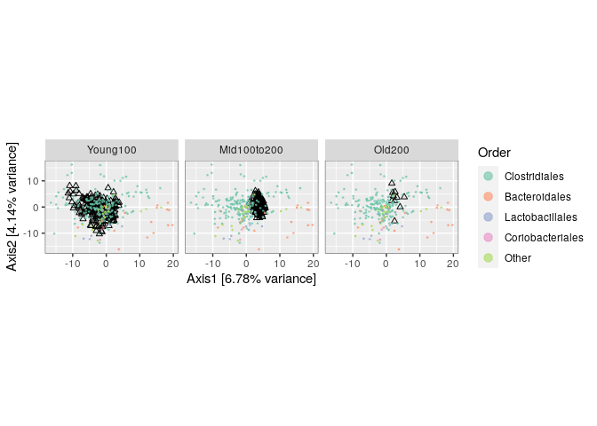

Ecogenomique2_CC1
================

### Analyses de données DADA2 et Phyloseq avec des données type

## Bio-informatique et amplicons : des reads aux tables de données

``` r
library(gitcreds)
```

``` r
if (!requireNamespace("BiocManager", quietly = TRUE))
    install.packages("BiocManager")
```

``` r
library("knitr")
library("BiocStyle")
.cran_packages <- c("ggplot2", "gridExtra", "devtools")
.bioc_packages <- c("dada2", "phyloseq", "DECIPHER", "phangorn")
sapply(c(.cran_packages, .bioc_packages), require, character.only = TRUE)
```

    ## Loading required package: ggplot2

    ## Loading required package: gridExtra

    ## Loading required package: devtools

    ## Loading required package: usethis

    ## Loading required package: dada2

    ## Loading required package: Rcpp

    ## Loading required package: phyloseq

    ## Loading required package: DECIPHER

    ## Loading required package: Biostrings

    ## Loading required package: BiocGenerics

    ## 
    ## Attaching package: 'BiocGenerics'

    ## The following object is masked from 'package:gridExtra':
    ## 
    ##     combine

    ## The following objects are masked from 'package:stats':
    ## 
    ##     IQR, mad, sd, var, xtabs

    ## The following objects are masked from 'package:base':
    ## 
    ##     anyDuplicated, append, as.data.frame, basename, cbind, colnames,
    ##     dirname, do.call, duplicated, eval, evalq, Filter, Find, get, grep,
    ##     grepl, intersect, is.unsorted, lapply, Map, mapply, match, mget,
    ##     order, paste, pmax, pmax.int, pmin, pmin.int, Position, rank,
    ##     rbind, Reduce, rownames, sapply, setdiff, sort, table, tapply,
    ##     union, unique, unsplit, which.max, which.min

    ## Loading required package: S4Vectors

    ## Loading required package: stats4

    ## 
    ## Attaching package: 'S4Vectors'

    ## The following objects are masked from 'package:base':
    ## 
    ##     expand.grid, I, unname

    ## Loading required package: IRanges

    ## 
    ## Attaching package: 'IRanges'

    ## The following object is masked from 'package:phyloseq':
    ## 
    ##     distance

    ## Loading required package: XVector

    ## Loading required package: GenomeInfoDb

    ## 
    ## Attaching package: 'Biostrings'

    ## The following object is masked from 'package:base':
    ## 
    ##     strsplit

    ## Loading required package: RSQLite

    ## Loading required package: parallel

    ## Loading required package: phangorn

    ## Loading required package: ape

    ## 
    ## Attaching package: 'ape'

    ## The following object is masked from 'package:Biostrings':
    ## 
    ##     complement

    ##   ggplot2 gridExtra  devtools     dada2  phyloseq  DECIPHER  phangorn 
    ##      TRUE      TRUE      TRUE      TRUE      TRUE      TRUE      TRUE

``` r
library(dada2)
```

``` r
set.seed(100)
miseq_path <- "/home/rstudio/MiSeq_SOP"
list.files(miseq_path)
```

    ##  [1] "F3D0_S188_L001_R1_001.fastq"   "F3D0_S188_L001_R2_001.fastq"  
    ##  [3] "F3D1_S189_L001_R1_001.fastq"   "F3D1_S189_L001_R2_001.fastq"  
    ##  [5] "F3D141_S207_L001_R1_001.fastq" "F3D141_S207_L001_R2_001.fastq"
    ##  [7] "F3D142_S208_L001_R1_001.fastq" "F3D142_S208_L001_R2_001.fastq"
    ##  [9] "F3D143_S209_L001_R1_001.fastq" "F3D143_S209_L001_R2_001.fastq"
    ## [11] "F3D144_S210_L001_R1_001.fastq" "F3D144_S210_L001_R2_001.fastq"
    ## [13] "F3D145_S211_L001_R1_001.fastq" "F3D145_S211_L001_R2_001.fastq"
    ## [15] "F3D146_S212_L001_R1_001.fastq" "F3D146_S212_L001_R2_001.fastq"
    ## [17] "F3D147_S213_L001_R1_001.fastq" "F3D147_S213_L001_R2_001.fastq"
    ## [19] "F3D148_S214_L001_R1_001.fastq" "F3D148_S214_L001_R2_001.fastq"
    ## [21] "F3D149_S215_L001_R1_001.fastq" "F3D149_S215_L001_R2_001.fastq"
    ## [23] "F3D150_S216_L001_R1_001.fastq" "F3D150_S216_L001_R2_001.fastq"
    ## [25] "F3D2_S190_L001_R1_001.fastq"   "F3D2_S190_L001_R2_001.fastq"  
    ## [27] "F3D3_S191_L001_R1_001.fastq"   "F3D3_S191_L001_R2_001.fastq"  
    ## [29] "F3D5_S193_L001_R1_001.fastq"   "F3D5_S193_L001_R2_001.fastq"  
    ## [31] "F3D6_S194_L001_R1_001.fastq"   "F3D6_S194_L001_R2_001.fastq"  
    ## [33] "F3D7_S195_L001_R1_001.fastq"   "F3D7_S195_L001_R2_001.fastq"  
    ## [35] "F3D8_S196_L001_R1_001.fastq"   "F3D8_S196_L001_R2_001.fastq"  
    ## [37] "F3D9_S197_L001_R1_001.fastq"   "F3D9_S197_L001_R2_001.fastq"  
    ## [39] "filtered"                      "HMP_MOCK.v35.fasta"           
    ## [41] "Mock_S280_L001_R1_001.fastq"   "Mock_S280_L001_R2_001.fastq"  
    ## [43] "mouse.dpw.metadata"            "mouse.time.design"            
    ## [45] "SRR10194555.fastq.gz"          "SRR10194555.fastq.gz.1"       
    ## [47] "SRR10194624.fastq.gz"          "stability.batch"              
    ## [49] "stability.files"

## Filtration

# Met les reads forward et reverse dans le même ordre

``` r
fnFs <- sort(list.files(miseq_path,pattern="_R1_001.fastq"))
fnRs <- sort(list.files(miseq_path,pattern="_R2_001.fastq"))
```

# Extrait les noms des échantillons et met au même format.

``` r
sampleNames <- sapply(strsplit(fnFs, "_"), `[`, 1)
fnFs <- file.path(miseq_path, fnFs)
fnRs <- file.path(miseq_path, fnRs)
```

# Affiche les 3 premiers éléments de la liste de fnFS

``` r
fnFs[1:3]
```

    ## [1] "/home/rstudio/MiSeq_SOP/F3D0_S188_L001_R1_001.fastq"  
    ## [2] "/home/rstudio/MiSeq_SOP/F3D1_S189_L001_R1_001.fastq"  
    ## [3] "/home/rstudio/MiSeq_SOP/F3D141_S207_L001_R1_001.fastq"

# Affiche les 3 premiers éléments de la liste de fnRs

``` r
fnRs[1:3]
```

    ## [1] "/home/rstudio/MiSeq_SOP/F3D0_S188_L001_R2_001.fastq"  
    ## [2] "/home/rstudio/MiSeq_SOP/F3D1_S189_L001_R2_001.fastq"  
    ## [3] "/home/rstudio/MiSeq_SOP/F3D141_S207_L001_R2_001.fastq"

# Graphique de la qualité de fnFs

``` r
plotQualityProfile(fnFs[1:2])
```

    ## Warning: `guides(<scale> = FALSE)` is deprecated. Please use `guides(<scale> =
    ## "none")` instead.

<!-- --> #
Graphique de la qualité de fnRs

``` r
plotQualityProfile(fnRs[1:2])
```

    ## Warning: `guides(<scale> = FALSE)` is deprecated. Please use `guides(<scale> =
    ## "none")` instead.

<!-- -->

``` r
filt_path <- file.path(miseq_path, "filtered")
if(!file_test("-d", filt_path)) dir.create(filt_path)
filtFs <- file.path(filt_path, paste0(sampleNames, "_F_filt.fastq.gz"))
filtRs <- file.path(filt_path, paste0(sampleNames, "_R_filt.fastq.gz"))
```

# Filtration des reads forward et reverse

``` r
out <- filterAndTrim(fnFs, filtFs, fnRs, filtRs, truncLen=c(240,160),
              maxN=0, maxEE=c(2,2), truncQ=2, rm.phix=TRUE,
              compress=TRUE, multithread=TRUE) 
head(out)
```

    ##                               reads.in reads.out
    ## F3D0_S188_L001_R1_001.fastq       7793      7113
    ## F3D1_S189_L001_R1_001.fastq       5869      5299
    ## F3D141_S207_L001_R1_001.fastq     5958      5463
    ## F3D142_S208_L001_R1_001.fastq     3183      2914
    ## F3D143_S209_L001_R1_001.fastq     3178      2941
    ## F3D144_S210_L001_R1_001.fastq     4827      4312

## Enlève les variants de séquence

# Déréplication

``` r
derepFs <- derepFastq(filtFs, verbose=TRUE)
```

    ## Dereplicating sequence entries in Fastq file: /home/rstudio/MiSeq_SOP/filtered/F3D0_F_filt.fastq.gz

    ## Encountered 1979 unique sequences from 7113 total sequences read.

    ## Dereplicating sequence entries in Fastq file: /home/rstudio/MiSeq_SOP/filtered/F3D1_F_filt.fastq.gz

    ## Encountered 1639 unique sequences from 5299 total sequences read.

    ## Dereplicating sequence entries in Fastq file: /home/rstudio/MiSeq_SOP/filtered/F3D141_F_filt.fastq.gz

    ## Encountered 1477 unique sequences from 5463 total sequences read.

    ## Dereplicating sequence entries in Fastq file: /home/rstudio/MiSeq_SOP/filtered/F3D142_F_filt.fastq.gz

    ## Encountered 904 unique sequences from 2914 total sequences read.

    ## Dereplicating sequence entries in Fastq file: /home/rstudio/MiSeq_SOP/filtered/F3D143_F_filt.fastq.gz

    ## Encountered 939 unique sequences from 2941 total sequences read.

    ## Dereplicating sequence entries in Fastq file: /home/rstudio/MiSeq_SOP/filtered/F3D144_F_filt.fastq.gz

    ## Encountered 1267 unique sequences from 4312 total sequences read.

    ## Dereplicating sequence entries in Fastq file: /home/rstudio/MiSeq_SOP/filtered/F3D145_F_filt.fastq.gz

    ## Encountered 1756 unique sequences from 6741 total sequences read.

    ## Dereplicating sequence entries in Fastq file: /home/rstudio/MiSeq_SOP/filtered/F3D146_F_filt.fastq.gz

    ## Encountered 1438 unique sequences from 4560 total sequences read.

    ## Dereplicating sequence entries in Fastq file: /home/rstudio/MiSeq_SOP/filtered/F3D147_F_filt.fastq.gz

    ## Encountered 3590 unique sequences from 15637 total sequences read.

    ## Dereplicating sequence entries in Fastq file: /home/rstudio/MiSeq_SOP/filtered/F3D148_F_filt.fastq.gz

    ## Encountered 2762 unique sequences from 11413 total sequences read.

    ## Dereplicating sequence entries in Fastq file: /home/rstudio/MiSeq_SOP/filtered/F3D149_F_filt.fastq.gz

    ## Encountered 3021 unique sequences from 12017 total sequences read.

    ## Dereplicating sequence entries in Fastq file: /home/rstudio/MiSeq_SOP/filtered/F3D150_F_filt.fastq.gz

    ## Encountered 1566 unique sequences from 5032 total sequences read.

    ## Dereplicating sequence entries in Fastq file: /home/rstudio/MiSeq_SOP/filtered/F3D2_F_filt.fastq.gz

    ## Encountered 3707 unique sequences from 18075 total sequences read.

    ## Dereplicating sequence entries in Fastq file: /home/rstudio/MiSeq_SOP/filtered/F3D3_F_filt.fastq.gz

    ## Encountered 1479 unique sequences from 6250 total sequences read.

    ## Dereplicating sequence entries in Fastq file: /home/rstudio/MiSeq_SOP/filtered/F3D5_F_filt.fastq.gz

    ## Encountered 1195 unique sequences from 4052 total sequences read.

    ## Dereplicating sequence entries in Fastq file: /home/rstudio/MiSeq_SOP/filtered/F3D6_F_filt.fastq.gz

    ## Encountered 1832 unique sequences from 7369 total sequences read.

    ## Dereplicating sequence entries in Fastq file: /home/rstudio/MiSeq_SOP/filtered/F3D7_F_filt.fastq.gz

    ## Encountered 1183 unique sequences from 4765 total sequences read.

    ## Dereplicating sequence entries in Fastq file: /home/rstudio/MiSeq_SOP/filtered/F3D8_F_filt.fastq.gz

    ## Encountered 1382 unique sequences from 4871 total sequences read.

    ## Dereplicating sequence entries in Fastq file: /home/rstudio/MiSeq_SOP/filtered/F3D9_F_filt.fastq.gz

    ## Encountered 1709 unique sequences from 6504 total sequences read.

    ## Dereplicating sequence entries in Fastq file: /home/rstudio/MiSeq_SOP/filtered/Mock_F_filt.fastq.gz

    ## Encountered 897 unique sequences from 4314 total sequences read.

``` r
derepRs <- derepFastq(filtRs, verbose=TRUE)
```

    ## Dereplicating sequence entries in Fastq file: /home/rstudio/MiSeq_SOP/filtered/F3D0_R_filt.fastq.gz

    ## Encountered 1660 unique sequences from 7113 total sequences read.

    ## Dereplicating sequence entries in Fastq file: /home/rstudio/MiSeq_SOP/filtered/F3D1_R_filt.fastq.gz

    ## Encountered 1349 unique sequences from 5299 total sequences read.

    ## Dereplicating sequence entries in Fastq file: /home/rstudio/MiSeq_SOP/filtered/F3D141_R_filt.fastq.gz

    ## Encountered 1335 unique sequences from 5463 total sequences read.

    ## Dereplicating sequence entries in Fastq file: /home/rstudio/MiSeq_SOP/filtered/F3D142_R_filt.fastq.gz

    ## Encountered 853 unique sequences from 2914 total sequences read.

    ## Dereplicating sequence entries in Fastq file: /home/rstudio/MiSeq_SOP/filtered/F3D143_R_filt.fastq.gz

    ## Encountered 880 unique sequences from 2941 total sequences read.

    ## Dereplicating sequence entries in Fastq file: /home/rstudio/MiSeq_SOP/filtered/F3D144_R_filt.fastq.gz

    ## Encountered 1286 unique sequences from 4312 total sequences read.

    ## Dereplicating sequence entries in Fastq file: /home/rstudio/MiSeq_SOP/filtered/F3D145_R_filt.fastq.gz

    ## Encountered 1803 unique sequences from 6741 total sequences read.

    ## Dereplicating sequence entries in Fastq file: /home/rstudio/MiSeq_SOP/filtered/F3D146_R_filt.fastq.gz

    ## Encountered 1265 unique sequences from 4560 total sequences read.

    ## Dereplicating sequence entries in Fastq file: /home/rstudio/MiSeq_SOP/filtered/F3D147_R_filt.fastq.gz

    ## Encountered 3414 unique sequences from 15637 total sequences read.

    ## Dereplicating sequence entries in Fastq file: /home/rstudio/MiSeq_SOP/filtered/F3D148_R_filt.fastq.gz

    ## Encountered 2522 unique sequences from 11413 total sequences read.

    ## Dereplicating sequence entries in Fastq file: /home/rstudio/MiSeq_SOP/filtered/F3D149_R_filt.fastq.gz

    ## Encountered 2771 unique sequences from 12017 total sequences read.

    ## Dereplicating sequence entries in Fastq file: /home/rstudio/MiSeq_SOP/filtered/F3D150_R_filt.fastq.gz

    ## Encountered 1415 unique sequences from 5032 total sequences read.

    ## Dereplicating sequence entries in Fastq file: /home/rstudio/MiSeq_SOP/filtered/F3D2_R_filt.fastq.gz

    ## Encountered 3290 unique sequences from 18075 total sequences read.

    ## Dereplicating sequence entries in Fastq file: /home/rstudio/MiSeq_SOP/filtered/F3D3_R_filt.fastq.gz

    ## Encountered 1390 unique sequences from 6250 total sequences read.

    ## Dereplicating sequence entries in Fastq file: /home/rstudio/MiSeq_SOP/filtered/F3D5_R_filt.fastq.gz

    ## Encountered 1134 unique sequences from 4052 total sequences read.

    ## Dereplicating sequence entries in Fastq file: /home/rstudio/MiSeq_SOP/filtered/F3D6_R_filt.fastq.gz

    ## Encountered 1635 unique sequences from 7369 total sequences read.

    ## Dereplicating sequence entries in Fastq file: /home/rstudio/MiSeq_SOP/filtered/F3D7_R_filt.fastq.gz

    ## Encountered 1084 unique sequences from 4765 total sequences read.

    ## Dereplicating sequence entries in Fastq file: /home/rstudio/MiSeq_SOP/filtered/F3D8_R_filt.fastq.gz

    ## Encountered 1161 unique sequences from 4871 total sequences read.

    ## Dereplicating sequence entries in Fastq file: /home/rstudio/MiSeq_SOP/filtered/F3D9_R_filt.fastq.gz

    ## Encountered 1502 unique sequences from 6504 total sequences read.

    ## Dereplicating sequence entries in Fastq file: /home/rstudio/MiSeq_SOP/filtered/Mock_R_filt.fastq.gz

    ## Encountered 732 unique sequences from 4314 total sequences read.

``` r
names(derepFs) <- sampleNames
names(derepRs) <- sampleNames
```

``` r
errF <- learnErrors(filtFs, multithread=TRUE)
```

    ## 33514080 total bases in 139642 reads from 20 samples will be used for learning the error rates.

``` r
errR <- learnErrors(filtRs, multithread=TRUE)
```

    ## 22342720 total bases in 139642 reads from 20 samples will be used for learning the error rates.

``` r
plotErrors(errF)
```

    ## Warning: Transformation introduced infinite values in continuous y-axis

<!-- -->

``` r
plotErrors(errR)
```

    ## Warning: Transformation introduced infinite values in continuous y-axis

<!-- -->

``` r
dadaFs <- dada(derepFs, err=errF, multithread=TRUE)
```

    ## Sample 1 - 7113 reads in 1979 unique sequences.
    ## Sample 2 - 5299 reads in 1639 unique sequences.
    ## Sample 3 - 5463 reads in 1477 unique sequences.
    ## Sample 4 - 2914 reads in 904 unique sequences.
    ## Sample 5 - 2941 reads in 939 unique sequences.
    ## Sample 6 - 4312 reads in 1267 unique sequences.
    ## Sample 7 - 6741 reads in 1756 unique sequences.
    ## Sample 8 - 4560 reads in 1438 unique sequences.
    ## Sample 9 - 15637 reads in 3590 unique sequences.
    ## Sample 10 - 11413 reads in 2762 unique sequences.
    ## Sample 11 - 12017 reads in 3021 unique sequences.
    ## Sample 12 - 5032 reads in 1566 unique sequences.
    ## Sample 13 - 18075 reads in 3707 unique sequences.
    ## Sample 14 - 6250 reads in 1479 unique sequences.
    ## Sample 15 - 4052 reads in 1195 unique sequences.
    ## Sample 16 - 7369 reads in 1832 unique sequences.
    ## Sample 17 - 4765 reads in 1183 unique sequences.
    ## Sample 18 - 4871 reads in 1382 unique sequences.
    ## Sample 19 - 6504 reads in 1709 unique sequences.
    ## Sample 20 - 4314 reads in 897 unique sequences.

``` r
dadaRs <- dada(derepRs, err=errR, multithread=TRUE)
```

    ## Sample 1 - 7113 reads in 1660 unique sequences.
    ## Sample 2 - 5299 reads in 1349 unique sequences.
    ## Sample 3 - 5463 reads in 1335 unique sequences.
    ## Sample 4 - 2914 reads in 853 unique sequences.
    ## Sample 5 - 2941 reads in 880 unique sequences.
    ## Sample 6 - 4312 reads in 1286 unique sequences.
    ## Sample 7 - 6741 reads in 1803 unique sequences.
    ## Sample 8 - 4560 reads in 1265 unique sequences.
    ## Sample 9 - 15637 reads in 3414 unique sequences.
    ## Sample 10 - 11413 reads in 2522 unique sequences.
    ## Sample 11 - 12017 reads in 2771 unique sequences.
    ## Sample 12 - 5032 reads in 1415 unique sequences.
    ## Sample 13 - 18075 reads in 3290 unique sequences.
    ## Sample 14 - 6250 reads in 1390 unique sequences.
    ## Sample 15 - 4052 reads in 1134 unique sequences.
    ## Sample 16 - 7369 reads in 1635 unique sequences.
    ## Sample 17 - 4765 reads in 1084 unique sequences.
    ## Sample 18 - 4871 reads in 1161 unique sequences.
    ## Sample 19 - 6504 reads in 1502 unique sequences.
    ## Sample 20 - 4314 reads in 732 unique sequences.

``` r
dadaFs[[1]]
```

    ## dada-class: object describing DADA2 denoising results
    ## 128 sequence variants were inferred from 1979 input unique sequences.
    ## Key parameters: OMEGA_A = 1e-40, OMEGA_C = 1e-40, BAND_SIZE = 16

## Construction de table de séquences et on va enlever les chimères

``` r
mergers <- mergePairs(dadaFs, derepFs, dadaRs, derepRs)
seqtabAll <- makeSequenceTable(mergers[!grepl("Mock", names(mergers))])
table(nchar(getSequences(seqtabAll)))
```

    ## 
    ## 251 252 253 254 255 
    ##   1  85 186   5   2

``` r
seqtabNoC <- removeBimeraDenovo(seqtabAll)
```

## Assignement taxonomique

``` r
fastaRef <-"/home/rstudio/silva_nr99_v138.1_train_set.fa.gz"
taxTab<-assignTaxonomy(seqtabNoC, refFasta=fastaRef, multithread=TRUE)
unname(head(taxTab))
```

    ##      [,1]       [,2]           [,3]          [,4]            [,5]            
    ## [1,] "Bacteria" "Bacteroidota" "Bacteroidia" "Bacteroidales" "Muribaculaceae"
    ## [2,] "Bacteria" "Bacteroidota" "Bacteroidia" "Bacteroidales" "Muribaculaceae"
    ## [3,] "Bacteria" "Bacteroidota" "Bacteroidia" "Bacteroidales" "Muribaculaceae"
    ## [4,] "Bacteria" "Bacteroidota" "Bacteroidia" "Bacteroidales" "Muribaculaceae"
    ## [5,] "Bacteria" "Bacteroidota" "Bacteroidia" "Bacteroidales" "Bacteroidaceae"
    ## [6,] "Bacteria" "Bacteroidota" "Bacteroidia" "Bacteroidales" "Muribaculaceae"
    ##      [,6]         
    ## [1,] NA           
    ## [2,] NA           
    ## [3,] NA           
    ## [4,] NA           
    ## [5,] "Bacteroides"
    ## [6,] NA

#`{r} #fastaRef <- "./rdp_train_set_16.fa.gz" #taxTab <- assignTaxonomy(seqtabNoC, refFasta = fastaRef, multithread=TRUE) #unname(head(taxTab)) #`

``` bash
cd
wget  https://zenodo.org/record/4587955/files/silva_nr99_v138.1_train_set.fa.gz
```

    ## --2021-12-02 17:49:40--  https://zenodo.org/record/4587955/files/silva_nr99_v138.1_train_set.fa.gz
    ## Resolving zenodo.org (zenodo.org)... 137.138.76.77
    ## Connecting to zenodo.org (zenodo.org)|137.138.76.77|:443... connected.
    ## HTTP request sent, awaiting response... 200 OK
    ## Length: 137283333 (131M) [application/octet-stream]
    ## Saving to: ‘silva_nr99_v138.1_train_set.fa.gz.1’
    ## 
    ##      0K .......... .......... .......... .......... ..........  0% 14.7M 9s
    ##     50K .......... .......... .......... .......... ..........  0% 6.99M 14s
    ##    100K .......... .......... .......... .......... ..........  0% 13.1M 13s
    ##    150K .......... .......... .......... .......... ..........  0% 12.0M 12s
    ##    200K .......... .......... .......... .......... ..........  0% 12.8M 12s
    ##    250K .......... .......... .......... .......... ..........  0% 12.8M 11s
    ##    300K .......... .......... .......... .......... ..........  0% 14.1M 11s
    ##    350K .......... .......... .......... .......... ..........  0% 13.6M 11s
    ##    400K .......... .......... .......... .......... ..........  0% 13.1M 11s
    ##    450K .......... .......... .......... .......... ..........  0% 13.3M 11s
    ##    500K .......... .......... .......... .......... ..........  0% 14.8M 11s
    ##    550K .......... .......... .......... .......... ..........  0% 17.3M 10s
    ##    600K .......... .......... .......... .......... ..........  0% 14.9M 10s
    ##    650K .......... .......... .......... .......... ..........  0% 8.73M 11s
    ##    700K .......... .......... .......... .......... ..........  0% 12.4M 11s
    ##    750K .......... .......... .......... .......... ..........  0% 12.8M 10s
    ##    800K .......... .......... .......... .......... ..........  0% 18.6M 10s
    ##    850K .......... .......... .......... .......... ..........  0% 14.7M 10s
    ##    900K .......... .......... .......... .......... ..........  0% 14.2M 10s
    ##    950K .......... .......... .......... .......... ..........  0% 21.8M 10s
    ##   1000K .......... .......... .......... .......... ..........  0% 14.3M 10s
    ##   1050K .......... .......... .......... .......... ..........  0% 38.5M 10s
    ##   1100K .......... .......... .......... .......... ..........  0% 21.7M 9s
    ##   1150K .......... .......... .......... .......... ..........  0% 10.2M 10s
    ##   1200K .......... .......... .......... .......... ..........  0% 20.2M 9s
    ##   1250K .......... .......... .......... .......... ..........  0% 12.3M 9s
    ##   1300K .......... .......... .......... .......... ..........  1% 76.3M 9s
    ##   1350K .......... .......... .......... .......... ..........  1% 13.5M 9s
    ##   1400K .......... .......... .......... .......... ..........  1% 13.6M 9s
    ##   1450K .......... .......... .......... .......... ..........  1% 14.9M 9s
    ##   1500K .......... .......... .......... .......... ..........  1% 90.6M 9s
    ##   1550K .......... .......... .......... .......... ..........  1% 15.5M 9s
    ##   1600K .......... .......... .......... .......... ..........  1% 22.9M 9s
    ##   1650K .......... .......... .......... .......... ..........  1% 15.1M 9s
    ##   1700K .......... .......... .......... .......... ..........  1% 19.8M 9s
    ##   1750K .......... .......... .......... .......... ..........  1% 57.0M 9s
    ##   1800K .......... .......... .......... .......... ..........  1% 14.9M 9s
    ##   1850K .......... .......... .......... .......... ..........  1% 26.9M 8s
    ##   1900K .......... .......... .......... .......... ..........  1% 14.0M 8s
    ##   1950K .......... .......... .......... .......... ..........  1% 69.3M 8s
    ##   2000K .......... .......... .......... .......... ..........  1% 16.2M 8s
    ##   2050K .......... .......... .......... .......... ..........  1% 51.5M 8s
    ##   2100K .......... .......... .......... .......... ..........  1% 13.6M 8s
    ##   2150K .......... .......... .......... .......... ..........  1% 30.5M 8s
    ##   2200K .......... .......... .......... .......... ..........  1% 26.7M 8s
    ##   2250K .......... .......... .......... .......... ..........  1% 28.9M 8s
    ##   2300K .......... .......... .......... .......... ..........  1% 14.2M 8s
    ##   2350K .......... .......... .......... .......... ..........  1% 15.2M 8s
    ##   2400K .......... .......... .......... .......... ..........  1% 94.8M 8s
    ##   2450K .......... .......... .......... .......... ..........  1% 12.9M 8s
    ##   2500K .......... .......... .......... .......... ..........  1% 99.6M 8s
    ##   2550K .......... .......... .......... .......... ..........  1% 16.3M 8s
    ##   2600K .......... .......... .......... .......... ..........  1%  102M 8s
    ##   2650K .......... .......... .......... .......... ..........  2% 12.5M 8s
    ##   2700K .......... .......... .......... .......... ..........  2%  102M 8s
    ##   2750K .......... .......... .......... .......... ..........  2% 12.9M 8s
    ##   2800K .......... .......... .......... .......... ..........  2%  101M 7s
    ##   2850K .......... .......... .......... .......... ..........  2% 11.3M 8s
    ##   2900K .......... .......... .......... .......... ..........  2%  109M 7s
    ##   2950K .......... .......... .......... .......... ..........  2% 12.6M 7s
    ##   3000K .......... .......... .......... .......... ..........  2%  105M 7s
    ##   3050K .......... .......... .......... .......... ..........  2% 16.5M 7s
    ##   3100K .......... .......... .......... .......... ..........  2%  114M 7s
    ##   3150K .......... .......... .......... .......... ..........  2% 11.7M 7s
    ##   3200K .......... .......... .......... .......... ..........  2% 20.8M 7s
    ##   3250K .......... .......... .......... .......... ..........  2% 24.6M 7s
    ##   3300K .......... .......... .......... .......... ..........  2% 11.2M 7s
    ##   3350K .......... .......... .......... .......... ..........  2% 94.1M 7s
    ##   3400K .......... .......... .......... .......... ..........  2% 22.6M 7s
    ##   3450K .......... .......... .......... .......... ..........  2% 23.7M 7s
    ##   3500K .......... .......... .......... .......... ..........  2% 29.1M 7s
    ##   3550K .......... .......... .......... .......... ..........  2% 29.5M 7s
    ##   3600K .......... .......... .......... .......... ..........  2% 14.3M 7s
    ##   3650K .......... .......... .......... .......... ..........  2% 69.0M 7s
    ##   3700K .......... .......... .......... .......... ..........  2% 81.0M 7s
    ##   3750K .......... .......... .......... .......... ..........  2% 14.0M 7s
    ##   3800K .......... .......... .......... .......... ..........  2% 95.5M 7s
    ##   3850K .......... .......... .......... .......... ..........  2% 17.8M 7s
    ##   3900K .......... .......... .......... .......... ..........  2%  111M 7s
    ##   3950K .......... .......... .......... .......... ..........  2% 11.7M 7s
    ##   4000K .......... .......... .......... .......... ..........  3% 88.0M 7s
    ##   4050K .......... .......... .......... .......... ..........  3% 22.5M 7s
    ##   4100K .......... .......... .......... .......... ..........  3% 70.9M 7s
    ##   4150K .......... .......... .......... .......... ..........  3% 22.9M 7s
    ##   4200K .......... .......... .......... .......... ..........  3% 27.9M 7s
    ##   4250K .......... .......... .......... .......... ..........  3% 24.7M 7s
    ##   4300K .......... .......... .......... .......... ..........  3% 36.6M 7s
    ##   4350K .......... .......... .......... .......... ..........  3% 17.5M 7s
    ##   4400K .......... .......... .......... .......... ..........  3% 44.7M 7s
    ##   4450K .......... .......... .......... .......... ..........  3%  107M 7s
    ##   4500K .......... .......... .......... .......... ..........  3% 17.4M 7s
    ##   4550K .......... .......... .......... .......... ..........  3% 47.5M 6s
    ##   4600K .......... .......... .......... .......... ..........  3%  103M 6s
    ##   4650K .......... .......... .......... .......... ..........  3% 12.8M 6s
    ##   4700K .......... .......... .......... .......... ..........  3%  110M 6s
    ##   4750K .......... .......... .......... .......... ..........  3% 7.76M 6s
    ##   4800K .......... .......... .......... .......... ..........  3%  112M 6s
    ##   4850K .......... .......... .......... .......... ..........  3%  117M 6s
    ##   4900K .......... .......... .......... .......... ..........  3% 17.2M 6s
    ##   4950K .......... .......... .......... .......... ..........  3% 49.1M 6s
    ##   5000K .......... .......... .......... .......... ..........  3% 57.4M 6s
    ##   5050K .......... .......... .......... .......... ..........  3% 13.1M 6s
    ##   5100K .......... .......... .......... .......... ..........  3%  114M 6s
    ##   5150K .......... .......... .......... .......... ..........  3% 13.2M 6s
    ##   5200K .......... .......... .......... .......... ..........  3%  115M 6s
    ##   5250K .......... .......... .......... .......... ..........  3% 16.7M 6s
    ##   5300K .......... .......... .......... .......... ..........  3% 47.0M 6s
    ##   5350K .......... .......... .......... .......... ..........  4%  104M 6s
    ##   5400K .......... .......... .......... .......... ..........  4% 23.0M 6s
    ##   5450K .......... .......... .......... .......... ..........  4% 45.3M 6s
    ##   5500K .......... .......... .......... .......... ..........  4%  111M 6s
    ##   5550K .......... .......... .......... .......... ..........  4% 25.0M 6s
    ##   5600K .......... .......... .......... .......... ..........  4% 36.9M 6s
    ##   5650K .......... .......... .......... .......... ..........  4% 17.9M 6s
    ##   5700K .......... .......... .......... .......... ..........  4% 29.7M 6s
    ##   5750K .......... .......... .......... .......... ..........  4% 92.6M 6s
    ##   5800K .......... .......... .......... .......... ..........  4% 32.7M 6s
    ##   5850K .......... .......... .......... .......... ..........  4% 21.6M 6s
    ##   5900K .......... .......... .......... .......... ..........  4% 52.2M 6s
    ##   5950K .......... .......... .......... .......... ..........  4% 19.3M 6s
    ##   6000K .......... .......... .......... .......... ..........  4% 71.1M 6s
    ##   6050K .......... .......... .......... .......... ..........  4% 26.9M 6s
    ##   6100K .......... .......... .......... .......... ..........  4% 16.2M 6s
    ##   6150K .......... .......... .......... .......... ..........  4% 29.9M 6s
    ##   6200K .......... .......... .......... .......... ..........  4% 97.3M 6s
    ##   6250K .......... .......... .......... .......... ..........  4% 27.1M 6s
    ##   6300K .......... .......... .......... .......... ..........  4% 41.8M 6s
    ##   6350K .......... .......... .......... .......... ..........  4% 25.8M 6s
    ##   6400K .......... .......... .......... .......... ..........  4% 27.5M 6s
    ##   6450K .......... .......... .......... .......... ..........  4% 44.8M 6s
    ##   6500K .......... .......... .......... .......... ..........  4% 21.8M 6s
    ##   6550K .......... .......... .......... .......... ..........  4% 26.5M 6s
    ##   6600K .......... .......... .......... .......... ..........  4% 58.7M 6s
    ##   6650K .......... .......... .......... .......... ..........  4% 59.2M 6s
    ##   6700K .......... .......... .......... .......... ..........  5% 18.8M 6s
    ##   6750K .......... .......... .......... .......... ..........  5% 81.7M 6s
    ##   6800K .......... .......... .......... .......... ..........  5% 13.7M 6s
    ##   6850K .......... .......... .......... .......... ..........  5% 99.6M 6s
    ##   6900K .......... .......... .......... .......... ..........  5%  108M 6s
    ##   6950K .......... .......... .......... .......... ..........  5% 21.1M 6s
    ##   7000K .......... .......... .......... .......... ..........  5% 40.4M 6s
    ##   7050K .......... .......... .......... .......... ..........  5% 15.1M 6s
    ##   7100K .......... .......... .......... .......... ..........  5% 88.6M 6s
    ##   7150K .......... .......... .......... .......... ..........  5% 47.4M 6s
    ##   7200K .......... .......... .......... .......... ..........  5% 9.62M 6s
    ##   7250K .......... .......... .......... .......... ..........  5%  107M 6s
    ##   7300K .......... .......... .......... .......... ..........  5% 5.40M 6s
    ##   7350K .......... .......... .......... .......... ..........  5% 85.0M 6s
    ##   7400K .......... .......... .......... .......... ..........  5%  110M 6s
    ##   7450K .......... .......... .......... .......... ..........  5% 11.1M 6s
    ##   7500K .......... .......... .......... .......... ..........  5%  108M 6s
    ##   7550K .......... .......... .......... .......... ..........  5% 16.1M 6s
    ##   7600K .......... .......... .......... .......... ..........  5%  108M 6s
    ##   7650K .......... .......... .......... .......... ..........  5%  108M 6s
    ##   7700K .......... .......... .......... .......... ..........  5% 20.0M 6s
    ##   7750K .......... .......... .......... .......... ..........  5% 77.1M 6s
    ##   7800K .......... .......... .......... .......... ..........  5% 19.8M 6s
    ##   7850K .......... .......... .......... .......... ..........  5%  106M 6s
    ##   7900K .......... .......... .......... .......... ..........  5% 55.5M 6s
    ##   7950K .......... .......... .......... .......... ..........  5% 16.0M 6s
    ##   8000K .......... .......... .......... .......... ..........  6% 81.9M 5s
    ##   8050K .......... .......... .......... .......... ..........  6% 15.1M 5s
    ##   8100K .......... .......... .......... .......... ..........  6% 46.9M 5s
    ##   8150K .......... .......... .......... .......... ..........  6% 96.2M 5s
    ##   8200K .......... .......... .......... .......... ..........  6% 18.4M 5s
    ##   8250K .......... .......... .......... .......... ..........  6% 48.4M 5s
    ##   8300K .......... .......... .......... .......... ..........  6%  114M 5s
    ##   8350K .......... .......... .......... .......... ..........  6% 18.1M 5s
    ##   8400K .......... .......... .......... .......... ..........  6% 54.8M 5s
    ##   8450K .......... .......... .......... .......... ..........  6% 20.0M 5s
    ##   8500K .......... .......... .......... .......... ..........  6% 47.8M 5s
    ##   8550K .......... .......... .......... .......... ..........  6% 86.9M 5s
    ##   8600K .......... .......... .......... .......... ..........  6% 19.6M 5s
    ##   8650K .......... .......... .......... .......... ..........  6% 56.6M 5s
    ##   8700K .......... .......... .......... .......... ..........  6% 43.0M 5s
    ##   8750K .......... .......... .......... .......... ..........  6% 20.5M 5s
    ##   8800K .......... .......... .......... .......... ..........  6% 99.2M 5s
    ##   8850K .......... .......... .......... .......... ..........  6% 29.7M 5s
    ##   8900K .......... .......... .......... .......... ..........  6%  101M 5s
    ##   8950K .......... .......... .......... .......... ..........  6% 26.1M 5s
    ##   9000K .......... .......... .......... .......... ..........  6%  101M 5s
    ##   9050K .......... .......... .......... .......... ..........  6% 37.3M 5s
    ##   9100K .......... .......... .......... .......... ..........  6% 75.2M 5s
    ##   9150K .......... .......... .......... .......... ..........  6% 26.2M 5s
    ##   9200K .......... .......... .......... .......... ..........  6% 32.1M 5s
    ##   9250K .......... .......... .......... .......... ..........  6% 82.9M 5s
    ##   9300K .......... .......... .......... .......... ..........  6% 36.5M 5s
    ##   9350K .......... .......... .......... .......... ..........  7% 22.9M 5s
    ##   9400K .......... .......... .......... .......... ..........  7% 64.6M 5s
    ##   9450K .......... .......... .......... .......... ..........  7% 36.4M 5s
    ##   9500K .......... .......... .......... .......... ..........  7%  107M 5s
    ##   9550K .......... .......... .......... .......... ..........  7% 37.0M 5s
    ##   9600K .......... .......... .......... .......... ..........  7% 27.2M 5s
    ##   9650K .......... .......... .......... .......... ..........  7% 40.4M 5s
    ##   9700K .......... .......... .......... .......... ..........  7% 13.0M 5s
    ##   9750K .......... .......... .......... .......... ..........  7% 44.9M 5s
    ##   9800K .......... .......... .......... .......... ..........  7%  121M 5s
    ##   9850K .......... .......... .......... .......... ..........  7% 76.2M 5s
    ##   9900K .......... .......... .......... .......... ..........  7% 9.72M 5s
    ##   9950K .......... .......... .......... .......... ..........  7% 59.8M 5s
    ##  10000K .......... .......... .......... .......... ..........  7%  117M 5s
    ##  10050K .......... .......... .......... .......... ..........  7% 53.7M 5s
    ##  10100K .......... .......... .......... .......... ..........  7% 9.89M 5s
    ##  10150K .......... .......... .......... .......... ..........  7% 58.2M 5s
    ##  10200K .......... .......... .......... .......... ..........  7%  105M 5s
    ##  10250K .......... .......... .......... .......... ..........  7%  134M 5s
    ##  10300K .......... .......... .......... .......... ..........  7% 13.4M 5s
    ##  10350K .......... .......... .......... .......... ..........  7% 51.5M 5s
    ##  10400K .......... .......... .......... .......... ..........  7%  125M 5s
    ##  10450K .......... .......... .......... .......... ..........  7%  132M 5s
    ##  10500K .......... .......... .......... .......... ..........  7% 16.7M 5s
    ##  10550K .......... .......... .......... .......... ..........  7% 51.6M 5s
    ##  10600K .......... .......... .......... .......... ..........  7% 59.6M 5s
    ##  10650K .......... .......... .......... .......... ..........  7%  144M 5s
    ##  10700K .......... .......... .......... .......... ..........  8% 46.8M 5s
    ##  10750K .......... .......... .......... .......... ..........  8% 40.4M 5s
    ##  10800K .......... .......... .......... .......... ..........  8% 17.2M 5s
    ##  10850K .......... .......... .......... .......... ..........  8%  131M 5s
    ##  10900K .......... .......... .......... .......... ..........  8% 56.5M 5s
    ##  10950K .......... .......... .......... .......... ..........  8%  115M 5s
    ##  11000K .......... .......... .......... .......... ..........  8% 33.1M 5s
    ##  11050K .......... .......... .......... .......... ..........  8% 59.3M 5s
    ##  11100K .......... .......... .......... .......... ..........  8%  139M 5s
    ##  11150K .......... .......... .......... .......... ..........  8% 46.7M 5s
    ##  11200K .......... .......... .......... .......... ..........  8% 18.7M 5s
    ##  11250K .......... .......... .......... .......... ..........  8%  109M 5s
    ##  11300K .......... .......... .......... .......... ..........  8% 81.3M 5s
    ##  11350K .......... .......... .......... .......... ..........  8%  132M 5s
    ##  11400K .......... .......... .......... .......... ..........  8% 16.2M 5s
    ##  11450K .......... .......... .......... .......... ..........  8% 62.4M 5s
    ##  11500K .......... .......... .......... .......... ..........  8%  134M 5s
    ##  11550K .......... .......... .......... .......... ..........  8% 18.5M 5s
    ##  11600K .......... .......... .......... .......... ..........  8% 70.6M 5s
    ##  11650K .......... .......... .......... .......... ..........  8%  109M 5s
    ##  11700K .......... .......... .......... .......... ..........  8% 59.6M 5s
    ##  11750K .......... .......... .......... .......... ..........  8% 28.9M 5s
    ##  11800K .......... .......... .......... .......... ..........  8% 63.8M 5s
    ##  11850K .......... .......... .......... .......... ..........  8%  160M 5s
    ##  11900K .......... .......... .......... .......... ..........  8% 48.1M 5s
    ##  11950K .......... .......... .......... .......... ..........  8% 33.9M 5s
    ##  12000K .......... .......... .......... .......... ..........  8% 71.3M 5s
    ##  12050K .......... .......... .......... .......... ..........  9% 55.1M 5s
    ##  12100K .......... .......... .......... .......... ..........  9% 98.1M 5s
    ##  12150K .......... .......... .......... .......... ..........  9% 35.3M 5s
    ##  12200K .......... .......... .......... .......... ..........  9% 60.7M 5s
    ##  12250K .......... .......... .......... .......... ..........  9% 55.6M 5s
    ##  12300K .......... .......... .......... .......... ..........  9%  170M 5s
    ##  12350K .......... .......... .......... .......... ..........  9% 33.2M 5s
    ##  12400K .......... .......... .......... .......... ..........  9% 47.3M 5s
    ##  12450K .......... .......... .......... .......... ..........  9% 48.4M 4s
    ##  12500K .......... .......... .......... .......... ..........  9% 39.1M 4s
    ##  12550K .......... .......... .......... .......... ..........  9%  104M 4s
    ##  12600K .......... .......... .......... .......... ..........  9% 57.1M 4s
    ##  12650K .......... .......... .......... .......... ..........  9% 46.7M 4s
    ##  12700K .......... .......... .......... .......... ..........  9% 39.9M 4s
    ##  12750K .......... .......... .......... .......... ..........  9% 50.2M 4s
    ##  12800K .......... .......... .......... .......... ..........  9%  144M 4s
    ##  12850K .......... .......... .......... .......... ..........  9% 49.6M 4s
    ##  12900K .......... .......... .......... .......... ..........  9% 27.2M 4s
    ##  12950K .......... .......... .......... .......... ..........  9% 64.2M 4s
    ##  13000K .......... .......... .......... .......... ..........  9% 98.3M 4s
    ##  13050K .......... .......... .......... .......... ..........  9%  122M 4s
    ##  13100K .......... .......... .......... .......... ..........  9%  189M 4s
    ##  13150K .......... .......... .......... .......... ..........  9% 27.6M 4s
    ##  13200K .......... .......... .......... .......... ..........  9%  141M 4s
    ##  13250K .......... .......... .......... .......... ..........  9% 92.0M 4s
    ##  13300K .......... .......... .......... .......... ..........  9%  195M 4s
    ##  13350K .......... .......... .......... .......... ..........  9% 72.3M 4s
    ##  13400K .......... .......... .......... .......... .......... 10% 24.5M 4s
    ##  13450K .......... .......... .......... .......... .......... 10% 30.0M 4s
    ##  13500K .......... .......... .......... .......... .......... 10% 25.4M 4s
    ##  13550K .......... .......... .......... .......... .......... 10% 28.7M 4s
    ##  13600K .......... .......... .......... .......... .......... 10% 24.2M 4s
    ##  13650K .......... .......... .......... .......... .......... 10% 23.7M 4s
    ##  13700K .......... .......... .......... .......... .......... 10% 36.3M 4s
    ##  13750K .......... .......... .......... .......... .......... 10% 28.2M 4s
    ##  13800K .......... .......... .......... .......... .......... 10% 28.0M 4s
    ##  13850K .......... .......... .......... .......... .......... 10% 40.6M 4s
    ##  13900K .......... .......... .......... .......... .......... 10% 28.7M 4s
    ##  13950K .......... .......... .......... .......... .......... 10% 29.5M 4s
    ##  14000K .......... .......... .......... .......... .......... 10% 41.3M 4s
    ##  14050K .......... .......... .......... .......... .......... 10% 27.5M 4s
    ##  14100K .......... .......... .......... .......... .......... 10% 32.7M 4s
    ##  14150K .......... .......... .......... .......... .......... 10% 21.5M 4s
    ##  14200K .......... .......... .......... .......... .......... 10% 25.4M 4s
    ##  14250K .......... .......... .......... .......... .......... 10% 32.6M 4s
    ##  14300K .......... .......... .......... .......... .......... 10% 28.3M 4s
    ##  14350K .......... .......... .......... .......... .......... 10% 32.8M 4s
    ##  14400K .......... .......... .......... .......... .......... 10% 35.8M 4s
    ##  14450K .......... .......... .......... .......... .......... 10% 34.4M 4s
    ##  14500K .......... .......... .......... .......... .......... 10% 24.3M 4s
    ##  14550K .......... .......... .......... .......... .......... 10% 33.7M 4s
    ##  14600K .......... .......... .......... .......... .......... 10% 34.6M 4s
    ##  14650K .......... .......... .......... .......... .......... 10% 27.7M 4s
    ##  14700K .......... .......... .......... .......... .......... 11% 36.5M 4s
    ##  14750K .......... .......... .......... .......... .......... 11% 33.1M 4s
    ##  14800K .......... .......... .......... .......... .......... 11% 18.4M 4s
    ##  14850K .......... .......... .......... .......... .......... 11% 30.7M 4s
    ##  14900K .......... .......... .......... .......... .......... 11% 25.3M 4s
    ##  14950K .......... .......... .......... .......... .......... 11% 24.6M 4s
    ##  15000K .......... .......... .......... .......... .......... 11% 39.6M 4s
    ##  15050K .......... .......... .......... .......... .......... 11% 37.4M 4s
    ##  15100K .......... .......... .......... .......... .......... 11% 37.2M 4s
    ##  15150K .......... .......... .......... .......... .......... 11% 31.7M 4s
    ##  15200K .......... .......... .......... .......... .......... 11% 38.1M 4s
    ##  15250K .......... .......... .......... .......... .......... 11% 39.9M 4s
    ##  15300K .......... .......... .......... .......... .......... 11% 35.7M 4s
    ##  15350K .......... .......... .......... .......... .......... 11% 32.9M 4s
    ##  15400K .......... .......... .......... .......... .......... 11% 41.0M 4s
    ##  15450K .......... .......... .......... .......... .......... 11% 34.9M 4s
    ##  15500K .......... .......... .......... .......... .......... 11% 36.7M 4s
    ##  15550K .......... .......... .......... .......... .......... 11% 34.5M 4s
    ##  15600K .......... .......... .......... .......... .......... 11% 32.1M 4s
    ##  15650K .......... .......... .......... .......... .......... 11% 34.7M 4s
    ##  15700K .......... .......... .......... .......... .......... 11% 39.8M 4s
    ##  15750K .......... .......... .......... .......... .......... 11% 25.0M 4s
    ##  15800K .......... .......... .......... .......... .......... 11% 24.5M 4s
    ##  15850K .......... .......... .......... .......... .......... 11% 37.1M 4s
    ##  15900K .......... .......... .......... .......... .......... 11% 39.8M 4s
    ##  15950K .......... .......... .......... .......... .......... 11% 31.5M 4s
    ##  16000K .......... .......... .......... .......... .......... 11% 39.3M 4s
    ##  16050K .......... .......... .......... .......... .......... 12% 36.4M 4s
    ##  16100K .......... .......... .......... .......... .......... 12% 39.0M 4s
    ##  16150K .......... .......... .......... .......... .......... 12% 19.8M 4s
    ##  16200K .......... .......... .......... .......... .......... 12% 40.6M 4s
    ##  16250K .......... .......... .......... .......... .......... 12% 23.0M 4s
    ##  16300K .......... .......... .......... .......... .......... 12% 39.9M 4s
    ##  16350K .......... .......... .......... .......... .......... 12% 29.1M 4s
    ##  16400K .......... .......... .......... .......... .......... 12% 28.1M 4s
    ##  16450K .......... .......... .......... .......... .......... 12% 40.3M 4s
    ##  16500K .......... .......... .......... .......... .......... 12% 26.4M 4s
    ##  16550K .......... .......... .......... .......... .......... 12% 35.2M 4s
    ##  16600K .......... .......... .......... .......... .......... 12% 34.8M 4s
    ##  16650K .......... .......... .......... .......... .......... 12% 24.6M 4s
    ##  16700K .......... .......... .......... .......... .......... 12% 39.9M 4s
    ##  16750K .......... .......... .......... .......... .......... 12% 31.9M 4s
    ##  16800K .......... .......... .......... .......... .......... 12% 36.0M 4s
    ##  16850K .......... .......... .......... .......... .......... 12% 38.6M 4s
    ##  16900K .......... .......... .......... .......... .......... 12% 36.2M 4s
    ##  16950K .......... .......... .......... .......... .......... 12% 35.5M 4s
    ##  17000K .......... .......... .......... .......... .......... 12% 40.6M 4s
    ##  17050K .......... .......... .......... .......... .......... 12% 27.2M 4s
    ##  17100K .......... .......... .......... .......... .......... 12% 39.9M 4s
    ##  17150K .......... .......... .......... .......... .......... 12% 34.1M 4s
    ##  17200K .......... .......... .......... .......... .......... 12% 21.9M 4s
    ##  17250K .......... .......... .......... .......... .......... 12% 40.4M 4s
    ##  17300K .......... .......... .......... .......... .......... 12% 26.7M 4s
    ##  17350K .......... .......... .......... .......... .......... 12% 35.5M 4s
    ##  17400K .......... .......... .......... .......... .......... 13% 40.2M 4s
    ##  17450K .......... .......... .......... .......... .......... 13% 27.1M 4s
    ##  17500K .......... .......... .......... .......... .......... 13% 40.7M 4s
    ##  17550K .......... .......... .......... .......... .......... 13% 30.4M 4s
    ##  17600K .......... .......... .......... .......... .......... 13% 36.4M 4s
    ##  17650K .......... .......... .......... .......... .......... 13% 39.5M 4s
    ##  17700K .......... .......... .......... .......... .......... 13% 39.7M 4s
    ##  17750K .......... .......... .......... .......... .......... 13% 26.0M 4s
    ##  17800K .......... .......... .......... .......... .......... 13% 39.6M 4s
    ##  17850K .......... .......... .......... .......... .......... 13% 39.5M 4s
    ##  17900K .......... .......... .......... .......... .......... 13% 35.0M 4s
    ##  17950K .......... .......... .......... .......... .......... 13% 34.5M 4s
    ##  18000K .......... .......... .......... .......... .......... 13% 39.1M 4s
    ##  18050K .......... .......... .......... .......... .......... 13% 32.1M 4s
    ##  18100K .......... .......... .......... .......... .......... 13% 30.2M 4s
    ##  18150K .......... .......... .......... .......... .......... 13% 40.0M 4s
    ##  18200K .......... .......... .......... .......... .......... 13%  136M 4s
    ##  18250K .......... .......... .......... .......... .......... 13%  179M 4s
    ##  18300K .......... .......... .......... .......... .......... 13%  169M 4s
    ##  18350K .......... .......... .......... .......... .......... 13%  139M 4s
    ##  18400K .......... .......... .......... .......... .......... 13%  183M 4s
    ##  18450K .......... .......... .......... .......... .......... 13%  183M 4s
    ##  18500K .......... .......... .......... .......... .......... 13%  174M 4s
    ##  18550K .......... .......... .......... .......... .......... 13%  163M 4s
    ##  18600K .......... .......... .......... .......... .......... 13%  186M 4s
    ##  18650K .......... .......... .......... .......... .......... 13%  181M 4s
    ##  18700K .......... .......... .......... .......... .......... 13%  167M 4s
    ##  18750K .......... .......... .......... .......... .......... 14%  144M 4s
    ##  18800K .......... .......... .......... .......... .......... 14%  122M 4s
    ##  18850K .......... .......... .......... .......... .......... 14%  181M 4s
    ##  18900K .......... .......... .......... .......... .......... 14%  188M 4s
    ##  18950K .......... .......... .......... .......... .......... 14%  152M 4s
    ##  19000K .......... .......... .......... .......... .......... 14%  177M 4s
    ##  19050K .......... .......... .......... .......... .......... 14%  193M 4s
    ##  19100K .......... .......... .......... .......... .......... 14%  198M 4s
    ##  19150K .......... .......... .......... .......... .......... 14%  153M 4s
    ##  19200K .......... .......... .......... .......... .......... 14%  185M 4s
    ##  19250K .......... .......... .......... .......... .......... 14%  187M 4s
    ##  19300K .......... .......... .......... .......... .......... 14%  182M 4s
    ##  19350K .......... .......... .......... .......... .......... 14%  162M 4s
    ##  19400K .......... .......... .......... .......... .......... 14%  157M 4s
    ##  19450K .......... .......... .......... .......... .......... 14%  179M 4s
    ##  19500K .......... .......... .......... .......... .......... 14%  187M 4s
    ##  19550K .......... .......... .......... .......... .......... 14%  149M 4s
    ##  19600K .......... .......... .......... .......... .......... 14%  181M 4s
    ##  19650K .......... .......... .......... .......... .......... 14%  194M 4s
    ##  19700K .......... .......... .......... .......... .......... 14%  186M 4s
    ##  19750K .......... .......... .......... .......... .......... 14%  163M 4s
    ##  19800K .......... .......... .......... .......... .......... 14%  183M 4s
    ##  19850K .......... .......... .......... .......... .......... 14%  160M 4s
    ##  19900K .......... .......... .......... .......... .......... 14%  183M 4s
    ##  19950K .......... .......... .......... .......... .......... 14%  153M 4s
    ##  20000K .......... .......... .......... .......... .......... 14%  191M 4s
    ##  20050K .......... .......... .......... .......... .......... 14%  149M 4s
    ##  20100K .......... .......... .......... .......... .......... 15%  173M 4s
    ##  20150K .......... .......... .......... .......... .......... 15%  164M 4s
    ##  20200K .......... .......... .......... .......... .......... 15%  188M 4s
    ##  20250K .......... .......... .......... .......... .......... 15%  175M 4s
    ##  20300K .......... .......... .......... .......... .......... 15%  194M 4s
    ##  20350K .......... .......... .......... .......... .......... 15%  160M 4s
    ##  20400K .......... .......... .......... .......... .......... 15% 30.7M 4s
    ##  20450K .......... .......... .......... .......... .......... 15%  184M 4s
    ##  20500K .......... .......... .......... .......... .......... 15% 90.5M 4s
    ##  20550K .......... .......... .......... .......... .......... 15%  150M 4s
    ##  20600K .......... .......... .......... .......... .......... 15% 71.7M 4s
    ##  20650K .......... .......... .......... .......... .......... 15% 23.1M 4s
    ##  20700K .......... .......... .......... .......... .......... 15%  144M 4s
    ##  20750K .......... .......... .......... .......... .......... 15%  121M 4s
    ##  20800K .......... .......... .......... .......... .......... 15%  166M 3s
    ##  20850K .......... .......... .......... .......... .......... 15% 46.2M 3s
    ##  20900K .......... .......... .......... .......... .......... 15% 45.6M 3s
    ##  20950K .......... .......... .......... .......... .......... 15% 45.7M 3s
    ##  21000K .......... .......... .......... .......... .......... 15%  148M 3s
    ##  21050K .......... .......... .......... .......... .......... 15% 22.8M 3s
    ##  21100K .......... .......... .......... .......... .......... 15%  108M 3s
    ##  21150K .......... .......... .......... .......... .......... 15% 64.0M 3s
    ##  21200K .......... .......... .......... .......... .......... 15% 80.1M 3s
    ##  21250K .......... .......... .......... .......... .......... 15% 96.5M 3s
    ##  21300K .......... .......... .......... .......... .......... 15% 36.8M 3s
    ##  21350K .......... .......... .......... .......... .......... 15% 82.2M 3s
    ##  21400K .......... .......... .......... .......... .......... 15% 31.3M 3s
    ##  21450K .......... .......... .......... .......... .......... 16% 97.9M 3s
    ##  21500K .......... .......... .......... .......... .......... 16% 89.0M 3s
    ##  21550K .......... .......... .......... .......... .......... 16% 76.6M 3s
    ##  21600K .......... .......... .......... .......... .......... 16%  118M 3s
    ##  21650K .......... .......... .......... .......... .......... 16% 57.9M 3s
    ##  21700K .......... .......... .......... .......... .......... 16% 76.9M 3s
    ##  21750K .......... .......... .......... .......... .......... 16% 85.2M 3s
    ##  21800K .......... .......... .......... .......... .......... 16% 38.0M 3s
    ##  21850K .......... .......... .......... .......... .......... 16%  113M 3s
    ##  21900K .......... .......... .......... .......... .......... 16%  100M 3s
    ##  21950K .......... .......... .......... .......... .......... 16% 81.3M 3s
    ##  22000K .......... .......... .......... .......... .......... 16% 72.8M 3s
    ##  22050K .......... .......... .......... .......... .......... 16% 20.3M 3s
    ##  22100K .......... .......... .......... .......... .......... 16% 94.3M 3s
    ##  22150K .......... .......... .......... .......... .......... 16% 93.6M 3s
    ##  22200K .......... .......... .......... .......... .......... 16% 94.1M 3s
    ##  22250K .......... .......... .......... .......... .......... 16% 89.5M 3s
    ##  22300K .......... .......... .......... .......... .......... 16% 35.1M 3s
    ##  22350K .......... .......... .......... .......... .......... 16% 88.4M 3s
    ##  22400K .......... .......... .......... .......... .......... 16% 84.9M 3s
    ##  22450K .......... .......... .......... .......... .......... 16%  114M 3s
    ##  22500K .......... .......... .......... .......... .......... 16%  103M 3s
    ##  22550K .......... .......... .......... .......... .......... 16% 15.7M 3s
    ##  22600K .......... .......... .......... .......... .......... 16% 97.9M 3s
    ##  22650K .......... .......... .......... .......... .......... 16% 94.9M 3s
    ##  22700K .......... .......... .......... .......... .......... 16% 84.4M 3s
    ##  22750K .......... .......... .......... .......... .......... 17% 91.0M 3s
    ##  22800K .......... .......... .......... .......... .......... 17%  115M 3s
    ##  22850K .......... .......... .......... .......... .......... 17% 26.4M 3s
    ##  22900K .......... .......... .......... .......... .......... 17% 77.6M 3s
    ##  22950K .......... .......... .......... .......... .......... 17% 81.6M 3s
    ##  23000K .......... .......... .......... .......... .......... 17% 83.3M 3s
    ##  23050K .......... .......... .......... .......... .......... 17%  108M 3s
    ##  23100K .......... .......... .......... .......... .......... 17%  116M 3s
    ##  23150K .......... .......... .......... .......... .......... 17% 22.1M 3s
    ##  23200K .......... .......... .......... .......... .......... 17% 68.7M 3s
    ##  23250K .......... .......... .......... .......... .......... 17% 81.2M 3s
    ##  23300K .......... .......... .......... .......... .......... 17% 92.3M 3s
    ##  23350K .......... .......... .......... .......... .......... 17% 99.0M 3s
    ##  23400K .......... .......... .......... .......... .......... 17% 93.5M 3s
    ##  23450K .......... .......... .......... .......... .......... 17% 24.4M 3s
    ##  23500K .......... .......... .......... .......... .......... 17% 78.2M 3s
    ##  23550K .......... .......... .......... .......... .......... 17% 76.9M 3s
    ##  23600K .......... .......... .......... .......... .......... 17%  110M 3s
    ##  23650K .......... .......... .......... .......... .......... 17%  109M 3s
    ##  23700K .......... .......... .......... .......... .......... 17% 39.0M 3s
    ##  23750K .......... .......... .......... .......... .......... 17% 61.1M 3s
    ##  23800K .......... .......... .......... .......... .......... 17% 90.0M 3s
    ##  23850K .......... .......... .......... .......... .......... 17% 87.2M 3s
    ##  23900K .......... .......... .......... .......... .......... 17%  117M 3s
    ##  23950K .......... .......... .......... .......... .......... 17% 42.2M 3s
    ##  24000K .......... .......... .......... .......... .......... 17% 26.9M 3s
    ##  24050K .......... .......... .......... .......... .......... 17% 91.5M 3s
    ##  24100K .......... .......... .......... .......... .......... 18% 95.4M 3s
    ##  24150K .......... .......... .......... .......... .......... 18% 35.3M 3s
    ##  24200K .......... .......... .......... .......... .......... 18%  110M 3s
    ##  24250K .......... .......... .......... .......... .......... 18%  101M 3s
    ##  24300K .......... .......... .......... .......... .......... 18%  115M 3s
    ##  24350K .......... .......... .......... .......... .......... 18% 38.3M 3s
    ##  24400K .......... .......... .......... .......... .......... 18% 52.1M 3s
    ##  24450K .......... .......... .......... .......... .......... 18% 55.2M 3s
    ##  24500K .......... .......... .......... .......... .......... 18% 90.5M 3s
    ##  24550K .......... .......... .......... .......... .......... 18%  104M 3s
    ##  24600K .......... .......... .......... .......... .......... 18%  121M 3s
    ##  24650K .......... .......... .......... .......... .......... 18% 85.4M 3s
    ##  24700K .......... .......... .......... .......... .......... 18% 41.9M 3s
    ##  24750K .......... .......... .......... .......... .......... 18% 63.2M 3s
    ##  24800K .......... .......... .......... .......... .......... 18%  107M 3s
    ##  24850K .......... .......... .......... .......... .......... 18% 37.0M 3s
    ##  24900K .......... .......... .......... .......... .......... 18% 78.9M 3s
    ##  24950K .......... .......... .......... .......... .......... 18% 71.8M 3s
    ##  25000K .......... .......... .......... .......... .......... 18% 90.9M 3s
    ##  25050K .......... .......... .......... .......... .......... 18% 25.2M 3s
    ##  25100K .......... .......... .......... .......... .......... 18% 43.2M 3s
    ##  25150K .......... .......... .......... .......... .......... 18% 61.9M 3s
    ##  25200K .......... .......... .......... .......... .......... 18% 36.0M 3s
    ##  25250K .......... .......... .......... .......... .......... 18% 87.6M 3s
    ##  25300K .......... .......... .......... .......... .......... 18% 45.8M 3s
    ##  25350K .......... .......... .......... .......... .......... 18% 30.5M 3s
    ##  25400K .......... .......... .......... .......... .......... 18% 40.1M 3s
    ##  25450K .......... .......... .......... .......... .......... 19% 79.5M 3s
    ##  25500K .......... .......... .......... .......... .......... 19% 94.2M 3s
    ##  25550K .......... .......... .......... .......... .......... 19% 73.2M 3s
    ##  25600K .......... .......... .......... .......... .......... 19% 19.6M 3s
    ##  25650K .......... .......... .......... .......... .......... 19% 85.8M 3s
    ##  25700K .......... .......... .......... .......... .......... 19% 92.0M 3s
    ##  25750K .......... .......... .......... .......... .......... 19% 82.4M 3s
    ##  25800K .......... .......... .......... .......... .......... 19% 85.8M 3s
    ##  25850K .......... .......... .......... .......... .......... 19% 27.6M 3s
    ##  25900K .......... .......... .......... .......... .......... 19% 70.9M 3s
    ##  25950K .......... .......... .......... .......... .......... 19% 74.8M 3s
    ##  26000K .......... .......... .......... .......... .......... 19% 82.5M 3s
    ##  26050K .......... .......... .......... .......... .......... 19% 70.4M 3s
    ##  26100K .......... .......... .......... .......... .......... 19% 26.8M 3s
    ##  26150K .......... .......... .......... .......... .......... 19% 75.1M 3s
    ##  26200K .......... .......... .......... .......... .......... 19% 77.3M 3s
    ##  26250K .......... .......... .......... .......... .......... 19%  117M 3s
    ##  26300K .......... .......... .......... .......... .......... 19% 85.1M 3s
    ##  26350K .......... .......... .......... .......... .......... 19% 14.5M 3s
    ##  26400K .......... .......... .......... .......... .......... 19% 72.6M 3s
    ##  26450K .......... .......... .......... .......... .......... 19% 88.7M 3s
    ##  26500K .......... .......... .......... .......... .......... 19% 84.8M 3s
    ##  26550K .......... .......... .......... .......... .......... 19% 72.5M 3s
    ##  26600K .......... .......... .......... .......... .......... 19% 18.2M 3s
    ##  26650K .......... .......... .......... .......... .......... 19% 89.6M 3s
    ##  26700K .......... .......... .......... .......... .......... 19% 98.0M 3s
    ##  26750K .......... .......... .......... .......... .......... 19% 98.7M 3s
    ##  26800K .......... .......... .......... .......... .......... 20% 94.5M 3s
    ##  26850K .......... .......... .......... .......... .......... 20% 20.7M 3s
    ##  26900K .......... .......... .......... .......... .......... 20% 67.8M 3s
    ##  26950K .......... .......... .......... .......... .......... 20% 86.9M 3s
    ##  27000K .......... .......... .......... .......... .......... 20% 75.5M 3s
    ##  27050K .......... .......... .......... .......... .......... 20%  114M 3s
    ##  27100K .......... .......... .......... .......... .......... 20%  110M 3s
    ##  27150K .......... .......... .......... .......... .......... 20% 21.4M 3s
    ##  27200K .......... .......... .......... .......... .......... 20% 85.1M 3s
    ##  27250K .......... .......... .......... .......... .......... 20% 74.2M 3s
    ##  27300K .......... .......... .......... .......... .......... 20% 69.8M 3s
    ##  27350K .......... .......... .......... .......... .......... 20% 86.5M 3s
    ##  27400K .......... .......... .......... .......... .......... 20% 70.5M 3s
    ##  27450K .......... .......... .......... .......... .......... 20% 46.5M 3s
    ##  27500K .......... .......... .......... .......... .......... 20% 64.9M 3s
    ##  27550K .......... .......... .......... .......... .......... 20% 58.0M 3s
    ##  27600K .......... .......... .......... .......... .......... 20% 81.3M 3s
    ##  27650K .......... .......... .......... .......... .......... 20% 63.8M 3s
    ##  27700K .......... .......... .......... .......... .......... 20% 46.4M 3s
    ##  27750K .......... .......... .......... .......... .......... 20% 68.1M 3s
    ##  27800K .......... .......... .......... .......... .......... 20% 79.5M 3s
    ##  27850K .......... .......... .......... .......... .......... 20% 62.3M 3s
    ##  27900K .......... .......... .......... .......... .......... 20% 64.6M 3s
    ##  27950K .......... .......... .......... .......... .......... 20% 63.8M 3s
    ##  28000K .......... .......... .......... .......... .......... 20% 45.4M 3s
    ##  28050K .......... .......... .......... .......... .......... 20% 95.3M 3s
    ##  28100K .......... .......... .......... .......... .......... 20% 14.0M 3s
    ##  28150K .......... .......... .......... .......... .......... 21% 59.0M 3s
    ##  28200K .......... .......... .......... .......... .......... 21% 94.9M 3s
    ##  28250K .......... .......... .......... .......... .......... 21% 95.6M 3s
    ##  28300K .......... .......... .......... .......... .......... 21% 34.6M 3s
    ##  28350K .......... .......... .......... .......... .......... 21% 20.6M 3s
    ##  28400K .......... .......... .......... .......... .......... 21% 81.1M 3s
    ##  28450K .......... .......... .......... .......... .......... 21% 39.9M 3s
    ##  28500K .......... .......... .......... .......... .......... 21% 72.6M 3s
    ##  28550K .......... .......... .......... .......... .......... 21% 75.9M 3s
    ##  28600K .......... .......... .......... .......... .......... 21% 82.9M 3s
    ##  28650K .......... .......... .......... .......... .......... 21% 73.6M 3s
    ##  28700K .......... .......... .......... .......... .......... 21% 77.9M 3s
    ##  28750K .......... .......... .......... .......... .......... 21% 64.1M 3s
    ##  28800K .......... .......... .......... .......... .......... 21% 87.1M 3s
    ##  28850K .......... .......... .......... .......... .......... 21% 28.0M 3s
    ##  28900K .......... .......... .......... .......... .......... 21% 61.5M 3s
    ##  28950K .......... .......... .......... .......... .......... 21% 33.7M 3s
    ##  29000K .......... .......... .......... .......... .......... 21% 71.5M 3s
    ##  29050K .......... .......... .......... .......... .......... 21% 58.7M 3s
    ##  29100K .......... .......... .......... .......... .......... 21% 76.2M 3s
    ##  29150K .......... .......... .......... .......... .......... 21% 73.6M 3s
    ##  29200K .......... .......... .......... .......... .......... 21% 90.4M 3s
    ##  29250K .......... .......... .......... .......... .......... 21% 67.6M 3s
    ##  29300K .......... .......... .......... .......... .......... 21% 39.4M 3s
    ##  29350K .......... .......... .......... .......... .......... 21% 60.8M 3s
    ##  29400K .......... .......... .......... .......... .......... 21% 62.2M 3s
    ##  29450K .......... .......... .......... .......... .......... 22% 83.7M 3s
    ##  29500K .......... .......... .......... .......... .......... 22% 80.8M 3s
    ##  29550K .......... .......... .......... .......... .......... 22% 40.0M 3s
    ##  29600K .......... .......... .......... .......... .......... 22% 28.4M 3s
    ##  29650K .......... .......... .......... .......... .......... 22% 71.3M 3s
    ##  29700K .......... .......... .......... .......... .......... 22% 85.8M 3s
    ##  29750K .......... .......... .......... .......... .......... 22% 38.2M 3s
    ##  29800K .......... .......... .......... .......... .......... 22% 73.7M 3s
    ##  29850K .......... .......... .......... .......... .......... 22% 83.5M 3s
    ##  29900K .......... .......... .......... .......... .......... 22% 79.4M 3s
    ##  29950K .......... .......... .......... .......... .......... 22% 48.4M 3s
    ##  30000K .......... .......... .......... .......... .......... 22% 52.4M 3s
    ##  30050K .......... .......... .......... .......... .......... 22% 57.0M 3s
    ##  30100K .......... .......... .......... .......... .......... 22% 58.2M 3s
    ##  30150K .......... .......... .......... .......... .......... 22% 70.5M 3s
    ##  30200K .......... .......... .......... .......... .......... 22% 62.5M 3s
    ##  30250K .......... .......... .......... .......... .......... 22% 51.5M 3s
    ##  30300K .......... .......... .......... .......... .......... 22% 65.9M 3s
    ##  30350K .......... .......... .......... .......... .......... 22% 60.4M 3s
    ##  30400K .......... .......... .......... .......... .......... 22% 74.5M 3s
    ##  30450K .......... .......... .......... .......... .......... 22% 69.4M 3s
    ##  30500K .......... .......... .......... .......... .......... 22% 63.3M 3s
    ##  30550K .......... .......... .......... .......... .......... 22% 57.7M 3s
    ##  30600K .......... .......... .......... .......... .......... 22% 88.3M 3s
    ##  30650K .......... .......... .......... .......... .......... 22% 60.4M 3s
    ##  30700K .......... .......... .......... .......... .......... 22% 62.6M 3s
    ##  30750K .......... .......... .......... .......... .......... 22% 46.3M 3s
    ##  30800K .......... .......... .......... .......... .......... 23% 18.3M 3s
    ##  30850K .......... .......... .......... .......... .......... 23% 9.33M 3s
    ##  30900K .......... .......... .......... .......... .......... 23% 81.6M 3s
    ##  30950K .......... .......... .......... .......... .......... 23% 98.9M 3s
    ##  31000K .......... .......... .......... .......... .......... 23%  107M 3s
    ##  31050K .......... .......... .......... .......... .......... 23%  114M 3s
    ##  31100K .......... .......... .......... .......... .......... 23%  115M 3s
    ##  31150K .......... .......... .......... .......... .......... 23% 11.0M 3s
    ##  31200K .......... .......... .......... .......... .......... 23% 83.1M 3s
    ##  31250K .......... .......... .......... .......... .......... 23% 98.6M 3s
    ##  31300K .......... .......... .......... .......... .......... 23%  116M 3s
    ##  31350K .......... .......... .......... .......... .......... 23% 98.2M 3s
    ##  31400K .......... .......... .......... .......... .......... 23% 6.77M 3s
    ##  31450K .......... .......... .......... .......... .......... 23% 85.8M 3s
    ##  31500K .......... .......... .......... .......... .......... 23% 79.2M 3s
    ##  31550K .......... .......... .......... .......... .......... 23% 85.4M 3s
    ##  31600K .......... .......... .......... .......... .......... 23%  115M 3s
    ##  31650K .......... .......... .......... .......... .......... 23% 24.2M 3s
    ##  31700K .......... .......... .......... .......... .......... 23% 85.4M 3s
    ##  31750K .......... .......... .......... .......... .......... 23% 89.6M 3s
    ##  31800K .......... .......... .......... .......... .......... 23% 70.6M 3s
    ##  31850K .......... .......... .......... .......... .......... 23%  109M 3s
    ##  31900K .......... .......... .......... .......... .......... 23% 69.9M 3s
    ##  31950K .......... .......... .......... .......... .......... 23% 20.7M 3s
    ##  32000K .......... .......... .......... .......... .......... 23% 88.6M 3s
    ##  32050K .......... .......... .......... .......... .......... 23% 81.4M 3s
    ##  32100K .......... .......... .......... .......... .......... 23% 31.2M 3s
    ##  32150K .......... .......... .......... .......... .......... 24% 94.7M 3s
    ##  32200K .......... .......... .......... .......... .......... 24% 40.6M 3s
    ##  32250K .......... .......... .......... .......... .......... 24% 89.1M 3s
    ##  32300K .......... .......... .......... .......... .......... 24% 79.2M 3s
    ##  32350K .......... .......... .......... .......... .......... 24% 49.9M 3s
    ##  32400K .......... .......... .......... .......... .......... 24% 76.6M 3s
    ##  32450K .......... .......... .......... .......... .......... 24% 50.5M 3s
    ##  32500K .......... .......... .......... .......... .......... 24% 35.1M 3s
    ##  32550K .......... .......... .......... .......... .......... 24% 42.2M 3s
    ##  32600K .......... .......... .......... .......... .......... 24% 38.1M 3s
    ##  32650K .......... .......... .......... .......... .......... 24%  107M 3s
    ##  32700K .......... .......... .......... .......... .......... 24%  109M 3s
    ##  32750K .......... .......... .......... .......... .......... 24% 93.5M 3s
    ##  32800K .......... .......... .......... .......... .......... 24% 66.6M 3s
    ##  32850K .......... .......... .......... .......... .......... 24% 81.0M 3s
    ##  32900K .......... .......... .......... .......... .......... 24% 89.1M 3s
    ##  32950K .......... .......... .......... .......... .......... 24% 72.2M 3s
    ##  33000K .......... .......... .......... .......... .......... 24%  106M 3s
    ##  33050K .......... .......... .......... .......... .......... 24% 34.9M 3s
    ##  33100K .......... .......... .......... .......... .......... 24% 34.0M 3s
    ##  33150K .......... .......... .......... .......... .......... 24% 82.1M 3s
    ##  33200K .......... .......... .......... .......... .......... 24% 56.5M 3s
    ##  33250K .......... .......... .......... .......... .......... 24% 85.3M 3s
    ##  33300K .......... .......... .......... .......... .......... 24% 75.8M 3s
    ##  33350K .......... .......... .......... .......... .......... 24% 55.5M 3s
    ##  33400K .......... .......... .......... .......... .......... 24% 23.3M 3s
    ##  33450K .......... .......... .......... .......... .......... 24% 89.4M 3s
    ##  33500K .......... .......... .......... .......... .......... 25% 90.6M 3s
    ##  33550K .......... .......... .......... .......... .......... 25% 96.5M 3s
    ##  33600K .......... .......... .......... .......... .......... 25%  116M 3s
    ##  33650K .......... .......... .......... .......... .......... 25% 29.2M 3s
    ##  33700K .......... .......... .......... .......... .......... 25% 88.8M 3s
    ##  33750K .......... .......... .......... .......... .......... 25% 46.8M 3s
    ##  33800K .......... .......... .......... .......... .......... 25%  112M 3s
    ##  33850K .......... .......... .......... .......... .......... 25% 43.2M 3s
    ##  33900K .......... .......... .......... .......... .......... 25%  106M 3s
    ##  33950K .......... .......... .......... .......... .......... 25% 4.02M 3s
    ##  34000K .......... .......... .......... .......... .......... 25% 74.8M 3s
    ##  34050K .......... .......... .......... .......... .......... 25% 87.6M 3s
    ##  34100K .......... .......... .......... .......... .......... 25% 95.7M 3s
    ##  34150K .......... .......... .......... .......... .......... 25% 92.3M 3s
    ##  34200K .......... .......... .......... .......... .......... 25%  108M 3s
    ##  34250K .......... .......... .......... .......... .......... 25% 48.6M 3s
    ##  34300K .......... .......... .......... .......... .......... 25%  103M 3s
    ##  34350K .......... .......... .......... .......... .......... 25% 72.1M 3s
    ##  34400K .......... .......... .......... .......... .......... 25%  107M 3s
    ##  34450K .......... .......... .......... .......... .......... 25% 74.3M 3s
    ##  34500K .......... .......... .......... .......... .......... 25% 92.8M 3s
    ##  34550K .......... .......... .......... .......... .......... 25% 40.2M 3s
    ##  34600K .......... .......... .......... .......... .......... 25%  101M 3s
    ##  34650K .......... .......... .......... .......... .......... 25% 7.45M 3s
    ##  34700K .......... .......... .......... .......... .......... 25%  107M 3s
    ##  34750K .......... .......... .......... .......... .......... 25% 77.9M 3s
    ##  34800K .......... .......... .......... .......... .......... 25%  114M 3s
    ##  34850K .......... .......... .......... .......... .......... 26%  114M 3s
    ##  34900K .......... .......... .......... .......... .......... 26%  118M 3s
    ##  34950K .......... .......... .......... .......... .......... 26%  105M 3s
    ##  35000K .......... .......... .......... .......... .......... 26% 24.9M 3s
    ##  35050K .......... .......... .......... .......... .......... 26%  107M 3s
    ##  35100K .......... .......... .......... .......... .......... 26% 76.2M 3s
    ##  35150K .......... .......... .......... .......... .......... 26% 72.3M 3s
    ##  35200K .......... .......... .......... .......... .......... 26% 87.5M 3s
    ##  35250K .......... .......... .......... .......... .......... 26% 42.0M 3s
    ##  35300K .......... .......... .......... .......... .......... 26% 83.7M 3s
    ##  35350K .......... .......... .......... .......... .......... 26% 94.9M 3s
    ##  35400K .......... .......... .......... .......... .......... 26% 75.1M 3s
    ##  35450K .......... .......... .......... .......... .......... 26% 70.1M 3s
    ##  35500K .......... .......... .......... .......... .......... 26% 27.5M 3s
    ##  35550K .......... .......... .......... .......... .......... 26% 82.7M 3s
    ##  35600K .......... .......... .......... .......... .......... 26% 93.0M 3s
    ##  35650K .......... .......... .......... .......... .......... 26%  105M 3s
    ##  35700K .......... .......... .......... .......... .......... 26% 99.1M 3s
    ##  35750K .......... .......... .......... .......... .......... 26% 21.0M 3s
    ##  35800K .......... .......... .......... .......... .......... 26%  111M 3s
    ##  35850K .......... .......... .......... .......... .......... 26%  103M 3s
    ##  35900K .......... .......... .......... .......... .......... 26%  137M 3s
    ##  35950K .......... .......... .......... .......... .......... 26% 99.3M 3s
    ##  36000K .......... .......... .......... .......... .......... 26% 13.3M 3s
    ##  36050K .......... .......... .......... .......... .......... 26% 99.3M 3s
    ##  36100K .......... .......... .......... .......... .......... 26% 89.2M 3s
    ##  36150K .......... .......... .......... .......... .......... 27% 82.0M 3s
    ##  36200K .......... .......... .......... .......... .......... 27%  101M 3s
    ##  36250K .......... .......... .......... .......... .......... 27%  119M 3s
    ##  36300K .......... .......... .......... .......... .......... 27%  124M 3s
    ##  36350K .......... .......... .......... .......... .......... 27% 17.0M 3s
    ##  36400K .......... .......... .......... .......... .......... 27% 88.7M 3s
    ##  36450K .......... .......... .......... .......... .......... 27%  105M 3s
    ##  36500K .......... .......... .......... .......... .......... 27% 65.3M 3s
    ##  36550K .......... .......... .......... .......... .......... 27%  110M 3s
    ##  36600K .......... .......... .......... .......... .......... 27%  123M 2s
    ##  36650K .......... .......... .......... .......... .......... 27% 55.9M 2s
    ##  36700K .......... .......... .......... .......... .......... 27% 83.5M 2s
    ##  36750K .......... .......... .......... .......... .......... 27%  101M 2s
    ##  36800K .......... .......... .......... .......... .......... 27% 87.1M 2s
    ##  36850K .......... .......... .......... .......... .......... 27%  128M 2s
    ##  36900K .......... .......... .......... .......... .......... 27%  110M 2s
    ##  36950K .......... .......... .......... .......... .......... 27% 46.4M 2s
    ##  37000K .......... .......... .......... .......... .......... 27%  102M 2s
    ##  37050K .......... .......... .......... .......... .......... 27% 99.9M 2s
    ##  37100K .......... .......... .......... .......... .......... 27% 45.7M 2s
    ##  37150K .......... .......... .......... .......... .......... 27% 93.5M 2s
    ##  37200K .......... .......... .......... .......... .......... 27%  120M 2s
    ##  37250K .......... .......... .......... .......... .......... 27% 36.7M 2s
    ##  37300K .......... .......... .......... .......... .......... 27% 85.4M 2s
    ##  37350K .......... .......... .......... .......... .......... 27%  109M 2s
    ##  37400K .......... .......... .......... .......... .......... 27%  122M 2s
    ##  37450K .......... .......... .......... .......... .......... 27%  127M 2s
    ##  37500K .......... .......... .......... .......... .......... 28% 12.0M 2s
    ##  37550K .......... .......... .......... .......... .......... 28% 75.6M 2s
    ##  37600K .......... .......... .......... .......... .......... 28%  100M 2s
    ##  37650K .......... .......... .......... .......... .......... 28%  105M 2s
    ##  37700K .......... .......... .......... .......... .......... 28%  107M 2s
    ##  37750K .......... .......... .......... .......... .......... 28%  111M 2s
    ##  37800K .......... .......... .......... .......... .......... 28% 36.8M 2s
    ##  37850K .......... .......... .......... .......... .......... 28% 71.8M 2s
    ##  37900K .......... .......... .......... .......... .......... 28%  126M 2s
    ##  37950K .......... .......... .......... .......... .......... 28% 46.7M 2s
    ##  38000K .......... .......... .......... .......... .......... 28%  122M 2s
    ##  38050K .......... .......... .......... .......... .......... 28% 80.2M 2s
    ##  38100K .......... .......... .......... .......... .......... 28%  113M 2s
    ##  38150K .......... .......... .......... .......... .......... 28%  108M 2s
    ##  38200K .......... .......... .......... .......... .......... 28% 23.3M 2s
    ##  38250K .......... .......... .......... .......... .......... 28% 66.0M 2s
    ##  38300K .......... .......... .......... .......... .......... 28% 41.7M 2s
    ##  38350K .......... .......... .......... .......... .......... 28% 57.7M 2s
    ##  38400K .......... .......... .......... .......... .......... 28%  129M 2s
    ##  38450K .......... .......... .......... .......... .......... 28%  115M 2s
    ##  38500K .......... .......... .......... .......... .......... 28%  105M 2s
    ##  38550K .......... .......... .......... .......... .......... 28% 33.4M 2s
    ##  38600K .......... .......... .......... .......... .......... 28% 80.9M 2s
    ##  38650K .......... .......... .......... .......... .......... 28%  112M 2s
    ##  38700K .......... .......... .......... .......... .......... 28% 19.8M 2s
    ##  38750K .......... .......... .......... .......... .......... 28% 69.0M 2s
    ##  38800K .......... .......... .......... .......... .......... 28% 59.2M 2s
    ##  38850K .......... .......... .......... .......... .......... 29% 83.2M 2s
    ##  38900K .......... .......... .......... .......... .......... 29% 54.7M 2s
    ##  38950K .......... .......... .......... .......... .......... 29% 70.5M 2s
    ##  39000K .......... .......... .......... .......... .......... 29% 74.7M 2s
    ##  39050K .......... .......... .......... .......... .......... 29% 78.1M 2s
    ##  39100K .......... .......... .......... .......... .......... 29% 55.5M 2s
    ##  39150K .......... .......... .......... .......... .......... 29% 30.0M 2s
    ##  39200K .......... .......... .......... .......... .......... 29% 92.8M 2s
    ##  39250K .......... .......... .......... .......... .......... 29% 84.0M 2s
    ##  39300K .......... .......... .......... .......... .......... 29% 98.4M 2s
    ##  39350K .......... .......... .......... .......... .......... 29% 91.2M 2s
    ##  39400K .......... .......... .......... .......... .......... 29%  103M 2s
    ##  39450K .......... .......... .......... .......... .......... 29% 42.1M 2s
    ##  39500K .......... .......... .......... .......... .......... 29% 78.4M 2s
    ##  39550K .......... .......... .......... .......... .......... 29% 55.5M 2s
    ##  39600K .......... .......... .......... .......... .......... 29% 49.5M 2s
    ##  39650K .......... .......... .......... .......... .......... 29% 96.5M 2s
    ##  39700K .......... .......... .......... .......... .......... 29% 97.7M 2s
    ##  39750K .......... .......... .......... .......... .......... 29% 30.4M 2s
    ##  39800K .......... .......... .......... .......... .......... 29% 15.9M 2s
    ##  39850K .......... .......... .......... .......... .......... 29% 72.7M 2s
    ##  39900K .......... .......... .......... .......... .......... 29% 77.5M 2s
    ##  39950K .......... .......... .......... .......... .......... 29% 91.5M 2s
    ##  40000K .......... .......... .......... .......... .......... 29%  107M 2s
    ##  40050K .......... .......... .......... .......... .......... 29%  106M 2s
    ##  40100K .......... .......... .......... .......... .......... 29% 77.1M 2s
    ##  40150K .......... .......... .......... .......... .......... 29% 41.9M 2s
    ##  40200K .......... .......... .......... .......... .......... 30% 66.2M 2s
    ##  40250K .......... .......... .......... .......... .......... 30% 60.9M 2s
    ##  40300K .......... .......... .......... .......... .......... 30% 60.1M 2s
    ##  40350K .......... .......... .......... .......... .......... 30% 70.0M 2s
    ##  40400K .......... .......... .......... .......... .......... 30% 87.3M 2s
    ##  40450K .......... .......... .......... .......... .......... 30% 81.6M 2s
    ##  40500K .......... .......... .......... .......... .......... 30% 83.0M 2s
    ##  40550K .......... .......... .......... .......... .......... 30% 13.4M 2s
    ##  40600K .......... .......... .......... .......... .......... 30% 83.8M 2s
    ##  40650K .......... .......... .......... .......... .......... 30% 97.1M 2s
    ##  40700K .......... .......... .......... .......... .......... 30%  105M 2s
    ##  40750K .......... .......... .......... .......... .......... 30%  104M 2s
    ##  40800K .......... .......... .......... .......... .......... 30%  109M 2s
    ##  40850K .......... .......... .......... .......... .......... 30%  106M 2s
    ##  40900K .......... .......... .......... .......... .......... 30% 45.3M 2s
    ##  40950K .......... .......... .......... .......... .......... 30% 61.8M 2s
    ##  41000K .......... .......... .......... .......... .......... 30% 86.2M 2s
    ##  41050K .......... .......... .......... .......... .......... 30% 84.9M 2s
    ##  41100K .......... .......... .......... .......... .......... 30%  101M 2s
    ##  41150K .......... .......... .......... .......... .......... 30% 82.5M 2s
    ##  41200K .......... .......... .......... .......... .......... 30%  112M 2s
    ##  41250K .......... .......... .......... .......... .......... 30% 63.6M 2s
    ##  41300K .......... .......... .......... .......... .......... 30% 43.0M 2s
    ##  41350K .......... .......... .......... .......... .......... 30% 29.9M 2s
    ##  41400K .......... .......... .......... .......... .......... 30% 98.0M 2s
    ##  41450K .......... .......... .......... .......... .......... 30% 35.9M 2s
    ##  41500K .......... .......... .......... .......... .......... 30%  114M 2s
    ##  41550K .......... .......... .......... .......... .......... 31% 37.5M 2s
    ##  41600K .......... .......... .......... .......... .......... 31%  112M 2s
    ##  41650K .......... .......... .......... .......... .......... 31%  120M 2s
    ##  41700K .......... .......... .......... .......... .......... 31% 89.7M 2s
    ##  41750K .......... .......... .......... .......... .......... 31% 84.0M 2s
    ##  41800K .......... .......... .......... .......... .......... 31%  120M 2s
    ##  41850K .......... .......... .......... .......... .......... 31% 17.8M 2s
    ##  41900K .......... .......... .......... .......... .......... 31%  118M 2s
    ##  41950K .......... .......... .......... .......... .......... 31% 93.4M 2s
    ##  42000K .......... .......... .......... .......... .......... 31%  126M 2s
    ##  42050K .......... .......... .......... .......... .......... 31%  112M 2s
    ##  42100K .......... .......... .......... .......... .......... 31% 45.9M 2s
    ##  42150K .......... .......... .......... .......... .......... 31% 99.2M 2s
    ##  42200K .......... .......... .......... .......... .......... 31% 22.3M 2s
    ##  42250K .......... .......... .......... .......... .......... 31% 85.0M 2s
    ##  42300K .......... .......... .......... .......... .......... 31% 94.9M 2s
    ##  42350K .......... .......... .......... .......... .......... 31% 78.8M 2s
    ##  42400K .......... .......... .......... .......... .......... 31%  117M 2s
    ##  42450K .......... .......... .......... .......... .......... 31%  124M 2s
    ##  42500K .......... .......... .......... .......... .......... 31% 37.1M 2s
    ##  42550K .......... .......... .......... .......... .......... 31% 48.5M 2s
    ##  42600K .......... .......... .......... .......... .......... 31% 95.1M 2s
    ##  42650K .......... .......... .......... .......... .......... 31% 63.5M 2s
    ##  42700K .......... .......... .......... .......... .......... 31% 85.8M 2s
    ##  42750K .......... .......... .......... .......... .......... 31% 80.8M 2s
    ##  42800K .......... .......... .......... .......... .......... 31%  109M 2s
    ##  42850K .......... .......... .......... .......... .......... 31%  121M 2s
    ##  42900K .......... .......... .......... .......... .......... 32% 54.3M 2s
    ##  42950K .......... .......... .......... .......... .......... 32% 32.2M 2s
    ##  43000K .......... .......... .......... .......... .......... 32% 70.4M 2s
    ##  43050K .......... .......... .......... .......... .......... 32% 76.4M 2s
    ##  43100K .......... .......... .......... .......... .......... 32%  102M 2s
    ##  43150K .......... .......... .......... .......... .......... 32% 69.2M 2s
    ##  43200K .......... .......... .......... .......... .......... 32% 98.5M 2s
    ##  43250K .......... .......... .......... .......... .......... 32% 32.0M 2s
    ##  43300K .......... .......... .......... .......... .......... 32% 98.7M 2s
    ##  43350K .......... .......... .......... .......... .......... 32% 86.4M 2s
    ##  43400K .......... .......... .......... .......... .......... 32% 84.9M 2s
    ##  43450K .......... .......... .......... .......... .......... 32% 83.5M 2s
    ##  43500K .......... .......... .......... .......... .......... 32% 98.9M 2s
    ##  43550K .......... .......... .......... .......... .......... 32% 70.8M 2s
    ##  43600K .......... .......... .......... .......... .......... 32% 83.8M 2s
    ##  43650K .......... .......... .......... .......... .......... 32%  102M 2s
    ##  43700K .......... .......... .......... .......... .......... 32%  103M 2s
    ##  43750K .......... .......... .......... .......... .......... 32% 94.4M 2s
    ##  43800K .......... .......... .......... .......... .......... 32%  100M 2s
    ##  43850K .......... .......... .......... .......... .......... 32% 63.3M 2s
    ##  43900K .......... .......... .......... .......... .......... 32% 81.7M 2s
    ##  43950K .......... .......... .......... .......... .......... 32% 73.1M 2s
    ##  44000K .......... .......... .......... .......... .......... 32% 83.7M 2s
    ##  44050K .......... .......... .......... .......... .......... 32%  105M 2s
    ##  44100K .......... .......... .......... .......... .......... 32%  119M 2s
    ##  44150K .......... .......... .......... .......... .......... 32% 60.9M 2s
    ##  44200K .......... .......... .......... .......... .......... 33% 38.1M 2s
    ##  44250K .......... .......... .......... .......... .......... 33% 76.4M 2s
    ##  44300K .......... .......... .......... .......... .......... 33%  108M 2s
    ##  44350K .......... .......... .......... .......... .......... 33% 72.5M 2s
    ##  44400K .......... .......... .......... .......... .......... 33% 84.6M 2s
    ##  44450K .......... .......... .......... .......... .......... 33% 89.6M 2s
    ##  44500K .......... .......... .......... .......... .......... 33% 85.9M 2s
    ##  44550K .......... .......... .......... .......... .......... 33% 28.9M 2s
    ##  44600K .......... .......... .......... .......... .......... 33%  102M 2s
    ##  44650K .......... .......... .......... .......... .......... 33% 14.8M 2s
    ##  44700K .......... .......... .......... .......... .......... 33% 95.0M 2s
    ##  44750K .......... .......... .......... .......... .......... 33% 82.4M 2s
    ##  44800K .......... .......... .......... .......... .......... 33% 89.7M 2s
    ##  44850K .......... .......... .......... .......... .......... 33%  100M 2s
    ##  44900K .......... .......... .......... .......... .......... 33% 90.8M 2s
    ##  44950K .......... .......... .......... .......... .......... 33% 99.2M 2s
    ##  45000K .......... .......... .......... .......... .......... 33% 94.3M 2s
    ##  45050K .......... .......... .......... .......... .......... 33% 86.4M 2s
    ##  45100K .......... .......... .......... .......... .......... 33% 80.4M 2s
    ##  45150K .......... .......... .......... .......... .......... 33% 85.2M 2s
    ##  45200K .......... .......... .......... .......... .......... 33%  105M 2s
    ##  45250K .......... .......... .......... .......... .......... 33% 99.8M 2s
    ##  45300K .......... .......... .......... .......... .......... 33% 63.4M 2s
    ##  45350K .......... .......... .......... .......... .......... 33% 82.4M 2s
    ##  45400K .......... .......... .......... .......... .......... 33% 94.0M 2s
    ##  45450K .......... .......... .......... .......... .......... 33% 31.9M 2s
    ##  45500K .......... .......... .......... .......... .......... 33% 89.4M 2s
    ##  45550K .......... .......... .......... .......... .......... 34% 39.9M 2s
    ##  45600K .......... .......... .......... .......... .......... 34% 79.3M 2s
    ##  45650K .......... .......... .......... .......... .......... 34% 67.8M 2s
    ##  45700K .......... .......... .......... .......... .......... 34% 78.5M 2s
    ##  45750K .......... .......... .......... .......... .......... 34% 57.8M 2s
    ##  45800K .......... .......... .......... .......... .......... 34% 69.3M 2s
    ##  45850K .......... .......... .......... .......... .......... 34% 57.2M 2s
    ##  45900K .......... .......... .......... .......... .......... 34% 62.4M 2s
    ##  45950K .......... .......... .......... .......... .......... 34% 68.1M 2s
    ##  46000K .......... .......... .......... .......... .......... 34% 74.1M 2s
    ##  46050K .......... .......... .......... .......... .......... 34% 80.1M 2s
    ##  46100K .......... .......... .......... .......... .......... 34% 82.6M 2s
    ##  46150K .......... .......... .......... .......... .......... 34% 74.9M 2s
    ##  46200K .......... .......... .......... .......... .......... 34% 64.9M 2s
    ##  46250K .......... .......... .......... .......... .......... 34% 66.8M 2s
    ##  46300K .......... .......... .......... .......... .......... 34% 75.8M 2s
    ##  46350K .......... .......... .......... .......... .......... 34% 42.8M 2s
    ##  46400K .......... .......... .......... .......... .......... 34% 77.8M 2s
    ##  46450K .......... .......... .......... .......... .......... 34% 77.4M 2s
    ##  46500K .......... .......... .......... .......... .......... 34% 66.3M 2s
    ##  46550K .......... .......... .......... .......... .......... 34% 59.3M 2s
    ##  46600K .......... .......... .......... .......... .......... 34% 87.2M 2s
    ##  46650K .......... .......... .......... .......... .......... 34% 92.7M 2s
    ##  46700K .......... .......... .......... .......... .......... 34% 66.3M 2s
    ##  46750K .......... .......... .......... .......... .......... 34% 57.6M 2s
    ##  46800K .......... .......... .......... .......... .......... 34% 49.9M 2s
    ##  46850K .......... .......... .......... .......... .......... 34% 95.9M 2s
    ##  46900K .......... .......... .......... .......... .......... 35% 64.0M 2s
    ##  46950K .......... .......... .......... .......... .......... 35% 80.6M 2s
    ##  47000K .......... .......... .......... .......... .......... 35% 84.9M 2s
    ##  47050K .......... .......... .......... .......... .......... 35% 81.1M 2s
    ##  47100K .......... .......... .......... .......... .......... 35% 59.0M 2s
    ##  47150K .......... .......... .......... .......... .......... 35% 49.6M 2s
    ##  47200K .......... .......... .......... .......... .......... 35% 74.5M 2s
    ##  47250K .......... .......... .......... .......... .......... 35% 82.5M 2s
    ##  47300K .......... .......... .......... .......... .......... 35% 85.8M 2s
    ##  47350K .......... .......... .......... .......... .......... 35% 76.1M 2s
    ##  47400K .......... .......... .......... .......... .......... 35% 92.5M 2s
    ##  47450K .......... .......... .......... .......... .......... 35% 10.4M 2s
    ##  47500K .......... .......... .......... .......... .......... 35% 56.0M 2s
    ##  47550K .......... .......... .......... .......... .......... 35% 43.4M 2s
    ##  47600K .......... .......... .......... .......... .......... 35% 87.1M 2s
    ##  47650K .......... .......... .......... .......... .......... 35%  131M 2s
    ##  47700K .......... .......... .......... .......... .......... 35%  119M 2s
    ##  47750K .......... .......... .......... .......... .......... 35%  103M 2s
    ##  47800K .......... .......... .......... .......... .......... 35% 23.9M 2s
    ##  47850K .......... .......... .......... .......... .......... 35% 82.7M 2s
    ##  47900K .......... .......... .......... .......... .......... 35% 73.8M 2s
    ##  47950K .......... .......... .......... .......... .......... 35% 66.8M 2s
    ##  48000K .......... .......... .......... .......... .......... 35% 85.0M 2s
    ##  48050K .......... .......... .......... .......... .......... 35%  107M 2s
    ##  48100K .......... .......... .......... .......... .......... 35%  106M 2s
    ##  48150K .......... .......... .......... .......... .......... 35% 92.7M 2s
    ##  48200K .......... .......... .......... .......... .......... 35% 19.8M 2s
    ##  48250K .......... .......... .......... .......... .......... 36% 90.8M 2s
    ##  48300K .......... .......... .......... .......... .......... 36%  107M 2s
    ##  48350K .......... .......... .......... .......... .......... 36% 80.4M 2s
    ##  48400K .......... .......... .......... .......... .......... 36%  101M 2s
    ##  48450K .......... .......... .......... .......... .......... 36%  110M 2s
    ##  48500K .......... .......... .......... .......... .......... 36%  108M 2s
    ##  48550K .......... .......... .......... .......... .......... 36% 93.2M 2s
    ##  48600K .......... .......... .......... .......... .......... 36% 62.7M 2s
    ##  48650K .......... .......... .......... .......... .......... 36%  115M 2s
    ##  48700K .......... .......... .......... .......... .......... 36%  110M 2s
    ##  48750K .......... .......... .......... .......... .......... 36% 82.8M 2s
    ##  48800K .......... .......... .......... .......... .......... 36%  124M 2s
    ##  48850K .......... .......... .......... .......... .......... 36%  126M 2s
    ##  48900K .......... .......... .......... .......... .......... 36% 9.84M 2s
    ##  48950K .......... .......... .......... .......... .......... 36%  104M 2s
    ##  49000K .......... .......... .......... .......... .......... 36% 73.6M 2s
    ##  49050K .......... .......... .......... .......... .......... 36%  118M 2s
    ##  49100K .......... .......... .......... .......... .......... 36% 48.2M 2s
    ##  49150K .......... .......... .......... .......... .......... 36% 88.8M 2s
    ##  49200K .......... .......... .......... .......... .......... 36%  120M 2s
    ##  49250K .......... .......... .......... .......... .......... 36%  105M 2s
    ##  49300K .......... .......... .......... .......... .......... 36% 50.9M 2s
    ##  49350K .......... .......... .......... .......... .......... 36% 80.6M 2s
    ##  49400K .......... .......... .......... .......... .......... 36% 37.3M 2s
    ##  49450K .......... .......... .......... .......... .......... 36% 69.2M 2s
    ##  49500K .......... .......... .......... .......... .......... 36% 87.9M 2s
    ##  49550K .......... .......... .......... .......... .......... 36% 68.2M 2s
    ##  49600K .......... .......... .......... .......... .......... 37% 58.4M 2s
    ##  49650K .......... .......... .......... .......... .......... 37% 46.5M 2s
    ##  49700K .......... .......... .......... .......... .......... 37% 38.1M 2s
    ##  49750K .......... .......... .......... .......... .......... 37% 71.1M 2s
    ##  49800K .......... .......... .......... .......... .......... 37%  112M 2s
    ##  49850K .......... .......... .......... .......... .......... 37%  108M 2s
    ##  49900K .......... .......... .......... .......... .......... 37% 98.2M 2s
    ##  49950K .......... .......... .......... .......... .......... 37% 82.2M 2s
    ##  50000K .......... .......... .......... .......... .......... 37% 97.0M 2s
    ##  50050K .......... .......... .......... .......... .......... 37% 83.6M 2s
    ##  50100K .......... .......... .......... .......... .......... 37%  102M 2s
    ##  50150K .......... .......... .......... .......... .......... 37% 99.1M 2s
    ##  50200K .......... .......... .......... .......... .......... 37%  114M 2s
    ##  50250K .......... .......... .......... .......... .......... 37% 67.0M 2s
    ##  50300K .......... .......... .......... .......... .......... 37% 77.9M 2s
    ##  50350K .......... .......... .......... .......... .......... 37% 82.0M 2s
    ##  50400K .......... .......... .......... .......... .......... 37%  110M 2s
    ##  50450K .......... .......... .......... .......... .......... 37%  109M 2s
    ##  50500K .......... .......... .......... .......... .......... 37% 14.8M 2s
    ##  50550K .......... .......... .......... .......... .......... 37% 5.93M 2s
    ##  50600K .......... .......... .......... .......... .......... 37% 67.8M 2s
    ##  50650K .......... .......... .......... .......... .......... 37% 78.8M 2s
    ##  50700K .......... .......... .......... .......... .......... 37% 83.1M 2s
    ##  50750K .......... .......... .......... .......... .......... 37% 97.2M 2s
    ##  50800K .......... .......... .......... .......... .......... 37%  108M 2s
    ##  50850K .......... .......... .......... .......... .......... 37%  111M 2s
    ##  50900K .......... .......... .......... .......... .......... 38%  115M 2s
    ##  50950K .......... .......... .......... .......... .......... 38% 95.6M 2s
    ##  51000K .......... .......... .......... .......... .......... 38% 73.6M 2s
    ##  51050K .......... .......... .......... .......... .......... 38% 92.5M 2s
    ##  51100K .......... .......... .......... .......... .......... 38% 95.2M 2s
    ##  51150K .......... .......... .......... .......... .......... 38% 95.4M 2s
    ##  51200K .......... .......... .......... .......... .......... 38%  113M 2s
    ##  51250K .......... .......... .......... .......... .......... 38% 14.3M 2s
    ##  51300K .......... .......... .......... .......... .......... 38% 79.5M 2s
    ##  51350K .......... .......... .......... .......... .......... 38% 78.0M 2s
    ##  51400K .......... .......... .......... .......... .......... 38% 96.8M 2s
    ##  51450K .......... .......... .......... .......... .......... 38%  103M 2s
    ##  51500K .......... .......... .......... .......... .......... 38%  108M 2s
    ##  51550K .......... .......... .......... .......... .......... 38% 45.1M 2s
    ##  51600K .......... .......... .......... .......... .......... 38% 74.4M 2s
    ##  51650K .......... .......... .......... .......... .......... 38%  101M 2s
    ##  51700K .......... .......... .......... .......... .......... 38% 90.4M 2s
    ##  51750K .......... .......... .......... .......... .......... 38% 87.8M 2s
    ##  51800K .......... .......... .......... .......... .......... 38%  123M 2s
    ##  51850K .......... .......... .......... .......... .......... 38% 86.0M 2s
    ##  51900K .......... .......... .......... .......... .......... 38%  110M 2s
    ##  51950K .......... .......... .......... .......... .......... 38% 21.5M 2s
    ##  52000K .......... .......... .......... .......... .......... 38% 96.3M 2s
    ##  52050K .......... .......... .......... .......... .......... 38% 80.5M 2s
    ##  52100K .......... .......... .......... .......... .......... 38%  103M 2s
    ##  52150K .......... .......... .......... .......... .......... 38% 80.3M 2s
    ##  52200K .......... .......... .......... .......... .......... 38%  103M 2s
    ##  52250K .......... .......... .......... .......... .......... 39%  118M 2s
    ##  52300K .......... .......... .......... .......... .......... 39%  126M 2s
    ##  52350K .......... .......... .......... .......... .......... 39% 10.9M 2s
    ##  52400K .......... .......... .......... .......... .......... 39% 91.4M 2s
    ##  52450K .......... .......... .......... .......... .......... 39% 92.7M 2s
    ##  52500K .......... .......... .......... .......... .......... 39%  100M 2s
    ##  52550K .......... .......... .......... .......... .......... 39%  105M 2s
    ##  52600K .......... .......... .......... .......... .......... 39%  123M 2s
    ##  52650K .......... .......... .......... .......... .......... 39% 28.7M 2s
    ##  52700K .......... .......... .......... .......... .......... 39% 95.9M 2s
    ##  52750K .......... .......... .......... .......... .......... 39% 41.0M 2s
    ##  52800K .......... .......... .......... .......... .......... 39% 51.9M 2s
    ##  52850K .......... .......... .......... .......... .......... 39% 53.7M 2s
    ##  52900K .......... .......... .......... .......... .......... 39%  118M 2s
    ##  52950K .......... .......... .......... .......... .......... 39%  101M 2s
    ##  53000K .......... .......... .......... .......... .......... 39%  116M 2s
    ##  53050K .......... .......... .......... .......... .......... 39% 47.7M 2s
    ##  53100K .......... .......... .......... .......... .......... 39% 35.7M 2s
    ##  53150K .......... .......... .......... .......... .......... 39% 72.4M 2s
    ##  53200K .......... .......... .......... .......... .......... 39% 95.1M 2s
    ##  53250K .......... .......... .......... .......... .......... 39% 98.0M 2s
    ##  53300K .......... .......... .......... .......... .......... 39% 95.0M 2s
    ##  53350K .......... .......... .......... .......... .......... 39%  107M 2s
    ##  53400K .......... .......... .......... .......... .......... 39%  106M 2s
    ##  53450K .......... .......... .......... .......... .......... 39% 77.2M 2s
    ##  53500K .......... .......... .......... .......... .......... 39% 41.8M 2s
    ##  53550K .......... .......... .......... .......... .......... 39% 59.0M 2s
    ##  53600K .......... .......... .......... .......... .......... 40% 92.9M 2s
    ##  53650K .......... .......... .......... .......... .......... 40% 66.1M 2s
    ##  53700K .......... .......... .......... .......... .......... 40%  100M 2s
    ##  53750K .......... .......... .......... .......... .......... 40% 26.5M 2s
    ##  53800K .......... .......... .......... .......... .......... 40%  100M 2s
    ##  53850K .......... .......... .......... .......... .......... 40%  123M 2s
    ##  53900K .......... .......... .......... .......... .......... 40% 90.4M 2s
    ##  53950K .......... .......... .......... .......... .......... 40% 80.3M 2s
    ##  54000K .......... .......... .......... .......... .......... 40% 87.8M 2s
    ##  54050K .......... .......... .......... .......... .......... 40% 97.3M 2s
    ##  54100K .......... .......... .......... .......... .......... 40% 80.2M 2s
    ##  54150K .......... .......... .......... .......... .......... 40% 88.7M 2s
    ##  54200K .......... .......... .......... .......... .......... 40%  108M 2s
    ##  54250K .......... .......... .......... .......... .......... 40%  106M 2s
    ##  54300K .......... .......... .......... .......... .......... 40%  107M 2s
    ##  54350K .......... .......... .......... .......... .......... 40% 78.5M 2s
    ##  54400K .......... .......... .......... .......... .......... 40%  118M 2s
    ##  54450K .......... .......... .......... .......... .......... 40% 80.5M 2s
    ##  54500K .......... .......... .......... .......... .......... 40%  101M 2s
    ##  54550K .......... .......... .......... .......... .......... 40% 86.3M 2s
    ##  54600K .......... .......... .......... .......... .......... 40%  122M 2s
    ##  54650K .......... .......... .......... .......... .......... 40% 24.3M 2s
    ##  54700K .......... .......... .......... .......... .......... 40% 51.5M 2s
    ##  54750K .......... .......... .......... .......... .......... 40% 57.1M 2s
    ##  54800K .......... .......... .......... .......... .......... 40% 91.7M 2s
    ##  54850K .......... .......... .......... .......... .......... 40%  106M 2s
    ##  54900K .......... .......... .......... .......... .......... 40% 98.8M 2s
    ##  54950K .......... .......... .......... .......... .......... 41% 25.4M 2s
    ##  55000K .......... .......... .......... .......... .......... 41%  122M 2s
    ##  55050K .......... .......... .......... .......... .......... 41% 35.6M 2s
    ##  55100K .......... .......... .......... .......... .......... 41%  106M 2s
    ##  55150K .......... .......... .......... .......... .......... 41%  104M 2s
    ##  55200K .......... .......... .......... .......... .......... 41%  131M 2s
    ##  55250K .......... .......... .......... .......... .......... 41% 39.5M 2s
    ##  55300K .......... .......... .......... .......... .......... 41%  109M 2s
    ##  55350K .......... .......... .......... .......... .......... 41%  108M 2s
    ##  55400K .......... .......... .......... .......... .......... 41% 37.8M 2s
    ##  55450K .......... .......... .......... .......... .......... 41% 76.1M 2s
    ##  55500K .......... .......... .......... .......... .......... 41% 53.9M 2s
    ##  55550K .......... .......... .......... .......... .......... 41% 32.0M 2s
    ##  55600K .......... .......... .......... .......... .......... 41%  119M 2s
    ##  55650K .......... .......... .......... .......... .......... 41%  117M 2s
    ##  55700K .......... .......... .......... .......... .......... 41% 94.1M 2s
    ##  55750K .......... .......... .......... .......... .......... 41% 76.1M 2s
    ##  55800K .......... .......... .......... .......... .......... 41%  108M 2s
    ##  55850K .......... .......... .......... .......... .......... 41% 92.5M 2s
    ##  55900K .......... .......... .......... .......... .......... 41%  100M 2s
    ##  55950K .......... .......... .......... .......... .......... 41% 90.6M 2s
    ##  56000K .......... .......... .......... .......... .......... 41%  130M 2s
    ##  56050K .......... .......... .......... .......... .......... 41% 44.5M 2s
    ##  56100K .......... .......... .......... .......... .......... 41%  121M 2s
    ##  56150K .......... .......... .......... .......... .......... 41% 86.7M 2s
    ##  56200K .......... .......... .......... .......... .......... 41% 94.2M 2s
    ##  56250K .......... .......... .......... .......... .......... 41%  110M 2s
    ##  56300K .......... .......... .......... .......... .......... 42%  105M 2s
    ##  56350K .......... .......... .......... .......... .......... 42% 98.7M 2s
    ##  56400K .......... .......... .......... .......... .......... 42% 33.7M 2s
    ##  56450K .......... .......... .......... .......... .......... 42% 76.4M 2s
    ##  56500K .......... .......... .......... .......... .......... 42% 89.2M 2s
    ##  56550K .......... .......... .......... .......... .......... 42% 89.6M 2s
    ##  56600K .......... .......... .......... .......... .......... 42%  122M 2s
    ##  56650K .......... .......... .......... .......... .......... 42%  105M 2s
    ##  56700K .......... .......... .......... .......... .......... 42%  103M 2s
    ##  56750K .......... .......... .......... .......... .......... 42% 40.6M 2s
    ##  56800K .......... .......... .......... .......... .......... 42%  105M 2s
    ##  56850K .......... .......... .......... .......... .......... 42% 52.1M 2s
    ##  56900K .......... .......... .......... .......... .......... 42% 73.7M 2s
    ##  56950K .......... .......... .......... .......... .......... 42% 87.1M 2s
    ##  57000K .......... .......... .......... .......... .......... 42% 36.3M 2s
    ##  57050K .......... .......... .......... .......... .......... 42%  114M 2s
    ##  57100K .......... .......... .......... .......... .......... 42% 48.4M 2s
    ##  57150K .......... .......... .......... .......... .......... 42% 51.1M 2s
    ##  57200K .......... .......... .......... .......... .......... 42% 92.0M 2s
    ##  57250K .......... .......... .......... .......... .......... 42%  112M 2s
    ##  57300K .......... .......... .......... .......... .......... 42% 41.0M 2s
    ##  57350K .......... .......... .......... .......... .......... 42% 79.2M 2s
    ##  57400K .......... .......... .......... .......... .......... 42% 78.7M 2s
    ##  57450K .......... .......... .......... .......... .......... 42% 93.0M 2s
    ##  57500K .......... .......... .......... .......... .......... 42% 57.0M 2s
    ##  57550K .......... .......... .......... .......... .......... 42% 59.1M 2s
    ##  57600K .......... .......... .......... .......... .......... 43% 70.1M 2s
    ##  57650K .......... .......... .......... .......... .......... 43% 71.9M 2s
    ##  57700K .......... .......... .......... .......... .......... 43% 96.4M 2s
    ##  57750K .......... .......... .......... .......... .......... 43% 85.6M 2s
    ##  57800K .......... .......... .......... .......... .......... 43% 57.4M 2s
    ##  57850K .......... .......... .......... .......... .......... 43% 66.4M 2s
    ##  57900K .......... .......... .......... .......... .......... 43% 28.1M 2s
    ##  57950K .......... .......... .......... .......... .......... 43% 37.5M 2s
    ##  58000K .......... .......... .......... .......... .......... 43% 75.7M 2s
    ##  58050K .......... .......... .......... .......... .......... 43% 82.6M 2s
    ##  58100K .......... .......... .......... .......... .......... 43% 62.3M 2s
    ##  58150K .......... .......... .......... .......... .......... 43% 88.4M 2s
    ##  58200K .......... .......... .......... .......... .......... 43% 37.6M 2s
    ##  58250K .......... .......... .......... .......... .......... 43% 65.0M 2s
    ##  58300K .......... .......... .......... .......... .......... 43% 42.1M 2s
    ##  58350K .......... .......... .......... .......... .......... 43% 8.75M 2s
    ##  58400K .......... .......... .......... .......... .......... 43%  103M 2s
    ##  58450K .......... .......... .......... .......... .......... 43%  124M 2s
    ##  58500K .......... .......... .......... .......... .......... 43%  121M 2s
    ##  58550K .......... .......... .......... .......... .......... 43%  107M 2s
    ##  58600K .......... .......... .......... .......... .......... 43%  129M 2s
    ##  58650K .......... .......... .......... .......... .......... 43%  127M 2s
    ##  58700K .......... .......... .......... .......... .......... 43%  131M 2s
    ##  58750K .......... .......... .......... .......... .......... 43% 3.60M 2s
    ##  58800K .......... .......... .......... .......... .......... 43% 82.1M 2s
    ##  58850K .......... .......... .......... .......... .......... 43% 35.0M 2s
    ##  58900K .......... .......... .......... .......... .......... 43% 93.0M 2s
    ##  58950K .......... .......... .......... .......... .......... 44% 56.9M 2s
    ##  59000K .......... .......... .......... .......... .......... 44% 34.0M 2s
    ##  59050K .......... .......... .......... .......... .......... 44%  113M 2s
    ##  59100K .......... .......... .......... .......... .......... 44%  127M 2s
    ##  59150K .......... .......... .......... .......... .......... 44% 82.8M 2s
    ##  59200K .......... .......... .......... .......... .......... 44%  113M 2s
    ##  59250K .......... .......... .......... .......... .......... 44%  106M 2s
    ##  59300K .......... .......... .......... .......... .......... 44%  102M 2s
    ##  59350K .......... .......... .......... .......... .......... 44% 93.9M 2s
    ##  59400K .......... .......... .......... .......... .......... 44% 65.7M 2s
    ##  59450K .......... .......... .......... .......... .......... 44% 48.0M 2s
    ##  59500K .......... .......... .......... .......... .......... 44% 45.6M 2s
    ##  59550K .......... .......... .......... .......... .......... 44% 86.9M 2s
    ##  59600K .......... .......... .......... .......... .......... 44% 42.7M 2s
    ##  59650K .......... .......... .......... .......... .......... 44% 80.2M 2s
    ##  59700K .......... .......... .......... .......... .......... 44%  104M 2s
    ##  59750K .......... .......... .......... .......... .......... 44% 80.7M 2s
    ##  59800K .......... .......... .......... .......... .......... 44% 49.0M 2s
    ##  59850K .......... .......... .......... .......... .......... 44% 85.6M 2s
    ##  59900K .......... .......... .......... .......... .......... 44%  108M 2s
    ##  59950K .......... .......... .......... .......... .......... 44% 53.3M 2s
    ##  60000K .......... .......... .......... .......... .......... 44% 74.6M 2s
    ##  60050K .......... .......... .......... .......... .......... 44% 57.5M 2s
    ##  60100K .......... .......... .......... .......... .......... 44% 90.0M 2s
    ##  60150K .......... .......... .......... .......... .......... 44% 52.8M 2s
    ##  60200K .......... .......... .......... .......... .......... 44% 99.1M 2s
    ##  60250K .......... .......... .......... .......... .......... 44% 85.5M 2s
    ##  60300K .......... .......... .......... .......... .......... 45% 73.0M 2s
    ##  60350K .......... .......... .......... .......... .......... 45% 41.6M 2s
    ##  60400K .......... .......... .......... .......... .......... 45% 94.7M 2s
    ##  60450K .......... .......... .......... .......... .......... 45% 93.6M 2s
    ##  60500K .......... .......... .......... .......... .......... 45% 47.5M 2s
    ##  60550K .......... .......... .......... .......... .......... 45% 63.4M 2s
    ##  60600K .......... .......... .......... .......... .......... 45%  103M 2s
    ##  60650K .......... .......... .......... .......... .......... 45% 98.1M 2s
    ##  60700K .......... .......... .......... .......... .......... 45% 90.7M 2s
    ##  60750K .......... .......... .......... .......... .......... 45% 80.3M 2s
    ##  60800K .......... .......... .......... .......... .......... 45% 24.2M 2s
    ##  60850K .......... .......... .......... .......... .......... 45% 23.5M 2s
    ##  60900K .......... .......... .......... .......... .......... 45%  111M 2s
    ##  60950K .......... .......... .......... .......... .......... 45% 98.9M 2s
    ##  61000K .......... .......... .......... .......... .......... 45% 33.7M 2s
    ##  61050K .......... .......... .......... .......... .......... 45%  111M 2s
    ##  61100K .......... .......... .......... .......... .......... 45%  116M 2s
    ##  61150K .......... .......... .......... .......... .......... 45% 94.4M 2s
    ##  61200K .......... .......... .......... .......... .......... 45%  106M 2s
    ##  61250K .......... .......... .......... .......... .......... 45%  104M 2s
    ##  61300K .......... .......... .......... .......... .......... 45%  111M 2s
    ##  61350K .......... .......... .......... .......... .......... 45% 35.7M 2s
    ##  61400K .......... .......... .......... .......... .......... 45%  105M 2s
    ##  61450K .......... .......... .......... .......... .......... 45% 93.2M 2s
    ##  61500K .......... .......... .......... .......... .......... 45%  117M 2s
    ##  61550K .......... .......... .......... .......... .......... 45% 81.4M 2s
    ##  61600K .......... .......... .......... .......... .......... 45% 93.5M 2s
    ##  61650K .......... .......... .......... .......... .......... 46%  118M 2s
    ##  61700K .......... .......... .......... .......... .......... 46% 96.4M 2s
    ##  61750K .......... .......... .......... .......... .......... 46% 79.3M 2s
    ##  61800K .......... .......... .......... .......... .......... 46% 71.1M 2s
    ##  61850K .......... .......... .......... .......... .......... 46% 68.1M 2s
    ##  61900K .......... .......... .......... .......... .......... 46% 48.4M 2s
    ##  61950K .......... .......... .......... .......... .......... 46% 84.4M 2s
    ##  62000K .......... .......... .......... .......... .......... 46% 68.7M 2s
    ##  62050K .......... .......... .......... .......... .......... 46% 71.3M 2s
    ##  62100K .......... .......... .......... .......... .......... 46% 46.4M 2s
    ##  62150K .......... .......... .......... .......... .......... 46% 74.9M 2s
    ##  62200K .......... .......... .......... .......... .......... 46% 48.8M 2s
    ##  62250K .......... .......... .......... .......... .......... 46% 80.2M 2s
    ##  62300K .......... .......... .......... .......... .......... 46% 80.7M 2s
    ##  62350K .......... .......... .......... .......... .......... 46% 38.3M 2s
    ##  62400K .......... .......... .......... .......... .......... 46% 79.5M 2s
    ##  62450K .......... .......... .......... .......... .......... 46% 82.9M 2s
    ##  62500K .......... .......... .......... .......... .......... 46% 19.0M 2s
    ##  62550K .......... .......... .......... .......... .......... 46% 93.4M 2s
    ##  62600K .......... .......... .......... .......... .......... 46% 25.5M 2s
    ##  62650K .......... .......... .......... .......... .......... 46% 99.6M 2s
    ##  62700K .......... .......... .......... .......... .......... 46%  106M 2s
    ##  62750K .......... .......... .......... .......... .......... 46% 87.1M 2s
    ##  62800K .......... .......... .......... .......... .......... 46% 96.6M 2s
    ##  62850K .......... .......... .......... .......... .......... 46%  100M 2s
    ##  62900K .......... .......... .......... .......... .......... 46% 27.7M 2s
    ##  62950K .......... .......... .......... .......... .......... 46% 72.9M 2s
    ##  63000K .......... .......... .......... .......... .......... 47% 30.5M 2s
    ##  63050K .......... .......... .......... .......... .......... 47% 76.6M 2s
    ##  63100K .......... .......... .......... .......... .......... 47% 61.0M 2s
    ##  63150K .......... .......... .......... .......... .......... 47% 65.8M 2s
    ##  63200K .......... .......... .......... .......... .......... 47% 49.9M 2s
    ##  63250K .......... .......... .......... .......... .......... 47% 47.8M 2s
    ##  63300K .......... .......... .......... .......... .......... 47% 36.8M 2s
    ##  63350K .......... .......... .......... .......... .......... 47% 71.4M 2s
    ##  63400K .......... .......... .......... .......... .......... 47% 88.8M 2s
    ##  63450K .......... .......... .......... .......... .......... 47% 36.7M 2s
    ##  63500K .......... .......... .......... .......... .......... 47%  101M 2s
    ##  63550K .......... .......... .......... .......... .......... 47% 39.3M 2s
    ##  63600K .......... .......... .......... .......... .......... 47% 78.7M 2s
    ##  63650K .......... .......... .......... .......... .......... 47% 88.8M 2s
    ##  63700K .......... .......... .......... .......... .......... 47% 94.5M 2s
    ##  63750K .......... .......... .......... .......... .......... 47% 21.7M 2s
    ##  63800K .......... .......... .......... .......... .......... 47% 40.9M 2s
    ##  63850K .......... .......... .......... .......... .......... 47%  111M 2s
    ##  63900K .......... .......... .......... .......... .......... 47% 22.2M 2s
    ##  63950K .......... .......... .......... .......... .......... 47% 68.3M 2s
    ##  64000K .......... .......... .......... .......... .......... 47% 82.2M 2s
    ##  64050K .......... .......... .......... .......... .......... 47% 52.2M 2s
    ##  64100K .......... .......... .......... .......... .......... 47% 75.8M 2s
    ##  64150K .......... .......... .......... .......... .......... 47% 80.9M 2s
    ##  64200K .......... .......... .......... .......... .......... 47% 93.5M 2s
    ##  64250K .......... .......... .......... .......... .......... 47% 42.1M 2s
    ##  64300K .......... .......... .......... .......... .......... 47% 89.2M 2s
    ##  64350K .......... .......... .......... .......... .......... 48% 78.7M 2s
    ##  64400K .......... .......... .......... .......... .......... 48% 80.1M 1s
    ##  64450K .......... .......... .......... .......... .......... 48% 72.1M 1s
    ##  64500K .......... .......... .......... .......... .......... 48% 69.7M 1s
    ##  64550K .......... .......... .......... .......... .......... 48% 75.6M 1s
    ##  64600K .......... .......... .......... .......... .......... 48% 57.1M 1s
    ##  64650K .......... .......... .......... .......... .......... 48% 66.6M 1s
    ##  64700K .......... .......... .......... .......... .......... 48% 68.8M 1s
    ##  64750K .......... .......... .......... .......... .......... 48% 53.9M 1s
    ##  64800K .......... .......... .......... .......... .......... 48% 98.2M 1s
    ##  64850K .......... .......... .......... .......... .......... 48% 61.9M 1s
    ##  64900K .......... .......... .......... .......... .......... 48%  101M 1s
    ##  64950K .......... .......... .......... .......... .......... 48% 58.6M 1s
    ##  65000K .......... .......... .......... .......... .......... 48% 93.3M 1s
    ##  65050K .......... .......... .......... .......... .......... 48% 65.5M 1s
    ##  65100K .......... .......... .......... .......... .......... 48% 67.2M 1s
    ##  65150K .......... .......... .......... .......... .......... 48% 61.8M 1s
    ##  65200K .......... .......... .......... .......... .......... 48% 71.2M 1s
    ##  65250K .......... .......... .......... .......... .......... 48% 79.5M 1s
    ##  65300K .......... .......... .......... .......... .......... 48%  111M 1s
    ##  65350K .......... .......... .......... .......... .......... 48% 75.1M 1s
    ##  65400K .......... .......... .......... .......... .......... 48% 55.8M 1s
    ##  65450K .......... .......... .......... .......... .......... 48% 66.7M 1s
    ##  65500K .......... .......... .......... .......... .......... 48%  102M 1s
    ##  65550K .......... .......... .......... .......... .......... 48% 50.3M 1s
    ##  65600K .......... .......... .......... .......... .......... 48% 94.3M 1s
    ##  65650K .......... .......... .......... .......... .......... 49% 67.2M 1s
    ##  65700K .......... .......... .......... .......... .......... 49% 67.8M 1s
    ##  65750K .......... .......... .......... .......... .......... 49% 94.5M 1s
    ##  65800K .......... .......... .......... .......... .......... 49% 69.4M 1s
    ##  65850K .......... .......... .......... .......... .......... 49% 73.3M 1s
    ##  65900K .......... .......... .......... .......... .......... 49%  105M 1s
    ##  65950K .......... .......... .......... .......... .......... 49% 62.4M 1s
    ##  66000K .......... .......... .......... .......... .......... 49%  117M 1s
    ##  66050K .......... .......... .......... .......... .......... 49% 63.4M 1s
    ##  66100K .......... .......... .......... .......... .......... 49% 96.5M 1s
    ##  66150K .......... .......... .......... .......... .......... 49% 56.9M 1s
    ##  66200K .......... .......... .......... .......... .......... 49% 98.2M 1s
    ##  66250K .......... .......... .......... .......... .......... 49%  105M 1s
    ##  66300K .......... .......... .......... .......... .......... 49% 78.9M 1s
    ##  66350K .......... .......... .......... .......... .......... 49% 57.8M 1s
    ##  66400K .......... .......... .......... .......... .......... 49% 93.7M 1s
    ##  66450K .......... .......... .......... .......... .......... 49%  105M 1s
    ##  66500K .......... .......... .......... .......... .......... 49% 69.2M 1s
    ##  66550K .......... .......... .......... .......... .......... 49% 63.0M 1s
    ##  66600K .......... .......... .......... .......... .......... 49% 70.4M 1s
    ##  66650K .......... .......... .......... .......... .......... 49%  129M 1s
    ##  66700K .......... .......... .......... .......... .......... 49%  108M 1s
    ##  66750K .......... .......... .......... .......... .......... 49% 52.1M 1s
    ##  66800K .......... .......... .......... .......... .......... 49% 96.4M 1s
    ##  66850K .......... .......... .......... .......... .......... 49%  128M 1s
    ##  66900K .......... .......... .......... .......... .......... 49%  108M 1s
    ##  66950K .......... .......... .......... .......... .......... 49% 74.6M 1s
    ##  67000K .......... .......... .......... .......... .......... 50% 22.4M 1s
    ##  67050K .......... .......... .......... .......... .......... 50% 42.5M 1s
    ##  67100K .......... .......... .......... .......... .......... 50% 72.5M 1s
    ##  67150K .......... .......... .......... .......... .......... 50% 82.1M 1s
    ##  67200K .......... .......... .......... .......... .......... 50%  115M 1s
    ##  67250K .......... .......... .......... .......... .......... 50% 74.1M 1s
    ##  67300K .......... .......... .......... .......... .......... 50%  119M 1s
    ##  67350K .......... .......... .......... .......... .......... 50% 29.0M 1s
    ##  67400K .......... .......... .......... .......... .......... 50%  120M 1s
    ##  67450K .......... .......... .......... .......... .......... 50% 69.0M 1s
    ##  67500K .......... .......... .......... .......... .......... 50% 26.8M 1s
    ##  67550K .......... .......... .......... .......... .......... 50%  124M 1s
    ##  67600K .......... .......... .......... .......... .......... 50% 64.1M 1s
    ##  67650K .......... .......... .......... .......... .......... 50%  127M 1s
    ##  67700K .......... .......... .......... .......... .......... 50%  110M 1s
    ##  67750K .......... .......... .......... .......... .......... 50%  137M 1s
    ##  67800K .......... .......... .......... .......... .......... 50%  139M 1s
    ##  67850K .......... .......... .......... .......... .......... 50%  123M 1s
    ##  67900K .......... .......... .......... .......... .......... 50% 73.8M 1s
    ##  67950K .......... .......... .......... .......... .......... 50% 69.4M 1s
    ##  68000K .......... .......... .......... .......... .......... 50% 37.1M 1s
    ##  68050K .......... .......... .......... .......... .......... 50%  107M 1s
    ##  68100K .......... .......... .......... .......... .......... 50% 66.9M 1s
    ##  68150K .......... .......... .......... .......... .......... 50% 89.5M 1s
    ##  68200K .......... .......... .......... .......... .......... 50% 61.1M 1s
    ##  68250K .......... .......... .......... .......... .......... 50% 81.6M 1s
    ##  68300K .......... .......... .......... .......... .......... 50%  100M 1s
    ##  68350K .......... .......... .......... .......... .......... 51% 46.3M 1s
    ##  68400K .......... .......... .......... .......... .......... 51%  153M 1s
    ##  68450K .......... .......... .......... .......... .......... 51% 47.1M 1s
    ##  68500K .......... .......... .......... .......... .......... 51%  122M 1s
    ##  68550K .......... .......... .......... .......... .......... 51% 78.7M 1s
    ##  68600K .......... .......... .......... .......... .......... 51% 71.9M 1s
    ##  68650K .......... .......... .......... .......... .......... 51% 80.1M 1s
    ##  68700K .......... .......... .......... .......... .......... 51% 58.8M 1s
    ##  68750K .......... .......... .......... .......... .......... 51% 73.7M 1s
    ##  68800K .......... .......... .......... .......... .......... 51%  104M 1s
    ##  68850K .......... .......... .......... .......... .......... 51% 84.6M 1s
    ##  68900K .......... .......... .......... .......... .......... 51% 71.3M 1s
    ##  68950K .......... .......... .......... .......... .......... 51% 68.4M 1s
    ##  69000K .......... .......... .......... .......... .......... 51%  109M 1s
    ##  69050K .......... .......... .......... .......... .......... 51% 66.5M 1s
    ##  69100K .......... .......... .......... .......... .......... 51% 58.1M 1s
    ##  69150K .......... .......... .......... .......... .......... 51% 74.5M 1s
    ##  69200K .......... .......... .......... .......... .......... 51% 62.5M 1s
    ##  69250K .......... .......... .......... .......... .......... 51%  144M 1s
    ##  69300K .......... .......... .......... .......... .......... 51%  130M 1s
    ##  69350K .......... .......... .......... .......... .......... 51% 8.63M 1s
    ##  69400K .......... .......... .......... .......... .......... 51% 65.0M 1s
    ##  69450K .......... .......... .......... .......... .......... 51% 53.0M 1s
    ##  69500K .......... .......... .......... .......... .......... 51% 75.1M 1s
    ##  69550K .......... .......... .......... .......... .......... 51% 97.5M 1s
    ##  69600K .......... .......... .......... .......... .......... 51%  137M 1s
    ##  69650K .......... .......... .......... .......... .......... 51%  150M 1s
    ##  69700K .......... .......... .......... .......... .......... 52% 47.1M 1s
    ##  69750K .......... .......... .......... .......... .......... 52%  138M 1s
    ##  69800K .......... .......... .......... .......... .......... 52%  107M 1s
    ##  69850K .......... .......... .......... .......... .......... 52% 83.3M 1s
    ##  69900K .......... .......... .......... .......... .......... 52% 44.6M 1s
    ##  69950K .......... .......... .......... .......... .......... 52% 57.1M 1s
    ##  70000K .......... .......... .......... .......... .......... 52%  135M 1s
    ##  70050K .......... .......... .......... .......... .......... 52% 36.1M 1s
    ##  70100K .......... .......... .......... .......... .......... 52%  127M 1s
    ##  70150K .......... .......... .......... .......... .......... 52% 50.0M 1s
    ##  70200K .......... .......... .......... .......... .......... 52%  127M 1s
    ##  70250K .......... .......... .......... .......... .......... 52% 37.2M 1s
    ##  70300K .......... .......... .......... .......... .......... 52%  107M 1s
    ##  70350K .......... .......... .......... .......... .......... 52% 98.4M 1s
    ##  70400K .......... .......... .......... .......... .......... 52% 38.7M 1s
    ##  70450K .......... .......... .......... .......... .......... 52%  103M 1s
    ##  70500K .......... .......... .......... .......... .......... 52%  108M 1s
    ##  70550K .......... .......... .......... .......... .......... 52% 67.8M 1s
    ##  70600K .......... .......... .......... .......... .......... 52% 41.8M 1s
    ##  70650K .......... .......... .......... .......... .......... 52%  139M 1s
    ##  70700K .......... .......... .......... .......... .......... 52% 30.3M 1s
    ##  70750K .......... .......... .......... .......... .......... 52%  110M 1s
    ##  70800K .......... .......... .......... .......... .......... 52% 73.9M 1s
    ##  70850K .......... .......... .......... .......... .......... 52% 47.5M 1s
    ##  70900K .......... .......... .......... .......... .......... 52%  108M 1s
    ##  70950K .......... .......... .......... .......... .......... 52% 50.8M 1s
    ##  71000K .......... .......... .......... .......... .......... 52%  171M 1s
    ##  71050K .......... .......... .......... .......... .......... 53% 30.2M 1s
    ##  71100K .......... .......... .......... .......... .......... 53%  136M 1s
    ##  71150K .......... .......... .......... .......... .......... 53%  136M 1s
    ##  71200K .......... .......... .......... .......... .......... 53%  140M 1s
    ##  71250K .......... .......... .......... .......... .......... 53% 81.5M 1s
    ##  71300K .......... .......... .......... .......... .......... 53%  123M 1s
    ##  71350K .......... .......... .......... .......... .......... 53%  107M 1s
    ##  71400K .......... .......... .......... .......... .......... 53% 87.0M 1s
    ##  71450K .......... .......... .......... .......... .......... 53% 56.8M 1s
    ##  71500K .......... .......... .......... .......... .......... 53% 42.7M 1s
    ##  71550K .......... .......... .......... .......... .......... 53%  135M 1s
    ##  71600K .......... .......... .......... .......... .......... 53% 55.9M 1s
    ##  71650K .......... .......... .......... .......... .......... 53%  106M 1s
    ##  71700K .......... .......... .......... .......... .......... 53% 42.6M 1s
    ##  71750K .......... .......... .......... .......... .......... 53%  149M 1s
    ##  71800K .......... .......... .......... .......... .......... 53%  155M 1s
    ##  71850K .......... .......... .......... .......... .......... 53%  179M 1s
    ##  71900K .......... .......... .......... .......... .......... 53%  145M 1s
    ##  71950K .......... .......... .......... .......... .......... 53%  127M 1s
    ##  72000K .......... .......... .......... .......... .......... 53%  149M 1s
    ##  72050K .......... .......... .......... .......... .......... 53% 34.0M 1s
    ##  72100K .......... .......... .......... .......... .......... 53%  135M 1s
    ##  72150K .......... .......... .......... .......... .......... 53%  147M 1s
    ##  72200K .......... .......... .......... .......... .......... 53% 24.0M 1s
    ##  72250K .......... .......... .......... .......... .......... 53%  140M 1s
    ##  72300K .......... .......... .......... .......... .......... 53%  157M 1s
    ##  72350K .......... .......... .......... .......... .......... 54%  121M 1s
    ##  72400K .......... .......... .......... .......... .......... 54%  142M 1s
    ##  72450K .......... .......... .......... .......... .......... 54%  154M 1s
    ##  72500K .......... .......... .......... .......... .......... 54%  173M 1s
    ##  72550K .......... .......... .......... .......... .......... 54%  154M 1s
    ##  72600K .......... .......... .......... .......... .......... 54% 31.3M 1s
    ##  72650K .......... .......... .......... .......... .......... 54%  122M 1s
    ##  72700K .......... .......... .......... .......... .......... 54%  120M 1s
    ##  72750K .......... .......... .......... .......... .......... 54%  111M 1s
    ##  72800K .......... .......... .......... .......... .......... 54%  159M 1s
    ##  72850K .......... .......... .......... .......... .......... 54% 16.6M 1s
    ##  72900K .......... .......... .......... .......... .......... 54%  130M 1s
    ##  72950K .......... .......... .......... .......... .......... 54% 92.4M 1s
    ##  73000K .......... .......... .......... .......... .......... 54%  128M 1s
    ##  73050K .......... .......... .......... .......... .......... 54% 95.3M 1s
    ##  73100K .......... .......... .......... .......... .......... 54% 82.7M 1s
    ##  73150K .......... .......... .......... .......... .......... 54%  107M 1s
    ##  73200K .......... .......... .......... .......... .......... 54% 37.4M 1s
    ##  73250K .......... .......... .......... .......... .......... 54% 91.5M 1s
    ##  73300K .......... .......... .......... .......... .......... 54%  155M 1s
    ##  73350K .......... .......... .......... .......... .......... 54% 46.8M 1s
    ##  73400K .......... .......... .......... .......... .......... 54%  131M 1s
    ##  73450K .......... .......... .......... .......... .......... 54% 34.9M 1s
    ##  73500K .......... .......... .......... .......... .......... 54%  124M 1s
    ##  73550K .......... .......... .......... .......... .......... 54%  103M 1s
    ##  73600K .......... .......... .......... .......... .......... 54% 24.1M 1s
    ##  73650K .......... .......... .......... .......... .......... 54%  154M 1s
    ##  73700K .......... .......... .......... .......... .......... 55%  180M 1s
    ##  73750K .......... .......... .......... .......... .......... 55%  153M 1s
    ##  73800K .......... .......... .......... .......... .......... 55%  178M 1s
    ##  73850K .......... .......... .......... .......... .......... 55%  157M 1s
    ##  73900K .......... .......... .......... .......... .......... 55%  139M 1s
    ##  73950K .......... .......... .......... .......... .......... 55% 50.4M 1s
    ##  74000K .......... .......... .......... .......... .......... 55% 36.7M 1s
    ##  74050K .......... .......... .......... .......... .......... 55%  143M 1s
    ##  74100K .......... .......... .......... .......... .......... 55% 11.6M 1s
    ##  74150K .......... .......... .......... .......... .......... 55%  132M 1s
    ##  74200K .......... .......... .......... .......... .......... 55%  155M 1s
    ##  74250K .......... .......... .......... .......... .......... 55%  164M 1s
    ##  74300K .......... .......... .......... .......... .......... 55%  158M 1s
    ##  74350K .......... .......... .......... .......... .......... 55%  136M 1s
    ##  74400K .......... .......... .......... .......... .......... 55%  169M 1s
    ##  74450K .......... .......... .......... .......... .......... 55% 63.5M 1s
    ##  74500K .......... .......... .......... .......... .......... 55% 32.1M 1s
    ##  74550K .......... .......... .......... .......... .......... 55% 41.7M 1s
    ##  74600K .......... .......... .......... .......... .......... 55% 25.2M 1s
    ##  74650K .......... .......... .......... .......... .......... 55%  146M 1s
    ##  74700K .......... .......... .......... .......... .......... 55% 40.4M 1s
    ##  74750K .......... .......... .......... .......... .......... 55%  111M 1s
    ##  74800K .......... .......... .......... .......... .......... 55%  158M 1s
    ##  74850K .......... .......... .......... .......... .......... 55%  160M 1s
    ##  74900K .......... .......... .......... .......... .......... 55% 19.2M 1s
    ##  74950K .......... .......... .......... .......... .......... 55% 64.9M 1s
    ##  75000K .......... .......... .......... .......... .......... 55% 72.6M 1s
    ##  75050K .......... .......... .......... .......... .......... 56% 88.2M 1s
    ##  75100K .......... .......... .......... .......... .......... 56%  106M 1s
    ##  75150K .......... .......... .......... .......... .......... 56% 90.7M 1s
    ##  75200K .......... .......... .......... .......... .......... 56% 78.0M 1s
    ##  75250K .......... .......... .......... .......... .......... 56%  108M 1s
    ##  75300K .......... .......... .......... .......... .......... 56% 92.6M 1s
    ##  75350K .......... .......... .......... .......... .......... 56% 98.8M 1s
    ##  75400K .......... .......... .......... .......... .......... 56%  108M 1s
    ##  75450K .......... .......... .......... .......... .......... 56%  122M 1s
    ##  75500K .......... .......... .......... .......... .......... 56% 85.3M 1s
    ##  75550K .......... .......... .......... .......... .......... 56% 92.8M 1s
    ##  75600K .......... .......... .......... .......... .......... 56%  107M 1s
    ##  75650K .......... .......... .......... .......... .......... 56%  109M 1s
    ##  75700K .......... .......... .......... .......... .......... 56%  103M 1s
    ##  75750K .......... .......... .......... .......... .......... 56% 84.1M 1s
    ##  75800K .......... .......... .......... .......... .......... 56%  104M 1s
    ##  75850K .......... .......... .......... .......... .......... 56%  113M 1s
    ##  75900K .......... .......... .......... .......... .......... 56% 86.7M 1s
    ##  75950K .......... .......... .......... .......... .......... 56% 82.8M 1s
    ##  76000K .......... .......... .......... .......... .......... 56% 78.2M 1s
    ##  76050K .......... .......... .......... .......... .......... 56%  104M 1s
    ##  76100K .......... .......... .......... .......... .......... 56%  103M 1s
    ##  76150K .......... .......... .......... .......... .......... 56% 74.2M 1s
    ##  76200K .......... .......... .......... .......... .......... 56% 89.9M 1s
    ##  76250K .......... .......... .......... .......... .......... 56% 47.9M 1s
    ##  76300K .......... .......... .......... .......... .......... 56% 27.7M 1s
    ##  76350K .......... .......... .......... .......... .......... 56% 33.5M 1s
    ##  76400K .......... .......... .......... .......... .......... 57% 78.6M 1s
    ##  76450K .......... .......... .......... .......... .......... 57% 84.2M 1s
    ##  76500K .......... .......... .......... .......... .......... 57% 93.3M 1s
    ##  76550K .......... .......... .......... .......... .......... 57% 91.8M 1s
    ##  76600K .......... .......... .......... .......... .......... 57%  101M 1s
    ##  76650K .......... .......... .......... .......... .......... 57% 93.5M 1s
    ##  76700K .......... .......... .......... .......... .......... 57%  109M 1s
    ##  76750K .......... .......... .......... .......... .......... 57% 83.7M 1s
    ##  76800K .......... .......... .......... .......... .......... 57% 91.0M 1s
    ##  76850K .......... .......... .......... .......... .......... 57% 79.0M 1s
    ##  76900K .......... .......... .......... .......... .......... 57% 93.8M 1s
    ##  76950K .......... .......... .......... .......... .......... 57% 96.7M 1s
    ##  77000K .......... .......... .......... .......... .......... 57%  131M 1s
    ##  77050K .......... .......... .......... .......... .......... 57%  124M 1s
    ##  77100K .......... .......... .......... .......... .......... 57%  134M 1s
    ##  77150K .......... .......... .......... .......... .......... 57% 11.4M 1s
    ##  77200K .......... .......... .......... .......... .......... 57% 75.5M 1s
    ##  77250K .......... .......... .......... .......... .......... 57%  101M 1s
    ##  77300K .......... .......... .......... .......... .......... 57%  110M 1s
    ##  77350K .......... .......... .......... .......... .......... 57%  102M 1s
    ##  77400K .......... .......... .......... .......... .......... 57% 99.2M 1s
    ##  77450K .......... .......... .......... .......... .......... 57%  121M 1s
    ##  77500K .......... .......... .......... .......... .......... 57%  115M 1s
    ##  77550K .......... .......... .......... .......... .......... 57% 98.3M 1s
    ##  77600K .......... .......... .......... .......... .......... 57% 24.0M 1s
    ##  77650K .......... .......... .......... .......... .......... 57% 76.6M 1s
    ##  77700K .......... .......... .......... .......... .......... 57% 86.7M 1s
    ##  77750K .......... .......... .......... .......... .......... 58% 85.8M 1s
    ##  77800K .......... .......... .......... .......... .......... 58% 81.2M 1s
    ##  77850K .......... .......... .......... .......... .......... 58% 86.1M 1s
    ##  77900K .......... .......... .......... .......... .......... 58% 86.2M 1s
    ##  77950K .......... .......... .......... .......... .......... 58% 80.2M 1s
    ##  78000K .......... .......... .......... .......... .......... 58% 78.4M 1s
    ##  78050K .......... .......... .......... .......... .......... 58% 89.6M 1s
    ##  78100K .......... .......... .......... .......... .......... 58% 42.9M 1s
    ##  78150K .......... .......... .......... .......... .......... 58% 88.7M 1s
    ##  78200K .......... .......... .......... .......... .......... 58% 56.2M 1s
    ##  78250K .......... .......... .......... .......... .......... 58% 95.9M 1s
    ##  78300K .......... .......... .......... .......... .......... 58% 89.0M 1s
    ##  78350K .......... .......... .......... .......... .......... 58% 47.3M 1s
    ##  78400K .......... .......... .......... .......... .......... 58% 58.6M 1s
    ##  78450K .......... .......... .......... .......... .......... 58% 66.6M 1s
    ##  78500K .......... .......... .......... .......... .......... 58% 74.9M 1s
    ##  78550K .......... .......... .......... .......... .......... 58% 51.7M 1s
    ##  78600K .......... .......... .......... .......... .......... 58% 70.4M 1s
    ##  78650K .......... .......... .......... .......... .......... 58% 50.2M 1s
    ##  78700K .......... .......... .......... .......... .......... 58% 80.4M 1s
    ##  78750K .......... .......... .......... .......... .......... 58% 64.6M 1s
    ##  78800K .......... .......... .......... .......... .......... 58% 68.9M 1s
    ##  78850K .......... .......... .......... .......... .......... 58% 80.9M 1s
    ##  78900K .......... .......... .......... .......... .......... 58% 84.0M 1s
    ##  78950K .......... .......... .......... .......... .......... 58% 72.4M 1s
    ##  79000K .......... .......... .......... .......... .......... 58% 34.6M 1s
    ##  79050K .......... .......... .......... .......... .......... 59% 71.7M 1s
    ##  79100K .......... .......... .......... .......... .......... 59% 71.9M 1s
    ##  79150K .......... .......... .......... .......... .......... 59% 63.6M 1s
    ##  79200K .......... .......... .......... .......... .......... 59% 64.9M 1s
    ##  79250K .......... .......... .......... .......... .......... 59% 85.8M 1s
    ##  79300K .......... .......... .......... .......... .......... 59% 90.0M 1s
    ##  79350K .......... .......... .......... .......... .......... 59% 71.9M 1s
    ##  79400K .......... .......... .......... .......... .......... 59% 44.5M 1s
    ##  79450K .......... .......... .......... .......... .......... 59% 68.1M 1s
    ##  79500K .......... .......... .......... .......... .......... 59% 81.3M 1s
    ##  79550K .......... .......... .......... .......... .......... 59% 53.9M 1s
    ##  79600K .......... .......... .......... .......... .......... 59% 62.4M 1s
    ##  79650K .......... .......... .......... .......... .......... 59% 62.0M 1s
    ##  79700K .......... .......... .......... .......... .......... 59% 75.5M 1s
    ##  79750K .......... .......... .......... .......... .......... 59% 81.7M 1s
    ##  79800K .......... .......... .......... .......... .......... 59% 26.8M 1s
    ##  79850K .......... .......... .......... .......... .......... 59% 86.9M 1s
    ##  79900K .......... .......... .......... .......... .......... 59% 85.8M 1s
    ##  79950K .......... .......... .......... .......... .......... 59% 69.0M 1s
    ##  80000K .......... .......... .......... .......... .......... 59% 88.8M 1s
    ##  80050K .......... .......... .......... .......... .......... 59% 91.7M 1s
    ##  80100K .......... .......... .......... .......... .......... 59% 95.3M 1s
    ##  80150K .......... .......... .......... .......... .......... 59% 73.9M 1s
    ##  80200K .......... .......... .......... .......... .......... 59% 21.2M 1s
    ##  80250K .......... .......... .......... .......... .......... 59% 68.5M 1s
    ##  80300K .......... .......... .......... .......... .......... 59% 76.2M 1s
    ##  80350K .......... .......... .......... .......... .......... 59% 58.5M 1s
    ##  80400K .......... .......... .......... .......... .......... 60% 80.5M 1s
    ##  80450K .......... .......... .......... .......... .......... 60% 79.5M 1s
    ##  80500K .......... .......... .......... .......... .......... 60% 97.5M 1s
    ##  80550K .......... .......... .......... .......... .......... 60% 85.6M 1s
    ##  80600K .......... .......... .......... .......... .......... 60% 96.4M 1s
    ##  80650K .......... .......... .......... .......... .......... 60% 73.7M 1s
    ##  80700K .......... .......... .......... .......... .......... 60% 85.3M 1s
    ##  80750K .......... .......... .......... .......... .......... 60% 64.4M 1s
    ##  80800K .......... .......... .......... .......... .......... 60% 89.6M 1s
    ##  80850K .......... .......... .......... .......... .......... 60% 94.7M 1s
    ##  80900K .......... .......... .......... .......... .......... 60% 84.3M 1s
    ##  80950K .......... .......... .......... .......... .......... 60% 83.5M 1s
    ##  81000K .......... .......... .......... .......... .......... 60% 91.2M 1s
    ##  81050K .......... .......... .......... .......... .......... 60% 9.50M 1s
    ##  81100K .......... .......... .......... .......... .......... 60% 69.0M 1s
    ##  81150K .......... .......... .......... .......... .......... 60% 22.8M 1s
    ##  81200K .......... .......... .......... .......... .......... 60% 66.7M 1s
    ##  81250K .......... .......... .......... .......... .......... 60% 24.5M 1s
    ##  81300K .......... .......... .......... .......... .......... 60% 41.8M 1s
    ##  81350K .......... .......... .......... .......... .......... 60% 53.1M 1s
    ##  81400K .......... .......... .......... .......... .......... 60% 61.5M 1s
    ##  81450K .......... .......... .......... .......... .......... 60% 65.9M 1s
    ##  81500K .......... .......... .......... .......... .......... 60% 90.9M 1s
    ##  81550K .......... .......... .......... .......... .......... 60% 72.8M 1s
    ##  81600K .......... .......... .......... .......... .......... 60% 96.8M 1s
    ##  81650K .......... .......... .......... .......... .......... 60%  103M 1s
    ##  81700K .......... .......... .......... .......... .......... 60% 94.2M 1s
    ##  81750K .......... .......... .......... .......... .......... 61% 87.6M 1s
    ##  81800K .......... .......... .......... .......... .......... 61% 96.1M 1s
    ##  81850K .......... .......... .......... .......... .......... 61% 97.2M 1s
    ##  81900K .......... .......... .......... .......... .......... 61% 8.39M 1s
    ##  81950K .......... .......... .......... .......... .......... 61% 66.8M 1s
    ##  82000K .......... .......... .......... .......... .......... 61%  101M 1s
    ##  82050K .......... .......... .......... .......... .......... 61% 31.3M 1s
    ##  82100K .......... .......... .......... .......... .......... 61% 62.8M 1s
    ##  82150K .......... .......... .......... .......... .......... 61% 68.7M 1s
    ##  82200K .......... .......... .......... .......... .......... 61% 53.4M 1s
    ##  82250K .......... .......... .......... .......... .......... 61%  108M 1s
    ##  82300K .......... .......... .......... .......... .......... 61%  115M 1s
    ##  82350K .......... .......... .......... .......... .......... 61% 82.0M 1s
    ##  82400K .......... .......... .......... .......... .......... 61% 77.4M 1s
    ##  82450K .......... .......... .......... .......... .......... 61% 74.4M 1s
    ##  82500K .......... .......... .......... .......... .......... 61% 69.4M 1s
    ##  82550K .......... .......... .......... .......... .......... 61% 81.9M 1s
    ##  82600K .......... .......... .......... .......... .......... 61%  107M 1s
    ##  82650K .......... .......... .......... .......... .......... 61%  100M 1s
    ##  82700K .......... .......... .......... .......... .......... 61%  118M 1s
    ##  82750K .......... .......... .......... .......... .......... 61% 94.9M 1s
    ##  82800K .......... .......... .......... .......... .......... 61% 90.4M 1s
    ##  82850K .......... .......... .......... .......... .......... 61% 99.0M 1s
    ##  82900K .......... .......... .......... .......... .......... 61% 94.6M 1s
    ##  82950K .......... .......... .......... .......... .......... 61% 98.4M 1s
    ##  83000K .......... .......... .......... .......... .......... 61%  115M 1s
    ##  83050K .......... .......... .......... .......... .......... 61%  114M 1s
    ##  83100K .......... .......... .......... .......... .......... 62%  114M 1s
    ##  83150K .......... .......... .......... .......... .......... 62% 99.0M 1s
    ##  83200K .......... .......... .......... .......... .......... 62% 9.50M 1s
    ##  83250K .......... .......... .......... .......... .......... 62% 80.1M 1s
    ##  83300K .......... .......... .......... .......... .......... 62% 75.3M 1s
    ##  83350K .......... .......... .......... .......... .......... 62% 82.6M 1s
    ##  83400K .......... .......... .......... .......... .......... 62%  115M 1s
    ##  83450K .......... .......... .......... .......... .......... 62% 48.3M 1s
    ##  83500K .......... .......... .......... .......... .......... 62% 90.2M 1s
    ##  83550K .......... .......... .......... .......... .......... 62% 30.6M 1s
    ##  83600K .......... .......... .......... .......... .......... 62%  107M 1s
    ##  83650K .......... .......... .......... .......... .......... 62%  106M 1s
    ##  83700K .......... .......... .......... .......... .......... 62%  118M 1s
    ##  83750K .......... .......... .......... .......... .......... 62% 37.4M 1s
    ##  83800K .......... .......... .......... .......... .......... 62%  117M 1s
    ##  83850K .......... .......... .......... .......... .......... 62% 27.1M 1s
    ##  83900K .......... .......... .......... .......... .......... 62%  116M 1s
    ##  83950K .......... .......... .......... .......... .......... 62% 84.2M 1s
    ##  84000K .......... .......... .......... .......... .......... 62%  108M 1s
    ##  84050K .......... .......... .......... .......... .......... 62%  113M 1s
    ##  84100K .......... .......... .......... .......... .......... 62% 32.0M 1s
    ##  84150K .......... .......... .......... .......... .......... 62% 91.2M 1s
    ##  84200K .......... .......... .......... .......... .......... 62% 25.7M 1s
    ##  84250K .......... .......... .......... .......... .......... 62%  104M 1s
    ##  84300K .......... .......... .......... .......... .......... 62%  115M 1s
    ##  84350K .......... .......... .......... .......... .......... 62% 80.8M 1s
    ##  84400K .......... .......... .......... .......... .......... 62% 73.9M 1s
    ##  84450K .......... .......... .......... .......... .......... 63% 28.0M 1s
    ##  84500K .......... .......... .......... .......... .......... 63% 89.3M 1s
    ##  84550K .......... .......... .......... .......... .......... 63% 93.1M 1s
    ##  84600K .......... .......... .......... .......... .......... 63% 88.8M 1s
    ##  84650K .......... .......... .......... .......... .......... 63% 56.2M 1s
    ##  84700K .......... .......... .......... .......... .......... 63% 93.1M 1s
    ##  84750K .......... .......... .......... .......... .......... 63% 34.7M 1s
    ##  84800K .......... .......... .......... .......... .......... 63% 71.2M 1s
    ##  84850K .......... .......... .......... .......... .......... 63% 34.8M 1s
    ##  84900K .......... .......... .......... .......... .......... 63%  114M 1s
    ##  84950K .......... .......... .......... .......... .......... 63% 21.8M 1s
    ##  85000K .......... .......... .......... .......... .......... 63% 52.8M 1s
    ##  85050K .......... .......... .......... .......... .......... 63% 75.4M 1s
    ##  85100K .......... .......... .......... .......... .......... 63% 53.3M 1s
    ##  85150K .......... .......... .......... .......... .......... 63% 44.9M 1s
    ##  85200K .......... .......... .......... .......... .......... 63% 95.5M 1s
    ##  85250K .......... .......... .......... .......... .......... 63%  123M 1s
    ##  85300K .......... .......... .......... .......... .......... 63% 76.7M 1s
    ##  85350K .......... .......... .......... .......... .......... 63% 29.6M 1s
    ##  85400K .......... .......... .......... .......... .......... 63% 53.1M 1s
    ##  85450K .......... .......... .......... .......... .......... 63% 94.6M 1s
    ##  85500K .......... .......... .......... .......... .......... 63% 94.4M 1s
    ##  85550K .......... .......... .......... .......... .......... 63% 23.3M 1s
    ##  85600K .......... .......... .......... .......... .......... 63%  123M 1s
    ##  85650K .......... .......... .......... .......... .......... 63%  120M 1s
    ##  85700K .......... .......... .......... .......... .......... 63% 99.4M 1s
    ##  85750K .......... .......... .......... .......... .......... 63%  110M 1s
    ##  85800K .......... .......... .......... .......... .......... 64% 18.5M 1s
    ##  85850K .......... .......... .......... .......... .......... 64%  131M 1s
    ##  85900K .......... .......... .......... .......... .......... 64%  129M 1s
    ##  85950K .......... .......... .......... .......... .......... 64% 32.7M 1s
    ##  86000K .......... .......... .......... .......... .......... 64%  127M 1s
    ##  86050K .......... .......... .......... .......... .......... 64%  126M 1s
    ##  86100K .......... .......... .......... .......... .......... 64% 40.8M 1s
    ##  86150K .......... .......... .......... .......... .......... 64%  113M 1s
    ##  86200K .......... .......... .......... .......... .......... 64% 35.1M 1s
    ##  86250K .......... .......... .......... .......... .......... 64%  128M 1s
    ##  86300K .......... .......... .......... .......... .......... 64% 96.5M 1s
    ##  86350K .......... .......... .......... .......... .......... 64% 68.3M 1s
    ##  86400K .......... .......... .......... .......... .......... 64%  115M 1s
    ##  86450K .......... .......... .......... .......... .......... 64%  126M 1s
    ##  86500K .......... .......... .......... .......... .......... 64% 32.0M 1s
    ##  86550K .......... .......... .......... .......... .......... 64% 51.9M 1s
    ##  86600K .......... .......... .......... .......... .......... 64% 52.7M 1s
    ##  86650K .......... .......... .......... .......... .......... 64%  119M 1s
    ##  86700K .......... .......... .......... .......... .......... 64% 27.2M 1s
    ##  86750K .......... .......... .......... .......... .......... 64% 29.3M 1s
    ##  86800K .......... .......... .......... .......... .......... 64% 57.8M 1s
    ##  86850K .......... .......... .......... .......... .......... 64% 58.9M 1s
    ##  86900K .......... .......... .......... .......... .......... 64% 95.3M 1s
    ##  86950K .......... .......... .......... .......... .......... 64% 35.7M 1s
    ##  87000K .......... .......... .......... .......... .......... 64% 60.1M 1s
    ##  87050K .......... .......... .......... .......... .......... 64% 54.8M 1s
    ##  87100K .......... .......... .......... .......... .......... 65%  103M 1s
    ##  87150K .......... .......... .......... .......... .......... 65% 42.0M 1s
    ##  87200K .......... .......... .......... .......... .......... 65% 37.2M 1s
    ##  87250K .......... .......... .......... .......... .......... 65% 42.0M 1s
    ##  87300K .......... .......... .......... .......... .......... 65% 48.1M 1s
    ##  87350K .......... .......... .......... .......... .......... 65%  100M 1s
    ##  87400K .......... .......... .......... .......... .......... 65% 30.5M 1s
    ##  87450K .......... .......... .......... .......... .......... 65%  101M 1s
    ##  87500K .......... .......... .......... .......... .......... 65% 32.1M 1s
    ##  87550K .......... .......... .......... .......... .......... 65% 30.8M 1s
    ##  87600K .......... .......... .......... .......... .......... 65%  126M 1s
    ##  87650K .......... .......... .......... .......... .......... 65% 29.8M 1s
    ##  87700K .......... .......... .......... .......... .......... 65% 89.6M 1s
    ##  87750K .......... .......... .......... .......... .......... 65% 67.5M 1s
    ##  87800K .......... .......... .......... .......... .......... 65% 96.9M 1s
    ##  87850K .......... .......... .......... .......... .......... 65% 29.0M 1s
    ##  87900K .......... .......... .......... .......... .......... 65% 15.8M 1s
    ##  87950K .......... .......... .......... .......... .......... 65% 69.7M 1s
    ##  88000K .......... .......... .......... .......... .......... 65%  121M 1s
    ##  88050K .......... .......... .......... .......... .......... 65%  129M 1s
    ##  88100K .......... .......... .......... .......... .......... 65% 61.4M 1s
    ##  88150K .......... .......... .......... .......... .......... 65% 16.5M 1s
    ##  88200K .......... .......... .......... .......... .......... 65% 94.6M 1s
    ##  88250K .......... .......... .......... .......... .......... 65%  129M 1s
    ##  88300K .......... .......... .......... .......... .......... 65% 63.6M 1s
    ##  88350K .......... .......... .......... .......... .......... 65% 79.8M 1s
    ##  88400K .......... .......... .......... .......... .......... 65% 11.5M 1s
    ##  88450K .......... .......... .......... .......... .......... 66% 97.1M 1s
    ##  88500K .......... .......... .......... .......... .......... 66% 71.9M 1s
    ##  88550K .......... .......... .......... .......... .......... 66% 85.7M 1s
    ##  88600K .......... .......... .......... .......... .......... 66%  110M 1s
    ##  88650K .......... .......... .......... .......... .......... 66% 12.8M 1s
    ##  88700K .......... .......... .......... .......... .......... 66% 58.8M 1s
    ##  88750K .......... .......... .......... .......... .......... 66% 50.4M 1s
    ##  88800K .......... .......... .......... .......... .......... 66% 75.8M 1s
    ##  88850K .......... .......... .......... .......... .......... 66% 87.2M 1s
    ##  88900K .......... .......... .......... .......... .......... 66% 23.4M 1s
    ##  88950K .......... .......... .......... .......... .......... 66% 62.5M 1s
    ##  89000K .......... .......... .......... .......... .......... 66% 78.6M 1s
    ##  89050K .......... .......... .......... .......... .......... 66%  103M 1s
    ##  89100K .......... .......... .......... .......... .......... 66%  106M 1s
    ##  89150K .......... .......... .......... .......... .......... 66% 21.9M 1s
    ##  89200K .......... .......... .......... .......... .......... 66% 88.1M 1s
    ##  89250K .......... .......... .......... .......... .......... 66% 60.6M 1s
    ##  89300K .......... .......... .......... .......... .......... 66% 85.2M 1s
    ##  89350K .......... .......... .......... .......... .......... 66% 67.3M 1s
    ##  89400K .......... .......... .......... .......... .......... 66% 33.1M 1s
    ##  89450K .......... .......... .......... .......... .......... 66%  100M 1s
    ##  89500K .......... .......... .......... .......... .......... 66% 54.2M 1s
    ##  89550K .......... .......... .......... .......... .......... 66% 77.3M 1s
    ##  89600K .......... .......... .......... .......... .......... 66% 81.2M 1s
    ##  89650K .......... .......... .......... .......... .......... 66% 21.2M 1s
    ##  89700K .......... .......... .......... .......... .......... 66% 84.9M 1s
    ##  89750K .......... .......... .......... .......... .......... 66% 50.8M 1s
    ##  89800K .......... .......... .......... .......... .......... 67% 75.5M 1s
    ##  89850K .......... .......... .......... .......... .......... 67% 69.0M 1s
    ##  89900K .......... .......... .......... .......... .......... 67% 83.2M 1s
    ##  89950K .......... .......... .......... .......... .......... 67% 68.4M 1s
    ##  90000K .......... .......... .......... .......... .......... 67% 21.9M 1s
    ##  90050K .......... .......... .......... .......... .......... 67% 87.8M 1s
    ##  90100K .......... .......... .......... .......... .......... 67% 85.0M 1s
    ##  90150K .......... .......... .......... .......... .......... 67% 66.5M 1s
    ##  90200K .......... .......... .......... .......... .......... 67% 94.5M 1s
    ##  90250K .......... .......... .......... .......... .......... 67% 13.0M 1s
    ##  90300K .......... .......... .......... .......... .......... 67% 89.5M 1s
    ##  90350K .......... .......... .......... .......... .......... 67% 88.7M 1s
    ##  90400K .......... .......... .......... .......... .......... 67% 93.8M 1s
    ##  90450K .......... .......... .......... .......... .......... 67%  102M 1s
    ##  90500K .......... .......... .......... .......... .......... 67% 14.3M 1s
    ##  90550K .......... .......... .......... .......... .......... 67% 60.6M 1s
    ##  90600K .......... .......... .......... .......... .......... 67% 85.8M 1s
    ##  90650K .......... .......... .......... .......... .......... 67% 89.5M 1s
    ##  90700K .......... .......... .......... .......... .......... 67% 96.8M 1s
    ##  90750K .......... .......... .......... .......... .......... 67% 24.7M 1s
    ##  90800K .......... .......... .......... .......... .......... 67% 87.9M 1s
    ##  90850K .......... .......... .......... .......... .......... 67%  105M 1s
    ##  90900K .......... .......... .......... .......... .......... 67% 84.9M 1s
    ##  90950K .......... .......... .......... .......... .......... 67% 90.1M 1s
    ##  91000K .......... .......... .......... .......... .......... 67% 23.8M 1s
    ##  91050K .......... .......... .......... .......... .......... 67% 80.8M 1s
    ##  91100K .......... .......... .......... .......... .......... 67% 70.9M 1s
    ##  91150K .......... .......... .......... .......... .......... 68% 73.4M 1s
    ##  91200K .......... .......... .......... .......... .......... 68% 88.4M 1s
    ##  91250K .......... .......... .......... .......... .......... 68% 10.7M 1s
    ##  91300K .......... .......... .......... .......... .......... 68% 78.2M 1s
    ##  91350K .......... .......... .......... .......... .......... 68% 52.1M 1s
    ##  91400K .......... .......... .......... .......... .......... 68% 68.9M 1s
    ##  91450K .......... .......... .......... .......... .......... 68% 84.6M 1s
    ##  91500K .......... .......... .......... .......... .......... 68% 32.1M 1s
    ##  91550K .......... .......... .......... .......... .......... 68% 59.6M 1s
    ##  91600K .......... .......... .......... .......... .......... 68% 80.8M 1s
    ##  91650K .......... .......... .......... .......... .......... 68% 74.8M 1s
    ##  91700K .......... .......... .......... .......... .......... 68% 62.6M 1s
    ##  91750K .......... .......... .......... .......... .......... 68% 78.8M 1s
    ##  91800K .......... .......... .......... .......... .......... 68% 74.9M 1s
    ##  91850K .......... .......... .......... .......... .......... 68% 57.9M 1s
    ##  91900K .......... .......... .......... .......... .......... 68% 62.1M 1s
    ##  91950K .......... .......... .......... .......... .......... 68% 69.2M 1s
    ##  92000K .......... .......... .......... .......... .......... 68% 63.8M 1s
    ##  92050K .......... .......... .......... .......... .......... 68% 67.5M 1s
    ##  92100K .......... .......... .......... .......... .......... 68% 74.6M 1s
    ##  92150K .......... .......... .......... .......... .......... 68% 69.0M 1s
    ##  92200K .......... .......... .......... .......... .......... 68% 64.3M 1s
    ##  92250K .......... .......... .......... .......... .......... 68% 88.3M 1s
    ##  92300K .......... .......... .......... .......... .......... 68% 62.0M 1s
    ##  92350K .......... .......... .......... .......... .......... 68% 60.7M 1s
    ##  92400K .......... .......... .......... .......... .......... 68% 74.8M 1s
    ##  92450K .......... .......... .......... .......... .......... 68% 57.7M 1s
    ##  92500K .......... .......... .......... .......... .......... 69% 92.8M 1s
    ##  92550K .......... .......... .......... .......... .......... 69% 69.1M 1s
    ##  92600K .......... .......... .......... .......... .......... 69% 59.0M 1s
    ##  92650K .......... .......... .......... .......... .......... 69% 80.2M 1s
    ##  92700K .......... .......... .......... .......... .......... 69% 60.8M 1s
    ##  92750K .......... .......... .......... .......... .......... 69% 50.8M 1s
    ##  92800K .......... .......... .......... .......... .......... 69% 82.9M 1s
    ##  92850K .......... .......... .......... .......... .......... 69% 82.9M 1s
    ##  92900K .......... .......... .......... .......... .......... 69% 38.8M 1s
    ##  92950K .......... .......... .......... .......... .......... 69% 79.0M 1s
    ##  93000K .......... .......... .......... .......... .......... 69% 97.5M 1s
    ##  93050K .......... .......... .......... .......... .......... 69% 51.7M 1s
    ##  93100K .......... .......... .......... .......... .......... 69% 75.6M 1s
    ##  93150K .......... .......... .......... .......... .......... 69% 32.2M 1s
    ##  93200K .......... .......... .......... .......... .......... 69% 78.3M 1s
    ##  93250K .......... .......... .......... .......... .......... 69% 86.0M 1s
    ##  93300K .......... .......... .......... .......... .......... 69% 84.0M 1s
    ##  93350K .......... .......... .......... .......... .......... 69% 78.2M 1s
    ##  93400K .......... .......... .......... .......... .......... 69% 27.6M 1s
    ##  93450K .......... .......... .......... .......... .......... 69% 72.2M 1s
    ##  93500K .......... .......... .......... .......... .......... 69% 81.4M 1s
    ##  93550K .......... .......... .......... .......... .......... 69% 69.2M 1s
    ##  93600K .......... .......... .......... .......... .......... 69%  107M 1s
    ##  93650K .......... .......... .......... .......... .......... 69% 31.0M 1s
    ##  93700K .......... .......... .......... .......... .......... 69% 72.2M 1s
    ##  93750K .......... .......... .......... .......... .......... 69% 57.8M 1s
    ##  93800K .......... .......... .......... .......... .......... 70% 23.1M 1s
    ##  93850K .......... .......... .......... .......... .......... 70%  107M 1s
    ##  93900K .......... .......... .......... .......... .......... 70% 65.9M 1s
    ##  93950K .......... .......... .......... .......... .......... 70% 80.6M 1s
    ##  94000K .......... .......... .......... .......... .......... 70%  103M 1s
    ##  94050K .......... .......... .......... .......... .......... 70% 58.1M 1s
    ##  94100K .......... .......... .......... .......... .......... 70% 83.7M 1s
    ##  94150K .......... .......... .......... .......... .......... 70% 90.4M 1s
    ##  94200K .......... .......... .......... .......... .......... 70% 21.6M 1s
    ##  94250K .......... .......... .......... .......... .......... 70%  108M 1s
    ##  94300K .......... .......... .......... .......... .......... 70% 96.0M 1s
    ##  94350K .......... .......... .......... .......... .......... 70% 96.0M 1s
    ##  94400K .......... .......... .......... .......... .......... 70%  119M 1s
    ##  94450K .......... .......... .......... .......... .......... 70% 72.3M 1s
    ##  94500K .......... .......... .......... .......... .......... 70% 91.1M 1s
    ##  94550K .......... .......... .......... .......... .......... 70% 18.4M 1s
    ##  94600K .......... .......... .......... .......... .......... 70% 98.9M 1s
    ##  94650K .......... .......... .......... .......... .......... 70%  109M 1s
    ##  94700K .......... .......... .......... .......... .......... 70% 89.9M 1s
    ##  94750K .......... .......... .......... .......... .......... 70% 78.3M 1s
    ##  94800K .......... .......... .......... .......... .......... 70% 32.8M 1s
    ##  94850K .......... .......... .......... .......... .......... 70% 59.0M 1s
    ##  94900K .......... .......... .......... .......... .......... 70% 70.1M 1s
    ##  94950K .......... .......... .......... .......... .......... 70% 40.2M 1s
    ##  95000K .......... .......... .......... .......... .......... 70% 71.4M 1s
    ##  95050K .......... .......... .......... .......... .......... 70%  105M 1s
    ##  95100K .......... .......... .......... .......... .......... 70% 76.6M 1s
    ##  95150K .......... .......... .......... .......... .......... 71% 43.8M 1s
    ##  95200K .......... .......... .......... .......... .......... 71% 60.6M 1s
    ##  95250K .......... .......... .......... .......... .......... 71% 32.6M 1s
    ##  95300K .......... .......... .......... .......... .......... 71% 79.4M 1s
    ##  95350K .......... .......... .......... .......... .......... 71% 76.6M 1s
    ##  95400K .......... .......... .......... .......... .......... 71% 67.5M 1s
    ##  95450K .......... .......... .......... .......... .......... 71% 91.5M 1s
    ##  95500K .......... .......... .......... .......... .......... 71% 48.6M 1s
    ##  95550K .......... .......... .......... .......... .......... 71% 70.6M 1s
    ##  95600K .......... .......... .......... .......... .......... 71% 86.1M 1s
    ##  95650K .......... .......... .......... .......... .......... 71% 53.4M 1s
    ##  95700K .......... .......... .......... .......... .......... 71% 74.2M 1s
    ##  95750K .......... .......... .......... .......... .......... 71% 59.8M 1s
    ##  95800K .......... .......... .......... .......... .......... 71% 84.6M 1s
    ##  95850K .......... .......... .......... .......... .......... 71% 67.2M 1s
    ##  95900K .......... .......... .......... .......... .......... 71% 64.7M 1s
    ##  95950K .......... .......... .......... .......... .......... 71% 44.5M 1s
    ##  96000K .......... .......... .......... .......... .......... 71% 69.7M 1s
    ##  96050K .......... .......... .......... .......... .......... 71% 74.0M 1s
    ##  96100K .......... .......... .......... .......... .......... 71% 70.5M 1s
    ##  96150K .......... .......... .......... .......... .......... 71% 74.2M 1s
    ##  96200K .......... .......... .......... .......... .......... 71% 45.9M 1s
    ##  96250K .......... .......... .......... .......... .......... 71% 80.8M 1s
    ##  96300K .......... .......... .......... .......... .......... 71% 88.6M 1s
    ##  96350K .......... .......... .......... .......... .......... 71% 66.1M 1s
    ##  96400K .......... .......... .......... .......... .......... 71% 66.0M 1s
    ##  96450K .......... .......... .......... .......... .......... 71% 84.6M 1s
    ##  96500K .......... .......... .......... .......... .......... 72% 94.0M 1s
    ##  96550K .......... .......... .......... .......... .......... 72% 51.9M 1s
    ##  96600K .......... .......... .......... .......... .......... 72% 74.5M 1s
    ##  96650K .......... .......... .......... .......... .......... 72% 68.2M 1s
    ##  96700K .......... .......... .......... .......... .......... 72% 86.2M 1s
    ##  96750K .......... .......... .......... .......... .......... 72% 57.1M 1s
    ##  96800K .......... .......... .......... .......... .......... 72% 53.1M 1s
    ##  96850K .......... .......... .......... .......... .......... 72% 87.4M 1s
    ##  96900K .......... .......... .......... .......... .......... 72% 71.8M 1s
    ##  96950K .......... .......... .......... .......... .......... 72% 81.0M 1s
    ##  97000K .......... .......... .......... .......... .......... 72% 90.9M 1s
    ##  97050K .......... .......... .......... .......... .......... 72% 59.0M 1s
    ##  97100K .......... .......... .......... .......... .......... 72% 79.6M 1s
    ##  97150K .......... .......... .......... .......... .......... 72% 49.2M 1s
    ##  97200K .......... .......... .......... .......... .......... 72% 88.4M 1s
    ##  97250K .......... .......... .......... .......... .......... 72% 86.1M 1s
    ##  97300K .......... .......... .......... .......... .......... 72% 80.5M 1s
    ##  97350K .......... .......... .......... .......... .......... 72% 71.9M 1s
    ##  97400K .......... .......... .......... .......... .......... 72% 77.4M 1s
    ##  97450K .......... .......... .......... .......... .......... 72% 95.3M 1s
    ##  97500K .......... .......... .......... .......... .......... 72% 63.8M 1s
    ##  97550K .......... .......... .......... .......... .......... 72% 84.9M 1s
    ##  97600K .......... .......... .......... .......... .......... 72% 63.9M 1s
    ##  97650K .......... .......... .......... .......... .......... 72% 76.4M 1s
    ##  97700K .......... .......... .......... .......... .......... 72%  101M 1s
    ##  97750K .......... .......... .......... .......... .......... 72% 85.9M 1s
    ##  97800K .......... .......... .......... .......... .......... 72% 69.8M 1s
    ##  97850K .......... .......... .......... .......... .......... 73% 62.4M 1s
    ##  97900K .......... .......... .......... .......... .......... 73% 75.9M 1s
    ##  97950K .......... .......... .......... .......... .......... 73% 56.0M 1s
    ##  98000K .......... .......... .......... .......... .......... 73% 72.6M 1s
    ##  98050K .......... .......... .......... .......... .......... 73% 26.2M 1s
    ##  98100K .......... .......... .......... .......... .......... 73% 73.5M 1s
    ##  98150K .......... .......... .......... .......... .......... 73% 99.3M 1s
    ##  98200K .......... .......... .......... .......... .......... 73% 86.9M 1s
    ##  98250K .......... .......... .......... .......... .......... 73% 42.8M 1s
    ##  98300K .......... .......... .......... .......... .......... 73% 86.3M 1s
    ##  98350K .......... .......... .......... .......... .......... 73% 73.2M 1s
    ##  98400K .......... .......... .......... .......... .......... 73% 43.1M 1s
    ##  98450K .......... .......... .......... .......... .......... 73%  104M 1s
    ##  98500K .......... .......... .......... .......... .......... 73% 90.0M 1s
    ##  98550K .......... .......... .......... .......... .......... 73% 56.9M 1s
    ##  98600K .......... .......... .......... .......... .......... 73% 95.9M 1s
    ##  98650K .......... .......... .......... .......... .......... 73%  108M 1s
    ##  98700K .......... .......... .......... .......... .......... 73% 35.8M 1s
    ##  98750K .......... .......... .......... .......... .......... 73% 87.8M 1s
    ##  98800K .......... .......... .......... .......... .......... 73% 47.2M 1s
    ##  98850K .......... .......... .......... .......... .......... 73% 43.7M 1s
    ##  98900K .......... .......... .......... .......... .......... 73%  117M 1s
    ##  98950K .......... .......... .......... .......... .......... 73%  124M 1s
    ##  99000K .......... .......... .......... .......... .......... 73%  135M 1s
    ##  99050K .......... .......... .......... .......... .......... 73% 45.5M 1s
    ##  99100K .......... .......... .......... .......... .......... 73%  109M 1s
    ##  99150K .......... .......... .......... .......... .......... 73% 64.6M 1s
    ##  99200K .......... .......... .......... .......... .......... 74% 57.4M 1s
    ##  99250K .......... .......... .......... .......... .......... 74% 25.0M 1s
    ##  99300K .......... .......... .......... .......... .......... 74%  144M 1s
    ##  99350K .......... .......... .......... .......... .......... 74%  121M 1s
    ##  99400K .......... .......... .......... .......... .......... 74% 24.7M 1s
    ##  99450K .......... .......... .......... .......... .......... 74%  144M 1s
    ##  99500K .......... .......... .......... .......... .......... 74%  132M 1s
    ##  99550K .......... .......... .......... .......... .......... 74% 98.5M 1s
    ##  99600K .......... .......... .......... .......... .......... 74%  142M 1s
    ##  99650K .......... .......... .......... .......... .......... 74% 64.2M 1s
    ##  99700K .......... .......... .......... .......... .......... 74% 14.5M 1s
    ##  99750K .......... .......... .......... .......... .......... 74% 69.9M 1s
    ##  99800K .......... .......... .......... .......... .......... 74% 90.0M 1s
    ##  99850K .......... .......... .......... .......... .......... 74% 83.6M 1s
    ##  99900K .......... .......... .......... .......... .......... 74%  149M 1s
    ##  99950K .......... .......... .......... .......... .......... 74%  122M 1s
    ## 100000K .......... .......... .......... .......... .......... 74% 28.4M 1s
    ## 100050K .......... .......... .......... .......... .......... 74% 72.2M 1s
    ## 100100K .......... .......... .......... .......... .......... 74% 85.7M 1s
    ## 100150K .......... .......... .......... .......... .......... 74% 40.8M 1s
    ## 100200K .......... .......... .......... .......... .......... 74%  146M 1s
    ## 100250K .......... .......... .......... .......... .......... 74% 54.3M 1s
    ## 100300K .......... .......... .......... .......... .......... 74%  115M 1s
    ## 100350K .......... .......... .......... .......... .......... 74% 95.7M 1s
    ## 100400K .......... .......... .......... .......... .......... 74%  141M 1s
    ## 100450K .......... .......... .......... .......... .......... 74%  121M 1s
    ## 100500K .......... .......... .......... .......... .......... 75% 81.5M 1s
    ## 100550K .......... .......... .......... .......... .......... 75% 19.6M 1s
    ## 100600K .......... .......... .......... .......... .......... 75%  144M 1s
    ## 100650K .......... .......... .......... .......... .......... 75%  148M 1s
    ## 100700K .......... .......... .......... .......... .......... 75%  151M 1s
    ## 100750K .......... .......... .......... .......... .......... 75%  112M 1s
    ## 100800K .......... .......... .......... .......... .......... 75%  145M 1s
    ## 100850K .......... .......... .......... .......... .......... 75% 13.3M 1s
    ## 100900K .......... .......... .......... .......... .......... 75%  138M 1s
    ## 100950K .......... .......... .......... .......... .......... 75% 46.5M 1s
    ## 101000K .......... .......... .......... .......... .......... 75%  133M 1s
    ## 101050K .......... .......... .......... .......... .......... 75%  100M 1s
    ## 101100K .......... .......... .......... .......... .......... 75% 97.7M 1s
    ## 101150K .......... .......... .......... .......... .......... 75% 29.4M 1s
    ## 101200K .......... .......... .......... .......... .......... 75% 50.0M 1s
    ## 101250K .......... .......... .......... .......... .......... 75%  100M 1s
    ## 101300K .......... .......... .......... .......... .......... 75%  102M 1s
    ## 101350K .......... .......... .......... .......... .......... 75% 47.6M 1s
    ## 101400K .......... .......... .......... .......... .......... 75%  150M 1s
    ## 101450K .......... .......... .......... .......... .......... 75%  176M 1s
    ## 101500K .......... .......... .......... .......... .......... 75% 29.1M 1s
    ## 101550K .......... .......... .......... .......... .......... 75% 97.3M 1s
    ## 101600K .......... .......... .......... .......... .......... 75% 31.9M 1s
    ## 101650K .......... .......... .......... .......... .......... 75% 31.8M 1s
    ## 101700K .......... .......... .......... .......... .......... 75% 32.7M 1s
    ## 101750K .......... .......... .......... .......... .......... 75% 27.2M 1s
    ## 101800K .......... .......... .......... .......... .......... 75% 35.5M 1s
    ## 101850K .......... .......... .......... .......... .......... 76% 33.2M 1s
    ## 101900K .......... .......... .......... .......... .......... 76% 33.6M 1s
    ## 101950K .......... .......... .......... .......... .......... 76% 27.3M 1s
    ## 102000K .......... .......... .......... .......... .......... 76% 33.2M 1s
    ## 102050K .......... .......... .......... .......... .......... 76% 35.3M 1s
    ## 102100K .......... .......... .......... .......... .......... 76% 34.1M 1s
    ## 102150K .......... .......... .......... .......... .......... 76% 29.0M 1s
    ## 102200K .......... .......... .......... .......... .......... 76% 32.3M 1s
    ## 102250K .......... .......... .......... .......... .......... 76% 31.8M 1s
    ## 102300K .......... .......... .......... .......... .......... 76% 26.7M 1s
    ## 102350K .......... .......... .......... .......... .......... 76% 33.0M 1s
    ## 102400K .......... .......... .......... .......... .......... 76% 85.4M 1s
    ## 102450K .......... .......... .......... .......... .......... 76%  102M 1s
    ## 102500K .......... .......... .......... .......... .......... 76%  100M 1s
    ## 102550K .......... .......... .......... .......... .......... 76% 93.5M 1s
    ## 102600K .......... .......... .......... .......... .......... 76%  100M 1s
    ## 102650K .......... .......... .......... .......... .......... 76%  105M 1s
    ## 102700K .......... .......... .......... .......... .......... 76% 92.3M 1s
    ## 102750K .......... .......... .......... .......... .......... 76% 86.9M 1s
    ## 102800K .......... .......... .......... .......... .......... 76%  108M 1s
    ## 102850K .......... .......... .......... .......... .......... 76%  107M 1s
    ## 102900K .......... .......... .......... .......... .......... 76%  102M 1s
    ## 102950K .......... .......... .......... .......... .......... 76% 93.8M 1s
    ## 103000K .......... .......... .......... .......... .......... 76%  104M 1s
    ## 103050K .......... .......... .......... .......... .......... 76% 73.2M 1s
    ## 103100K .......... .......... .......... .......... .......... 76% 81.5M 1s
    ## 103150K .......... .......... .......... .......... .......... 76% 75.3M 1s
    ## 103200K .......... .......... .......... .......... .......... 77% 75.2M 1s
    ## 103250K .......... .......... .......... .......... .......... 77% 86.5M 1s
    ## 103300K .......... .......... .......... .......... .......... 77% 91.1M 1s
    ## 103350K .......... .......... .......... .......... .......... 77% 89.6M 1s
    ## 103400K .......... .......... .......... .......... .......... 77%  100M 1s
    ## 103450K .......... .......... .......... .......... .......... 77%  107M 1s
    ## 103500K .......... .......... .......... .......... .......... 77%  111M 1s
    ## 103550K .......... .......... .......... .......... .......... 77% 16.9M 1s
    ## 103600K .......... .......... .......... .......... .......... 77% 47.9M 1s
    ## 103650K .......... .......... .......... .......... .......... 77% 45.7M 1s
    ## 103700K .......... .......... .......... .......... .......... 77% 68.7M 1s
    ## 103750K .......... .......... .......... .......... .......... 77% 67.8M 1s
    ## 103800K .......... .......... .......... .......... .......... 77% 79.0M 1s
    ## 103850K .......... .......... .......... .......... .......... 77% 82.7M 1s
    ## 103900K .......... .......... .......... .......... .......... 77% 81.9M 1s
    ## 103950K .......... .......... .......... .......... .......... 77% 42.5M 1s
    ## 104000K .......... .......... .......... .......... .......... 77% 45.4M 1s
    ## 104050K .......... .......... .......... .......... .......... 77% 91.7M 1s
    ## 104100K .......... .......... .......... .......... .......... 77% 36.1M 1s
    ## 104150K .......... .......... .......... .......... .......... 77% 77.0M 1s
    ## 104200K .......... .......... .......... .......... .......... 77% 37.2M 1s
    ## 104250K .......... .......... .......... .......... .......... 77% 68.0M 1s
    ## 104300K .......... .......... .......... .......... .......... 77% 67.4M 1s
    ## 104350K .......... .......... .......... .......... .......... 77% 14.6M 1s
    ## 104400K .......... .......... .......... .......... .......... 77% 82.4M 1s
    ## 104450K .......... .......... .......... .......... .......... 77% 91.2M 1s
    ## 104500K .......... .......... .......... .......... .......... 77%  101M 1s
    ## 104550K .......... .......... .......... .......... .......... 78% 84.3M 1s
    ## 104600K .......... .......... .......... .......... .......... 78% 94.5M 1s
    ## 104650K .......... .......... .......... .......... .......... 78% 99.4M 1s
    ## 104700K .......... .......... .......... .......... .......... 78%  102M 1s
    ## 104750K .......... .......... .......... .......... .......... 78% 83.3M 1s
    ## 104800K .......... .......... .......... .......... .......... 78% 99.5M 1s
    ## 104850K .......... .......... .......... .......... .......... 78% 64.5M 1s
    ## 104900K .......... .......... .......... .......... .......... 78% 35.3M 1s
    ## 104950K .......... .......... .......... .......... .......... 78% 53.8M 1s
    ## 105000K .......... .......... .......... .......... .......... 78% 74.8M 1s
    ## 105050K .......... .......... .......... .......... .......... 78% 91.4M 1s
    ## 105100K .......... .......... .......... .......... .......... 78% 41.6M 1s
    ## 105150K .......... .......... .......... .......... .......... 78%  102M 1s
    ## 105200K .......... .......... .......... .......... .......... 78%  119M 1s
    ## 105250K .......... .......... .......... .......... .......... 78% 52.7M 1s
    ## 105300K .......... .......... .......... .......... .......... 78%  104M 1s
    ## 105350K .......... .......... .......... .......... .......... 78%  114M 1s
    ## 105400K .......... .......... .......... .......... .......... 78% 30.4M 1s
    ## 105450K .......... .......... .......... .......... .......... 78% 98.8M 1s
    ## 105500K .......... .......... .......... .......... .......... 78%  121M 1s
    ## 105550K .......... .......... .......... .......... .......... 78% 71.0M 1s
    ## 105600K .......... .......... .......... .......... .......... 78% 19.7M 1s
    ## 105650K .......... .......... .......... .......... .......... 78%  112M 1s
    ## 105700K .......... .......... .......... .......... .......... 78% 85.3M 1s
    ## 105750K .......... .......... .......... .......... .......... 78% 78.6M 1s
    ## 105800K .......... .......... .......... .......... .......... 78%  111M 1s
    ## 105850K .......... .......... .......... .......... .......... 78% 12.2M 1s
    ## 105900K .......... .......... .......... .......... .......... 79%  114M 1s
    ## 105950K .......... .......... .......... .......... .......... 79%  105M 1s
    ## 106000K .......... .......... .......... .......... .......... 79%  124M 1s
    ## 106050K .......... .......... .......... .......... .......... 79%  115M 1s
    ## 106100K .......... .......... .......... .......... .......... 79% 21.3M 1s
    ## 106150K .......... .......... .......... .......... .......... 79% 81.3M 1s
    ## 106200K .......... .......... .......... .......... .......... 79% 37.4M 1s
    ## 106250K .......... .......... .......... .......... .......... 79% 90.4M 1s
    ## 106300K .......... .......... .......... .......... .......... 79% 70.3M 1s
    ## 106350K .......... .......... .......... .......... .......... 79% 74.1M 1s
    ## 106400K .......... .......... .......... .......... .......... 79% 63.0M 1s
    ## 106450K .......... .......... .......... .......... .......... 79% 32.9M 1s
    ## 106500K .......... .......... .......... .......... .......... 79%  112M 1s
    ## 106550K .......... .......... .......... .......... .......... 79% 91.4M 1s
    ## 106600K .......... .......... .......... .......... .......... 79%  118M 1s
    ## 106650K .......... .......... .......... .......... .......... 79% 32.4M 1s
    ## 106700K .......... .......... .......... .......... .......... 79% 90.4M 1s
    ## 106750K .......... .......... .......... .......... .......... 79% 95.2M 1s
    ## 106800K .......... .......... .......... .......... .......... 79% 41.0M 1s
    ## 106850K .......... .......... .......... .......... .......... 79% 74.1M 1s
    ## 106900K .......... .......... .......... .......... .......... 79% 15.8M 1s
    ## 106950K .......... .......... .......... .......... .......... 79% 86.0M 1s
    ## 107000K .......... .......... .......... .......... .......... 79%  114M 1s
    ## 107050K .......... .......... .......... .......... .......... 79%  128M 1s
    ## 107100K .......... .......... .......... .......... .......... 79%  120M 1s
    ## 107150K .......... .......... .......... .......... .......... 79% 79.2M 1s
    ## 107200K .......... .......... .......... .......... .......... 79% 47.0M 1s
    ## 107250K .......... .......... .......... .......... .......... 80% 82.3M 1s
    ## 107300K .......... .......... .......... .......... .......... 80% 57.7M 1s
    ## 107350K .......... .......... .......... .......... .......... 80% 38.1M 1s
    ## 107400K .......... .......... .......... .......... .......... 80% 76.4M 1s
    ## 107450K .......... .......... .......... .......... .......... 80% 89.5M 1s
    ## 107500K .......... .......... .......... .......... .......... 80% 92.8M 1s
    ## 107550K .......... .......... .......... .......... .......... 80% 33.6M 1s
    ## 107600K .......... .......... .......... .......... .......... 80% 89.1M 1s
    ## 107650K .......... .......... .......... .......... .......... 80% 40.6M 1s
    ## 107700K .......... .......... .......... .......... .......... 80% 75.9M 1s
    ## 107750K .......... .......... .......... .......... .......... 80% 62.8M 1s
    ## 107800K .......... .......... .......... .......... .......... 80% 73.2M 1s
    ## 107850K .......... .......... .......... .......... .......... 80% 78.8M 1s
    ## 107900K .......... .......... .......... .......... .......... 80% 88.4M 1s
    ## 107950K .......... .......... .......... .......... .......... 80% 59.4M 1s
    ## 108000K .......... .......... .......... .......... .......... 80% 73.2M 1s
    ## 108050K .......... .......... .......... .......... .......... 80% 85.9M 1s
    ## 108100K .......... .......... .......... .......... .......... 80% 70.4M 1s
    ## 108150K .......... .......... .......... .......... .......... 80% 62.8M 1s
    ## 108200K .......... .......... .......... .......... .......... 80% 48.2M 1s
    ## 108250K .......... .......... .......... .......... .......... 80% 70.5M 1s
    ## 108300K .......... .......... .......... .......... .......... 80% 87.4M 0s
    ## 108350K .......... .......... .......... .......... .......... 80% 67.7M 0s
    ## 108400K .......... .......... .......... .......... .......... 80% 13.7M 0s
    ## 108450K .......... .......... .......... .......... .......... 80% 78.8M 0s
    ## 108500K .......... .......... .......... .......... .......... 80% 71.2M 0s
    ## 108550K .......... .......... .......... .......... .......... 81% 83.9M 0s
    ## 108600K .......... .......... .......... .......... .......... 81%  102M 0s
    ## 108650K .......... .......... .......... .......... .......... 81% 8.73M 0s
    ## 108700K .......... .......... .......... .......... .......... 81% 73.3M 0s
    ## 108750K .......... .......... .......... .......... .......... 81% 72.2M 0s
    ## 108800K .......... .......... .......... .......... .......... 81% 53.4M 0s
    ## 108850K .......... .......... .......... .......... .......... 81% 43.7M 0s
    ## 108900K .......... .......... .......... .......... .......... 81% 74.5M 0s
    ## 108950K .......... .......... .......... .......... .......... 81% 85.9M 0s
    ## 109000K .......... .......... .......... .......... .......... 81% 43.5M 0s
    ## 109050K .......... .......... .......... .......... .......... 81% 88.3M 0s
    ## 109100K .......... .......... .......... .......... .......... 81% 73.9M 0s
    ## 109150K .......... .......... .......... .......... .......... 81% 12.2M 0s
    ## 109200K .......... .......... .......... .......... .......... 81% 82.7M 0s
    ## 109250K .......... .......... .......... .......... .......... 81% 37.6M 0s
    ## 109300K .......... .......... .......... .......... .......... 81% 91.1M 0s
    ## 109350K .......... .......... .......... .......... .......... 81% 69.7M 0s
    ## 109400K .......... .......... .......... .......... .......... 81% 79.4M 0s
    ## 109450K .......... .......... .......... .......... .......... 81%  104M 0s
    ## 109500K .......... .......... .......... .......... .......... 81% 95.0M 0s
    ## 109550K .......... .......... .......... .......... .......... 81% 26.9M 0s
    ## 109600K .......... .......... .......... .......... .......... 81% 18.6M 0s
    ## 109650K .......... .......... .......... .......... .......... 81% 71.3M 0s
    ## 109700K .......... .......... .......... .......... .......... 81% 87.9M 0s
    ## 109750K .......... .......... .......... .......... .......... 81% 96.9M 0s
    ## 109800K .......... .......... .......... .......... .......... 81% 87.7M 0s
    ## 109850K .......... .......... .......... .......... .......... 81% 81.7M 0s
    ## 109900K .......... .......... .......... .......... .......... 82% 86.9M 0s
    ## 109950K .......... .......... .......... .......... .......... 82% 8.45M 0s
    ## 110000K .......... .......... .......... .......... .......... 82% 83.8M 0s
    ## 110050K .......... .......... .......... .......... .......... 82% 39.5M 0s
    ## 110100K .......... .......... .......... .......... .......... 82% 83.1M 0s
    ## 110150K .......... .......... .......... .......... .......... 82% 79.6M 0s
    ## 110200K .......... .......... .......... .......... .......... 82% 80.9M 0s
    ## 110250K .......... .......... .......... .......... .......... 82%  103M 0s
    ## 110300K .......... .......... .......... .......... .......... 82% 25.2M 0s
    ## 110350K .......... .......... .......... .......... .......... 82% 35.1M 0s
    ## 110400K .......... .......... .......... .......... .......... 82% 82.2M 0s
    ## 110450K .......... .......... .......... .......... .......... 82% 99.1M 0s
    ## 110500K .......... .......... .......... .......... .......... 82% 44.7M 0s
    ## 110550K .......... .......... .......... .......... .......... 82% 74.7M 0s
    ## 110600K .......... .......... .......... .......... .......... 82%  120M 0s
    ## 110650K .......... .......... .......... .......... .......... 82% 73.4M 0s
    ## 110700K .......... .......... .......... .......... .......... 82% 50.3M 0s
    ## 110750K .......... .......... .......... .......... .......... 82% 61.1M 0s
    ## 110800K .......... .......... .......... .......... .......... 82% 16.1M 0s
    ## 110850K .......... .......... .......... .......... .......... 82% 95.1M 0s
    ## 110900K .......... .......... .......... .......... .......... 82%  105M 0s
    ## 110950K .......... .......... .......... .......... .......... 82% 99.2M 0s
    ## 111000K .......... .......... .......... .......... .......... 82% 75.1M 0s
    ## 111050K .......... .......... .......... .......... .......... 82% 62.7M 0s
    ## 111100K .......... .......... .......... .......... .......... 82% 93.9M 0s
    ## 111150K .......... .......... .......... .......... .......... 82% 34.4M 0s
    ## 111200K .......... .......... .......... .......... .......... 82% 84.4M 0s
    ## 111250K .......... .......... .......... .......... .......... 83% 96.5M 0s
    ## 111300K .......... .......... .......... .......... .......... 83% 99.2M 0s
    ## 111350K .......... .......... .......... .......... .......... 83% 59.3M 0s
    ## 111400K .......... .......... .......... .......... .......... 83% 49.7M 0s
    ## 111450K .......... .......... .......... .......... .......... 83% 86.4M 0s
    ## 111500K .......... .......... .......... .......... .......... 83% 90.2M 0s
    ## 111550K .......... .......... .......... .......... .......... 83% 36.9M 0s
    ## 111600K .......... .......... .......... .......... .......... 83% 33.6M 0s
    ## 111650K .......... .......... .......... .......... .......... 83% 45.1M 0s
    ## 111700K .......... .......... .......... .......... .......... 83% 88.5M 0s
    ## 111750K .......... .......... .......... .......... .......... 83%  107M 0s
    ## 111800K .......... .......... .......... .......... .......... 83% 89.7M 0s
    ## 111850K .......... .......... .......... .......... .......... 83% 68.4M 0s
    ## 111900K .......... .......... .......... .......... .......... 83% 70.1M 0s
    ## 111950K .......... .......... .......... .......... .......... 83% 42.1M 0s
    ## 112000K .......... .......... .......... .......... .......... 83% 20.3M 0s
    ## 112050K .......... .......... .......... .......... .......... 83%  120M 0s
    ## 112100K .......... .......... .......... .......... .......... 83% 98.6M 0s
    ## 112150K .......... .......... .......... .......... .......... 83% 93.3M 0s
    ## 112200K .......... .......... .......... .......... .......... 83% 98.4M 0s
    ## 112250K .......... .......... .......... .......... .......... 83%  102M 0s
    ## 112300K .......... .......... .......... .......... .......... 83% 93.7M 0s
    ## 112350K .......... .......... .......... .......... .......... 83% 35.8M 0s
    ## 112400K .......... .......... .......... .......... .......... 83% 89.3M 0s
    ## 112450K .......... .......... .......... .......... .......... 83% 61.0M 0s
    ## 112500K .......... .......... .......... .......... .......... 83% 69.6M 0s
    ## 112550K .......... .......... .......... .......... .......... 83%  105M 0s
    ## 112600K .......... .......... .......... .......... .......... 84% 25.7M 0s
    ## 112650K .......... .......... .......... .......... .......... 84%  130M 0s
    ## 112700K .......... .......... .......... .......... .......... 84%  138M 0s
    ## 112750K .......... .......... .......... .......... .......... 84% 35.4M 0s
    ## 112800K .......... .......... .......... .......... .......... 84% 90.2M 0s
    ## 112850K .......... .......... .......... .......... .......... 84%  134M 0s
    ## 112900K .......... .......... .......... .......... .......... 84%  101M 0s
    ## 112950K .......... .......... .......... .......... .......... 84% 91.7M 0s
    ## 113000K .......... .......... .......... .......... .......... 84%  111M 0s
    ## 113050K .......... .......... .......... .......... .......... 84% 80.1M 0s
    ## 113100K .......... .......... .......... .......... .......... 84% 33.6M 0s
    ## 113150K .......... .......... .......... .......... .......... 84% 69.7M 0s
    ## 113200K .......... .......... .......... .......... .......... 84% 78.7M 0s
    ## 113250K .......... .......... .......... .......... .......... 84% 44.5M 0s
    ## 113300K .......... .......... .......... .......... .......... 84% 24.2M 0s
    ## 113350K .......... .......... .......... .......... .......... 84%  112M 0s
    ## 113400K .......... .......... .......... .......... .......... 84%  133M 0s
    ## 113450K .......... .......... .......... .......... .......... 84% 33.6M 0s
    ## 113500K .......... .......... .......... .......... .......... 84%  115M 0s
    ## 113550K .......... .......... .......... .......... .......... 84%  116M 0s
    ## 113600K .......... .......... .......... .......... .......... 84% 33.3M 0s
    ## 113650K .......... .......... .......... .......... .......... 84%  121M 0s
    ## 113700K .......... .......... .......... .......... .......... 84% 37.5M 0s
    ## 113750K .......... .......... .......... .......... .......... 84%  112M 0s
    ## 113800K .......... .......... .......... .......... .......... 84% 27.8M 0s
    ## 113850K .......... .......... .......... .......... .......... 84%  125M 0s
    ## 113900K .......... .......... .......... .......... .......... 84% 98.0M 0s
    ## 113950K .......... .......... .......... .......... .......... 85% 78.1M 0s
    ## 114000K .......... .......... .......... .......... .......... 85%  115M 0s
    ## 114050K .......... .......... .......... .......... .......... 85%  112M 0s
    ## 114100K .......... .......... .......... .......... .......... 85% 56.6M 0s
    ## 114150K .......... .......... .......... .......... .......... 85% 45.8M 0s
    ## 114200K .......... .......... .......... .......... .......... 85%  117M 0s
    ## 114250K .......... .......... .......... .......... .......... 85% 74.3M 0s
    ## 114300K .......... .......... .......... .......... .......... 85% 77.6M 0s
    ## 114350K .......... .......... .......... .......... .......... 85% 34.7M 0s
    ## 114400K .......... .......... .......... .......... .......... 85%  123M 0s
    ## 114450K .......... .......... .......... .......... .......... 85% 14.6M 0s
    ## 114500K .......... .......... .......... .......... .......... 85% 89.1M 0s
    ## 114550K .......... .......... .......... .......... .......... 85%  114M 0s
    ## 114600K .......... .......... .......... .......... .......... 85%  132M 0s
    ## 114650K .......... .......... .......... .......... .......... 85%  121M 0s
    ## 114700K .......... .......... .......... .......... .......... 85%  124M 0s
    ## 114750K .......... .......... .......... .......... .......... 85% 20.4M 0s
    ## 114800K .......... .......... .......... .......... .......... 85% 88.6M 0s
    ## 114850K .......... .......... .......... .......... .......... 85% 75.3M 0s
    ## 114900K .......... .......... .......... .......... .......... 85% 78.9M 0s
    ## 114950K .......... .......... .......... .......... .......... 85% 91.0M 0s
    ## 115000K .......... .......... .......... .......... .......... 85%  108M 0s
    ## 115050K .......... .......... .......... .......... .......... 85% 86.3M 0s
    ## 115100K .......... .......... .......... .......... .......... 85% 88.5M 0s
    ## 115150K .......... .......... .......... .......... .......... 85% 36.0M 0s
    ## 115200K .......... .......... .......... .......... .......... 85%  107M 0s
    ## 115250K .......... .......... .......... .......... .......... 86% 53.1M 0s
    ## 115300K .......... .......... .......... .......... .......... 86% 83.8M 0s
    ## 115350K .......... .......... .......... .......... .......... 86% 73.4M 0s
    ## 115400K .......... .......... .......... .......... .......... 86%  102M 0s
    ## 115450K .......... .......... .......... .......... .......... 86% 74.7M 0s
    ## 115500K .......... .......... .......... .......... .......... 86%  106M 0s
    ## 115550K .......... .......... .......... .......... .......... 86% 79.0M 0s
    ## 115600K .......... .......... .......... .......... .......... 86% 62.5M 0s
    ## 115650K .......... .......... .......... .......... .......... 86% 82.3M 0s
    ## 115700K .......... .......... .......... .......... .......... 86% 44.7M 0s
    ## 115750K .......... .......... .......... .......... .......... 86% 73.3M 0s
    ## 115800K .......... .......... .......... .......... .......... 86% 84.8M 0s
    ## 115850K .......... .......... .......... .......... .......... 86% 98.0M 0s
    ## 115900K .......... .......... .......... .......... .......... 86% 43.2M 0s
    ## 115950K .......... .......... .......... .......... .......... 86% 69.9M 0s
    ## 116000K .......... .......... .......... .......... .......... 86% 45.1M 0s
    ## 116050K .......... .......... .......... .......... .......... 86% 90.3M 0s
    ## 116100K .......... .......... .......... .......... .......... 86% 63.8M 0s
    ## 116150K .......... .......... .......... .......... .......... 86% 72.0M 0s
    ## 116200K .......... .......... .......... .......... .......... 86% 38.9M 0s
    ## 116250K .......... .......... .......... .......... .......... 86% 72.5M 0s
    ## 116300K .......... .......... .......... .......... .......... 86%  112M 0s
    ## 116350K .......... .......... .......... .......... .......... 86% 63.1M 0s
    ## 116400K .......... .......... .......... .......... .......... 86% 83.1M 0s
    ## 116450K .......... .......... .......... .......... .......... 86% 98.1M 0s
    ## 116500K .......... .......... .......... .......... .......... 86% 89.4M 0s
    ## 116550K .......... .......... .......... .......... .......... 86% 45.9M 0s
    ## 116600K .......... .......... .......... .......... .......... 87% 81.9M 0s
    ## 116650K .......... .......... .......... .......... .......... 87% 68.9M 0s
    ## 116700K .......... .......... .......... .......... .......... 87% 94.4M 0s
    ## 116750K .......... .......... .......... .......... .......... 87% 58.9M 0s
    ## 116800K .......... .......... .......... .......... .......... 87% 84.8M 0s
    ## 116850K .......... .......... .......... .......... .......... 87% 58.5M 0s
    ## 116900K .......... .......... .......... .......... .......... 87% 82.3M 0s
    ## 116950K .......... .......... .......... .......... .......... 87% 80.8M 0s
    ## 117000K .......... .......... .......... .......... .......... 87% 68.3M 0s
    ## 117050K .......... .......... .......... .......... .......... 87% 61.4M 0s
    ## 117100K .......... .......... .......... .......... .......... 87% 75.5M 0s
    ## 117150K .......... .......... .......... .......... .......... 87% 83.6M 0s
    ## 117200K .......... .......... .......... .......... .......... 87% 65.7M 0s
    ## 117250K .......... .......... .......... .......... .......... 87% 90.0M 0s
    ## 117300K .......... .......... .......... .......... .......... 87% 95.9M 0s
    ## 117350K .......... .......... .......... .......... .......... 87% 48.9M 0s
    ## 117400K .......... .......... .......... .......... .......... 87% 84.7M 0s
    ## 117450K .......... .......... .......... .......... .......... 87% 95.0M 0s
    ## 117500K .......... .......... .......... .......... .......... 87% 67.7M 0s
    ## 117550K .......... .......... .......... .......... .......... 87% 70.5M 0s
    ## 117600K .......... .......... .......... .......... .......... 87% 95.4M 0s
    ## 117650K .......... .......... .......... .......... .......... 87% 87.7M 0s
    ## 117700K .......... .......... .......... .......... .......... 87% 71.7M 0s
    ## 117750K .......... .......... .......... .......... .......... 87% 65.0M 0s
    ## 117800K .......... .......... .......... .......... .......... 87% 73.9M 0s
    ## 117850K .......... .......... .......... .......... .......... 87% 94.4M 0s
    ## 117900K .......... .......... .......... .......... .......... 87% 70.6M 0s
    ## 117950K .......... .......... .......... .......... .......... 88% 69.4M 0s
    ## 118000K .......... .......... .......... .......... .......... 88% 10.8M 0s
    ## 118050K .......... .......... .......... .......... .......... 88% 71.9M 0s
    ## 118100K .......... .......... .......... .......... .......... 88% 78.3M 0s
    ## 118150K .......... .......... .......... .......... .......... 88% 63.9M 0s
    ## 118200K .......... .......... .......... .......... .......... 88% 74.5M 0s
    ## 118250K .......... .......... .......... .......... .......... 88% 89.0M 0s
    ## 118300K .......... .......... .......... .......... .......... 88% 77.4M 0s
    ## 118350K .......... .......... .......... .......... .......... 88% 68.0M 0s
    ## 118400K .......... .......... .......... .......... .......... 88% 85.6M 0s
    ## 118450K .......... .......... .......... .......... .......... 88%  102M 0s
    ## 118500K .......... .......... .......... .......... .......... 88% 88.9M 0s
    ## 118550K .......... .......... .......... .......... .......... 88% 99.4M 0s
    ## 118600K .......... .......... .......... .......... .......... 88% 95.7M 0s
    ## 118650K .......... .......... .......... .......... .......... 88% 30.9M 0s
    ## 118700K .......... .......... .......... .......... .......... 88% 4.36M 0s
    ## 118750K .......... .......... .......... .......... .......... 88% 66.1M 0s
    ## 118800K .......... .......... .......... .......... .......... 88% 81.2M 0s
    ## 118850K .......... .......... .......... .......... .......... 88% 91.9M 0s
    ## 118900K .......... .......... .......... .......... .......... 88% 92.3M 0s
    ## 118950K .......... .......... .......... .......... .......... 88% 80.1M 0s
    ## 119000K .......... .......... .......... .......... .......... 88% 78.6M 0s
    ## 119050K .......... .......... .......... .......... .......... 88% 83.6M 0s
    ## 119100K .......... .......... .......... .......... .......... 88% 87.4M 0s
    ## 119150K .......... .......... .......... .......... .......... 88% 84.0M 0s
    ## 119200K .......... .......... .......... .......... .......... 88% 93.6M 0s
    ## 119250K .......... .......... .......... .......... .......... 88%  104M 0s
    ## 119300K .......... .......... .......... .......... .......... 89% 76.6M 0s
    ## 119350K .......... .......... .......... .......... .......... 89% 88.4M 0s
    ## 119400K .......... .......... .......... .......... .......... 89% 75.8M 0s
    ## 119450K .......... .......... .......... .......... .......... 89%  106M 0s
    ## 119500K .......... .......... .......... .......... .......... 89% 91.7M 0s
    ## 119550K .......... .......... .......... .......... .......... 89% 81.5M 0s
    ## 119600K .......... .......... .......... .......... .......... 89% 79.0M 0s
    ## 119650K .......... .......... .......... .......... .......... 89% 89.2M 0s
    ## 119700K .......... .......... .......... .......... .......... 89% 76.0M 0s
    ## 119750K .......... .......... .......... .......... .......... 89% 91.1M 0s
    ## 119800K .......... .......... .......... .......... .......... 89%  112M 0s
    ## 119850K .......... .......... .......... .......... .......... 89%  117M 0s
    ## 119900K .......... .......... .......... .......... .......... 89% 22.7M 0s
    ## 119950K .......... .......... .......... .......... .......... 89% 69.8M 0s
    ## 120000K .......... .......... .......... .......... .......... 89%  101M 0s
    ## 120050K .......... .......... .......... .......... .......... 89% 59.3M 0s
    ## 120100K .......... .......... .......... .......... .......... 89% 82.3M 0s
    ## 120150K .......... .......... .......... .......... .......... 89% 44.9M 0s
    ## 120200K .......... .......... .......... .......... .......... 89% 15.8M 0s
    ## 120250K .......... .......... .......... .......... .......... 89% 78.7M 0s
    ## 120300K .......... .......... .......... .......... .......... 89%  113M 0s
    ## 120350K .......... .......... .......... .......... .......... 89% 83.0M 0s
    ## 120400K .......... .......... .......... .......... .......... 89%  117M 0s
    ## 120450K .......... .......... .......... .......... .......... 89% 20.0M 0s
    ## 120500K .......... .......... .......... .......... .......... 89% 98.7M 0s
    ## 120550K .......... .......... .......... .......... .......... 89% 64.2M 0s
    ## 120600K .......... .......... .......... .......... .......... 89% 81.0M 0s
    ## 120650K .......... .......... .......... .......... .......... 90% 91.3M 0s
    ## 120700K .......... .......... .......... .......... .......... 90% 97.4M 0s
    ## 120750K .......... .......... .......... .......... .......... 90% 49.2M 0s
    ## 120800K .......... .......... .......... .......... .......... 90% 37.9M 0s
    ## 120850K .......... .......... .......... .......... .......... 90% 55.1M 0s
    ## 120900K .......... .......... .......... .......... .......... 90% 50.9M 0s
    ## 120950K .......... .......... .......... .......... .......... 90% 71.8M 0s
    ## 121000K .......... .......... .......... .......... .......... 90% 67.6M 0s
    ## 121050K .......... .......... .......... .......... .......... 90% 32.2M 0s
    ## 121100K .......... .......... .......... .......... .......... 90% 86.2M 0s
    ## 121150K .......... .......... .......... .......... .......... 90% 87.8M 0s
    ## 121200K .......... .......... .......... .......... .......... 90%  103M 0s
    ## 121250K .......... .......... .......... .......... .......... 90% 41.9M 0s
    ## 121300K .......... .......... .......... .......... .......... 90% 67.3M 0s
    ## 121350K .......... .......... .......... .......... .......... 90% 56.7M 0s
    ## 121400K .......... .......... .......... .......... .......... 90% 88.5M 0s
    ## 121450K .......... .......... .......... .......... .......... 90% 16.7M 0s
    ## 121500K .......... .......... .......... .......... .......... 90%  110M 0s
    ## 121550K .......... .......... .......... .......... .......... 90% 87.7M 0s
    ## 121600K .......... .......... .......... .......... .......... 90%  122M 0s
    ## 121650K .......... .......... .......... .......... .......... 90%  120M 0s
    ## 121700K .......... .......... .......... .......... .......... 90% 17.2M 0s
    ## 121750K .......... .......... .......... .......... .......... 90%  101M 0s
    ## 121800K .......... .......... .......... .......... .......... 90% 95.5M 0s
    ## 121850K .......... .......... .......... .......... .......... 90%  118M 0s
    ## 121900K .......... .......... .......... .......... .......... 90% 84.8M 0s
    ## 121950K .......... .......... .......... .......... .......... 91% 25.9M 0s
    ## 122000K .......... .......... .......... .......... .......... 91% 18.7M 0s
    ## 122050K .......... .......... .......... .......... .......... 91%  106M 0s
    ## 122100K .......... .......... .......... .......... .......... 91%  112M 0s
    ## 122150K .......... .......... .......... .......... .......... 91%  109M 0s
    ## 122200K .......... .......... .......... .......... .......... 91% 23.5M 0s
    ## 122250K .......... .......... .......... .......... .......... 91% 43.8M 0s
    ## 122300K .......... .......... .......... .......... .......... 91% 81.7M 0s
    ## 122350K .......... .......... .......... .......... .......... 91% 64.7M 0s
    ## 122400K .......... .......... .......... .......... .......... 91%  114M 0s
    ## 122450K .......... .......... .......... .......... .......... 91% 47.1M 0s
    ## 122500K .......... .......... .......... .......... .......... 91% 32.9M 0s
    ## 122550K .......... .......... .......... .......... .......... 91% 73.7M 0s
    ## 122600K .......... .......... .......... .......... .......... 91% 87.8M 0s
    ## 122650K .......... .......... .......... .......... .......... 91%  103M 0s
    ## 122700K .......... .......... .......... .......... .......... 91% 64.9M 0s
    ## 122750K .......... .......... .......... .......... .......... 91% 24.1M 0s
    ## 122800K .......... .......... .......... .......... .......... 91% 89.1M 0s
    ## 122850K .......... .......... .......... .......... .......... 91%  129M 0s
    ## 122900K .......... .......... .......... .......... .......... 91% 96.7M 0s
    ## 122950K .......... .......... .......... .......... .......... 91% 13.9M 0s
    ## 123000K .......... .......... .......... .......... .......... 91%  106M 0s
    ## 123050K .......... .......... .......... .......... .......... 91% 86.8M 0s
    ## 123100K .......... .......... .......... .......... .......... 91%  101M 0s
    ## 123150K .......... .......... .......... .......... .......... 91% 93.6M 0s
    ## 123200K .......... .......... .......... .......... .......... 91% 15.4M 0s
    ## 123250K .......... .......... .......... .......... .......... 91% 73.9M 0s
    ## 123300K .......... .......... .......... .......... .......... 92%  106M 0s
    ## 123350K .......... .......... .......... .......... .......... 92% 57.2M 0s
    ## 123400K .......... .......... .......... .......... .......... 92% 87.4M 0s
    ## 123450K .......... .......... .......... .......... .......... 92% 36.8M 0s
    ## 123500K .......... .......... .......... .......... .......... 92% 91.2M 0s
    ## 123550K .......... .......... .......... .......... .......... 92% 55.9M 0s
    ## 123600K .......... .......... .......... .......... .......... 92% 53.4M 0s
    ## 123650K .......... .......... .......... .......... .......... 92% 48.4M 0s
    ## 123700K .......... .......... .......... .......... .......... 92% 74.2M 0s
    ## 123750K .......... .......... .......... .......... .......... 92% 79.2M 0s
    ## 123800K .......... .......... .......... .......... .......... 92% 20.8M 0s
    ## 123850K .......... .......... .......... .......... .......... 92%  126M 0s
    ## 123900K .......... .......... .......... .......... .......... 92% 53.7M 0s
    ## 123950K .......... .......... .......... .......... .......... 92% 62.4M 0s
    ## 124000K .......... .......... .......... .......... .......... 92%  107M 0s
    ## 124050K .......... .......... .......... .......... .......... 92% 24.4M 0s
    ## 124100K .......... .......... .......... .......... .......... 92% 95.2M 0s
    ## 124150K .......... .......... .......... .......... .......... 92% 75.8M 0s
    ## 124200K .......... .......... .......... .......... .......... 92% 97.9M 0s
    ## 124250K .......... .......... .......... .......... .......... 92% 80.9M 0s
    ## 124300K .......... .......... .......... .......... .......... 92% 23.3M 0s
    ## 124350K .......... .......... .......... .......... .......... 92% 64.8M 0s
    ## 124400K .......... .......... .......... .......... .......... 92% 44.4M 0s
    ## 124450K .......... .......... .......... .......... .......... 92% 93.9M 0s
    ## 124500K .......... .......... .......... .......... .......... 92%  102M 0s
    ## 124550K .......... .......... .......... .......... .......... 92% 34.7M 0s
    ## 124600K .......... .......... .......... .......... .......... 92% 68.6M 0s
    ## 124650K .......... .......... .......... .......... .......... 93% 27.2M 0s
    ## 124700K .......... .......... .......... .......... .......... 93% 94.6M 0s
    ## 124750K .......... .......... .......... .......... .......... 93% 71.3M 0s
    ## 124800K .......... .......... .......... .......... .......... 93%  100M 0s
    ## 124850K .......... .......... .......... .......... .......... 93% 75.2M 0s
    ## 124900K .......... .......... .......... .......... .......... 93% 66.7M 0s
    ## 124950K .......... .......... .......... .......... .......... 93% 31.3M 0s
    ## 125000K .......... .......... .......... .......... .......... 93% 83.8M 0s
    ## 125050K .......... .......... .......... .......... .......... 93% 84.1M 0s
    ## 125100K .......... .......... .......... .......... .......... 93% 89.2M 0s
    ## 125150K .......... .......... .......... .......... .......... 93% 58.5M 0s
    ## 125200K .......... .......... .......... .......... .......... 93% 77.3M 0s
    ## 125250K .......... .......... .......... .......... .......... 93% 37.9M 0s
    ## 125300K .......... .......... .......... .......... .......... 93% 87.2M 0s
    ## 125350K .......... .......... .......... .......... .......... 93% 53.6M 0s
    ## 125400K .......... .......... .......... .......... .......... 93% 81.2M 0s
    ## 125450K .......... .......... .......... .......... .......... 93% 56.0M 0s
    ## 125500K .......... .......... .......... .......... .......... 93% 63.9M 0s
    ## 125550K .......... .......... .......... .......... .......... 93% 49.3M 0s
    ## 125600K .......... .......... .......... .......... .......... 93% 67.2M 0s
    ## 125650K .......... .......... .......... .......... .......... 93% 84.4M 0s
    ## 125700K .......... .......... .......... .......... .......... 93% 43.4M 0s
    ## 125750K .......... .......... .......... .......... .......... 93% 55.2M 0s
    ## 125800K .......... .......... .......... .......... .......... 93% 50.5M 0s
    ## 125850K .......... .......... .......... .......... .......... 93% 87.4M 0s
    ## 125900K .......... .......... .......... .......... .......... 93% 83.5M 0s
    ## 125950K .......... .......... .......... .......... .......... 93% 39.0M 0s
    ## 126000K .......... .......... .......... .......... .......... 94% 78.2M 0s
    ## 126050K .......... .......... .......... .......... .......... 94% 72.4M 0s
    ## 126100K .......... .......... .......... .......... .......... 94% 81.0M 0s
    ## 126150K .......... .......... .......... .......... .......... 94% 62.5M 0s
    ## 126200K .......... .......... .......... .......... .......... 94% 31.4M 0s
    ## 126250K .......... .......... .......... .......... .......... 94% 79.2M 0s
    ## 126300K .......... .......... .......... .......... .......... 94%  104M 0s
    ## 126350K .......... .......... .......... .......... .......... 94% 71.6M 0s
    ## 126400K .......... .......... .......... .......... .......... 94% 43.0M 0s
    ## 126450K .......... .......... .......... .......... .......... 94% 76.7M 0s
    ## 126500K .......... .......... .......... .......... .......... 94% 54.1M 0s
    ## 126550K .......... .......... .......... .......... .......... 94% 45.9M 0s
    ## 126600K .......... .......... .......... .......... .......... 94% 90.3M 0s
    ## 126650K .......... .......... .......... .......... .......... 94% 45.0M 0s
    ## 126700K .......... .......... .......... .......... .......... 94% 78.8M 0s
    ## 126750K .......... .......... .......... .......... .......... 94% 71.9M 0s
    ## 126800K .......... .......... .......... .......... .......... 94% 45.1M 0s
    ## 126850K .......... .......... .......... .......... .......... 94%  116M 0s
    ## 126900K .......... .......... .......... .......... .......... 94% 68.1M 0s
    ## 126950K .......... .......... .......... .......... .......... 94% 38.1M 0s
    ## 127000K .......... .......... .......... .......... .......... 94% 73.3M 0s
    ## 127050K .......... .......... .......... .......... .......... 94% 93.3M 0s
    ## 127100K .......... .......... .......... .......... .......... 94% 66.7M 0s
    ## 127150K .......... .......... .......... .......... .......... 94% 77.6M 0s
    ## 127200K .......... .......... .......... .......... .......... 94% 28.7M 0s
    ## 127250K .......... .......... .......... .......... .......... 94% 77.0M 0s
    ## 127300K .......... .......... .......... .......... .......... 94%  112M 0s
    ## 127350K .......... .......... .......... .......... .......... 95% 77.8M 0s
    ## 127400K .......... .......... .......... .......... .......... 95% 89.6M 0s
    ## 127450K .......... .......... .......... .......... .......... 95% 37.6M 0s
    ## 127500K .......... .......... .......... .......... .......... 95%  110M 0s
    ## 127550K .......... .......... .......... .......... .......... 95% 51.1M 0s
    ## 127600K .......... .......... .......... .......... .......... 95% 49.6M 0s
    ## 127650K .......... .......... .......... .......... .......... 95% 87.4M 0s
    ## 127700K .......... .......... .......... .......... .......... 95% 36.6M 0s
    ## 127750K .......... .......... .......... .......... .......... 95% 73.4M 0s
    ## 127800K .......... .......... .......... .......... .......... 95%  106M 0s
    ## 127850K .......... .......... .......... .......... .......... 95% 25.7M 0s
    ## 127900K .......... .......... .......... .......... .......... 95% 90.4M 0s
    ## 127950K .......... .......... .......... .......... .......... 95% 60.3M 0s
    ## 128000K .......... .......... .......... .......... .......... 95% 58.6M 0s
    ## 128050K .......... .......... .......... .......... .......... 95% 87.2M 0s
    ## 128100K .......... .......... .......... .......... .......... 95% 30.7M 0s
    ## 128150K .......... .......... .......... .......... .......... 95% 89.6M 0s
    ## 128200K .......... .......... .......... .......... .......... 95%  115M 0s
    ## 128250K .......... .......... .......... .......... .......... 95% 50.8M 0s
    ## 128300K .......... .......... .......... .......... .......... 95% 91.2M 0s
    ## 128350K .......... .......... .......... .......... .......... 95% 24.1M 0s
    ## 128400K .......... .......... .......... .......... .......... 95%  106M 0s
    ## 128450K .......... .......... .......... .......... .......... 95%  130M 0s
    ## 128500K .......... .......... .......... .......... .......... 95% 43.0M 0s
    ## 128550K .......... .......... .......... .......... .......... 95% 84.5M 0s
    ## 128600K .......... .......... .......... .......... .......... 95% 30.3M 0s
    ## 128650K .......... .......... .......... .......... .......... 95% 91.9M 0s
    ## 128700K .......... .......... .......... .......... .......... 96% 93.4M 0s
    ## 128750K .......... .......... .......... .......... .......... 96% 62.4M 0s
    ## 128800K .......... .......... .......... .......... .......... 96% 56.6M 0s
    ## 128850K .......... .......... .......... .......... .......... 96% 23.2M 0s
    ## 128900K .......... .......... .......... .......... .......... 96% 95.4M 0s
    ## 128950K .......... .......... .......... .......... .......... 96% 79.5M 0s
    ## 129000K .......... .......... .......... .......... .......... 96% 24.6M 0s
    ## 129050K .......... .......... .......... .......... .......... 96% 84.4M 0s
    ## 129100K .......... .......... .......... .......... .......... 96% 26.9M 0s
    ## 129150K .......... .......... .......... .......... .......... 96% 72.7M 0s
    ## 129200K .......... .......... .......... .......... .......... 96%  100M 0s
    ## 129250K .......... .......... .......... .......... .......... 96% 25.5M 0s
    ## 129300K .......... .......... .......... .......... .......... 96% 94.8M 0s
    ## 129350K .......... .......... .......... .......... .......... 96% 40.1M 0s
    ## 129400K .......... .......... .......... .......... .......... 96% 78.8M 0s
    ## 129450K .......... .......... .......... .......... .......... 96% 97.6M 0s
    ## 129500K .......... .......... .......... .......... .......... 96% 23.7M 0s
    ## 129550K .......... .......... .......... .......... .......... 96% 71.1M 0s
    ## 129600K .......... .......... .......... .......... .......... 96% 96.0M 0s
    ## 129650K .......... .......... .......... .......... .......... 96% 74.9M 0s
    ## 129700K .......... .......... .......... .......... .......... 96% 64.1M 0s
    ## 129750K .......... .......... .......... .......... .......... 96% 13.1M 0s
    ## 129800K .......... .......... .......... .......... .......... 96% 70.2M 0s
    ## 129850K .......... .......... .......... .......... .......... 96% 84.9M 0s
    ## 129900K .......... .......... .......... .......... .......... 96% 79.5M 0s
    ## 129950K .......... .......... .......... .......... .......... 96% 57.0M 0s
    ## 130000K .......... .......... .......... .......... .......... 97% 39.6M 0s
    ## 130050K .......... .......... .......... .......... .......... 97% 79.7M 0s
    ## 130100K .......... .......... .......... .......... .......... 97% 95.1M 0s
    ## 130150K .......... .......... .......... .......... .......... 97% 59.8M 0s
    ## 130200K .......... .......... .......... .......... .......... 97% 83.1M 0s
    ## 130250K .......... .......... .......... .......... .......... 97% 43.0M 0s
    ## 130300K .......... .......... .......... .......... .......... 97%  113M 0s
    ## 130350K .......... .......... .......... .......... .......... 97% 84.8M 0s
    ## 130400K .......... .......... .......... .......... .......... 97% 41.8M 0s
    ## 130450K .......... .......... .......... .......... .......... 97% 78.0M 0s
    ## 130500K .......... .......... .......... .......... .......... 97% 64.3M 0s
    ## 130550K .......... .......... .......... .......... .......... 97% 85.7M 0s
    ## 130600K .......... .......... .......... .......... .......... 97% 57.9M 0s
    ## 130650K .......... .......... .......... .......... .......... 97% 34.1M 0s
    ## 130700K .......... .......... .......... .......... .......... 97% 82.7M 0s
    ## 130750K .......... .......... .......... .......... .......... 97% 45.3M 0s
    ## 130800K .......... .......... .......... .......... .......... 97% 80.8M 0s
    ## 130850K .......... .......... .......... .......... .......... 97% 81.5M 0s
    ## 130900K .......... .......... .......... .......... .......... 97% 37.0M 0s
    ## 130950K .......... .......... .......... .......... .......... 97% 81.1M 0s
    ## 131000K .......... .......... .......... .......... .......... 97%  120M 0s
    ## 131050K .......... .......... .......... .......... .......... 97% 33.9M 0s
    ## 131100K .......... .......... .......... .......... .......... 97%  111M 0s
    ## 131150K .......... .......... .......... .......... .......... 97% 24.0M 0s
    ## 131200K .......... .......... .......... .......... .......... 97%  102M 0s
    ## 131250K .......... .......... .......... .......... .......... 97%  119M 0s
    ## 131300K .......... .......... .......... .......... .......... 97%  107M 0s
    ## 131350K .......... .......... .......... .......... .......... 98% 80.3M 0s
    ## 131400K .......... .......... .......... .......... .......... 98% 14.7M 0s
    ## 131450K .......... .......... .......... .......... .......... 98% 92.7M 0s
    ## 131500K .......... .......... .......... .......... .......... 98% 94.4M 0s
    ## 131550K .......... .......... .......... .......... .......... 98% 87.9M 0s
    ## 131600K .......... .......... .......... .......... .......... 98%  122M 0s
    ## 131650K .......... .......... .......... .......... .......... 98%  121M 0s
    ## 131700K .......... .......... .......... .......... .......... 98% 39.3M 0s
    ## 131750K .......... .......... .......... .......... .......... 98% 85.6M 0s
    ## 131800K .......... .......... .......... .......... .......... 98% 91.3M 0s
    ## 131850K .......... .......... .......... .......... .......... 98% 97.4M 0s
    ## 131900K .......... .......... .......... .......... .......... 98%  125M 0s
    ## 131950K .......... .......... .......... .......... .......... 98% 23.7M 0s
    ## 132000K .......... .......... .......... .......... .......... 98%  103M 0s
    ## 132050K .......... .......... .......... .......... .......... 98% 63.7M 0s
    ## 132100K .......... .......... .......... .......... .......... 98%  100M 0s
    ## 132150K .......... .......... .......... .......... .......... 98% 84.7M 0s
    ## 132200K .......... .......... .......... .......... .......... 98%  111M 0s
    ## 132250K .......... .......... .......... .......... .......... 98% 32.1M 0s
    ## 132300K .......... .......... .......... .......... .......... 98% 47.2M 0s
    ## 132350K .......... .......... .......... .......... .......... 98% 76.9M 0s
    ## 132400K .......... .......... .......... .......... .......... 98%  115M 0s
    ## 132450K .......... .......... .......... .......... .......... 98% 99.8M 0s
    ## 132500K .......... .......... .......... .......... .......... 98% 39.4M 0s
    ## 132550K .......... .......... .......... .......... .......... 98% 18.7M 0s
    ## 132600K .......... .......... .......... .......... .......... 98% 95.9M 0s
    ## 132650K .......... .......... .......... .......... .......... 98% 91.2M 0s
    ## 132700K .......... .......... .......... .......... .......... 99%  126M 0s
    ## 132750K .......... .......... .......... .......... .......... 99% 85.6M 0s
    ## 132800K .......... .......... .......... .......... .......... 99% 20.3M 0s
    ## 132850K .......... .......... .......... .......... .......... 99% 96.9M 0s
    ## 132900K .......... .......... .......... .......... .......... 99% 99.4M 0s
    ## 132950K .......... .......... .......... .......... .......... 99% 82.9M 0s
    ## 133000K .......... .......... .......... .......... .......... 99%  108M 0s
    ## 133050K .......... .......... .......... .......... .......... 99% 19.4M 0s
    ## 133100K .......... .......... .......... .......... .......... 99% 97.8M 0s
    ## 133150K .......... .......... .......... .......... .......... 99% 98.5M 0s
    ## 133200K .......... .......... .......... .......... .......... 99% 76.1M 0s
    ## 133250K .......... .......... .......... .......... .......... 99% 95.4M 0s
    ## 133300K .......... .......... .......... .......... .......... 99% 21.7M 0s
    ## 133350K .......... .......... .......... .......... .......... 99% 82.7M 0s
    ## 133400K .......... .......... .......... .......... .......... 99%  130M 0s
    ## 133450K .......... .......... .......... .......... .......... 99% 97.5M 0s
    ## 133500K .......... .......... .......... .......... .......... 99% 94.3M 0s
    ## 133550K .......... .......... .......... .......... .......... 99% 31.4M 0s
    ## 133600K .......... .......... .......... .......... .......... 99%  100M 0s
    ## 133650K .......... .......... .......... .......... .......... 99%  113M 0s
    ## 133700K .......... .......... .......... .......... .......... 99%  113M 0s
    ## 133750K .......... .......... .......... .......... .......... 99% 67.2M 0s
    ## 133800K .......... .......... .......... .......... .......... 99% 32.7M 0s
    ## 133850K .......... .......... .......... .......... .......... 99% 77.2M 0s
    ## 133900K .......... .......... .......... .......... .......... 99%  128M 0s
    ## 133950K .......... .......... .......... .......... .......... 99% 35.1M 0s
    ## 134000K .......... .......... .......... .......... .......... 99%  128M 0s
    ## 134050K .......... .....                                      100%  125M=2.6s
    ## 
    ## 2021-12-02 17:49:44 (51.2 MB/s) - ‘silva_nr99_v138.1_train_set.fa.gz.1’ saved [137283333/137283333]

``` r
fastaRef <-"/home/rstudio/silva_nr99_v138.1_train_set.fa.gz"
taxTab<-assignTaxonomy(seqtabNoC, refFasta=fastaRef, multithread=TRUE)
unname(head(taxTab))
```

    ##      [,1]       [,2]           [,3]          [,4]            [,5]            
    ## [1,] "Bacteria" "Bacteroidota" "Bacteroidia" "Bacteroidales" "Muribaculaceae"
    ## [2,] "Bacteria" "Bacteroidota" "Bacteroidia" "Bacteroidales" "Muribaculaceae"
    ## [3,] "Bacteria" "Bacteroidota" "Bacteroidia" "Bacteroidales" "Muribaculaceae"
    ## [4,] "Bacteria" "Bacteroidota" "Bacteroidia" "Bacteroidales" "Muribaculaceae"
    ## [5,] "Bacteria" "Bacteroidota" "Bacteroidia" "Bacteroidales" "Bacteroidaceae"
    ## [6,] "Bacteria" "Bacteroidota" "Bacteroidia" "Bacteroidales" "Muribaculaceae"
    ##      [,6]         
    ## [1,] NA           
    ## [2,] NA           
    ## [3,] NA           
    ## [4,] NA           
    ## [5,] "Bacteroides"
    ## [6,] NA

## Construction de l’arbre phylogénétique

``` r
seqs <- getSequences(seqtabNoC)
names(seqs) <- seqs # This propagates to the tip labels of the tree
alignment <- AlignSeqs(DNAStringSet(seqs), anchor=NA,verbose=FALSE)
```

``` r
sapply(c(.cran_packages, .bioc_packages), require, character.only = TRUE)
```

    ##   ggplot2 gridExtra  devtools     dada2  phyloseq  DECIPHER  phangorn 
    ##      TRUE      TRUE      TRUE      TRUE      TRUE      TRUE      TRUE

``` r
phangAlign <- phyDat(as(alignment, "matrix"), type="DNA")
dm <- dist.ml(phangAlign)
treeNJ <- NJ(dm) # Note, tip order != sequence order
fit = pml(treeNJ, data=phangAlign)
fitGTR <- update(fit, k=4, inv=0.2)
fitGTR <- optim.pml(fitGTR, model="GTR", optInv=TRUE, optGamma=TRUE,
        rearrangement = "stochastic", control = pml.control(trace = 0))
detach("package:phangorn", unload=TRUE)
```

## Combinaison des data dans un objet phyloseq

``` r
samdf <- read.csv("https://raw.githubusercontent.com/spholmes/F1000_workflow/master/data/MIMARKS_Data_combined.csv",header=TRUE)
samdf$SampleID <- paste0(gsub("00", "", samdf$host_subject_id), "D", samdf$age-21)
samdf <- samdf[!duplicated(samdf$SampleID),] # Remove dupicate entries for reverse reads
rownames(seqtabAll) <- gsub("124", "125", rownames(seqtabAll)) # Fix discrepancy
all(rownames(seqtabAll) %in% samdf$SampleID) # TRUE
```

    ## [1] TRUE

``` r
rownames(samdf) <- samdf$SampleID
keep.cols <- c("collection_date", "biome", "target_gene", "target_subfragment",
"host_common_name", "host_subject_id", "age", "sex", "body_product", "tot_mass",
"diet", "family_relationship", "genotype", "SampleID") 
samdf <- samdf[rownames(seqtabAll), keep.cols]
```

``` r
ps <- phyloseq(otu_table(seqtabNoC, taxa_are_rows=FALSE), 
               sample_data(samdf), 
               tax_table(taxTab),phy_tree(fitGTR$tree))
ps <- prune_samples(sample_names(ps) != "Mock", ps) # Remove mock sample
ps
```

    ## phyloseq-class experiment-level object
    ## otu_table()   OTU Table:         [ 218 taxa and 19 samples ]
    ## sample_data() Sample Data:       [ 19 samples by 14 sample variables ]
    ## tax_table()   Taxonomy Table:    [ 218 taxa by 6 taxonomic ranks ]
    ## phy_tree()    Phylogenetic Tree: [ 218 tips and 216 internal nodes ]

## Utilisation de phyloseq

# Chargement des données

``` r
import_biom
```

    ## function (BIOMfilename, treefilename = NULL, refseqfilename = NULL, 
    ##     refseqFunction = readDNAStringSet, refseqArgs = NULL, parseFunction = parse_taxonomy_default, 
    ##     parallel = FALSE, version = 1, ...) 
    ## {
    ##     argumentlist <- list()
    ##     if (class(BIOMfilename) == "character") {
    ##         x = read_biom(biom_file = BIOMfilename)
    ##     }
    ##     else if (class(BIOMfilename) == "biom") {
    ##         x = BIOMfilename
    ##     }
    ##     else {
    ##         stop("import_biom requires a 'character' string to a biom file or a 'biom-class' object")
    ##     }
    ##     otutab = otu_table(as(biom_data(x), "matrix"), taxa_are_rows = TRUE)
    ##     argumentlist <- c(argumentlist, list(otutab))
    ##     if (all(sapply(sapply(x$rows, function(i) {
    ##         i$metadata
    ##     }), is.null))) {
    ##         taxtab <- NULL
    ##     }
    ##     else {
    ##         taxlist = lapply(x$rows, function(i) {
    ##             parseFunction(i$metadata$taxonomy)
    ##         })
    ##         names(taxlist) = sapply(x$rows, function(i) {
    ##             i$id
    ##         })
    ##         taxtab = build_tax_table(taxlist)
    ##     }
    ##     argumentlist <- c(argumentlist, list(taxtab))
    ##     if (is.null(sample_metadata(x))) {
    ##         samdata <- NULL
    ##     }
    ##     else {
    ##         samdata = sample_data(sample_metadata(x))
    ##     }
    ##     argumentlist <- c(argumentlist, list(samdata))
    ##     if (!is.null(treefilename)) {
    ##         if (inherits(treefilename, "phylo")) {
    ##             tree = treefilename
    ##         }
    ##         else {
    ##             tree <- read_tree(treefilename, ...)
    ##         }
    ##         if (is.null(tree)) {
    ##             warning("treefilename failed import. It not included.")
    ##         }
    ##         else {
    ##             argumentlist <- c(argumentlist, list(tree))
    ##         }
    ##     }
    ##     if (!is.null(refseqfilename)) {
    ##         if (inherits(refseqfilename, "XStringSet")) {
    ##             refseq = refseqfilename
    ##         }
    ##         else {
    ##             if (!is.null(refseqArgs)) {
    ##                 refseq = do.call("refseqFunction", c(list(refseqfilename), 
    ##                   refseqArgs))
    ##             }
    ##             else {
    ##                 refseq = refseqFunction(refseqfilename)
    ##             }
    ##         }
    ##         argumentlist <- c(argumentlist, list(refseq))
    ##     }
    ##     return(do.call("phyloseq", argumentlist))
    ## }
    ## <bytecode: 0x55f45f88d310>
    ## <environment: namespace:phyloseq>

``` r
import_qiime
```

    ## function (otufilename = NULL, mapfilename = NULL, treefilename = NULL, 
    ##     refseqfilename = NULL, refseqFunction = readDNAStringSet, 
    ##     refseqArgs = NULL, parseFunction = parse_taxonomy_qiime, 
    ##     verbose = TRUE, ...) 
    ## {
    ##     argumentlist <- list()
    ##     if (!is.null(mapfilename)) {
    ##         if (verbose) {
    ##             cat("Processing map file...", fill = TRUE)
    ##         }
    ##         QiimeMap <- import_qiime_sample_data(mapfilename)
    ##         argumentlist <- c(argumentlist, list(QiimeMap))
    ##     }
    ##     if (!is.null(otufilename)) {
    ##         if (verbose) {
    ##             cat("Processing otu/tax file...", fill = TRUE)
    ##         }
    ##         otutax <- import_qiime_otu_tax(otufilename, parseFunction, 
    ##             verbose = verbose)
    ##         otutab <- otu_table(otutax$otutab, TRUE)
    ##         taxtab <- tax_table(otutax$taxtab)
    ##         argumentlist <- c(argumentlist, list(otutab), list(taxtab))
    ##     }
    ##     if (!is.null(treefilename)) {
    ##         if (verbose) {
    ##             cat("Processing phylogenetic tree...\n", treefilename, 
    ##                 "...\n")
    ##         }
    ##         if (inherits(treefilename, "phylo")) {
    ##             tree = treefilename
    ##         }
    ##         else {
    ##             tree <- read_tree(treefilename, ...)
    ##         }
    ##         if (is.null(tree)) {
    ##             warning("treefilename failed import. It will not be included.")
    ##         }
    ##         else {
    ##             argumentlist <- c(argumentlist, list(tree))
    ##         }
    ##     }
    ##     if (!is.null(refseqfilename)) {
    ##         if (verbose) {
    ##             cat("Processing Reference Sequences...", fill = TRUE)
    ##         }
    ##         if (inherits(refseqfilename, "XStringSet")) {
    ##             refseq = refseqfilename
    ##         }
    ##         else {
    ##             if (!is.null(refseqArgs)) {
    ##                 refseq = do.call("refseqFunction", c(list(refseqfilename), 
    ##                   refseqArgs))
    ##             }
    ##             else {
    ##                 refseq = refseqFunction(refseqfilename)
    ##             }
    ##         }
    ##         argumentlist <- c(argumentlist, list(refseq))
    ##     }
    ##     do.call("phyloseq", argumentlist)
    ## }
    ## <bytecode: 0x55f45f782bb8>
    ## <environment: namespace:phyloseq>

``` r
ps_connect <-url("https://raw.githubusercontent.com/spholmes/F1000_workflow/master/data/ps.rds")
ps = readRDS(ps_connect)
ps
```

    ## phyloseq-class experiment-level object
    ## otu_table()   OTU Table:         [ 389 taxa and 360 samples ]
    ## sample_data() Sample Data:       [ 360 samples by 14 sample variables ]
    ## tax_table()   Taxonomy Table:    [ 389 taxa by 6 taxonomic ranks ]
    ## phy_tree()    Phylogenetic Tree: [ 389 tips and 387 internal nodes ]

# Filtration taxonomique

``` r
rank_names(ps)
```

    ## [1] "Kingdom" "Phylum"  "Class"   "Order"   "Family"  "Genus"

``` r
table(tax_table(ps)[, "Phylum"], exclude = NULL)
```

    ## 
    ##              Actinobacteria               Bacteroidetes 
    ##                          13                          23 
    ## Candidatus_Saccharibacteria   Cyanobacteria/Chloroplast 
    ##                           1                           4 
    ##         Deinococcus-Thermus                  Firmicutes 
    ##                           1                         327 
    ##                Fusobacteria              Proteobacteria 
    ##                           1                          11 
    ##                 Tenericutes             Verrucomicrobia 
    ##                           1                           1 
    ##                        <NA> 
    ##                           6

``` r
ps <- subset_taxa(ps, !is.na(Phylum) & !Phylum %in% c("", "uncharacterized"))

prevdf = apply(X = otu_table(ps),
               MARGIN = ifelse(taxa_are_rows(ps), yes = 1, no = 2),
               FUN = function(x){sum(x > 0)})
```

``` r
prevdf = data.frame(Prevalence = prevdf,
                    TotalAbundance = taxa_sums(ps),
                    tax_table(ps))
```

``` r
plyr::ddply(prevdf, "Phylum", function(df1){cbind(mean(df1$Prevalence),sum(df1$Prevalence))})
```

    ##                         Phylum         1     2
    ## 1               Actinobacteria 120.15385  1562
    ## 2                Bacteroidetes 265.52174  6107
    ## 3  Candidatus_Saccharibacteria 280.00000   280
    ## 4    Cyanobacteria/Chloroplast  64.25000   257
    ## 5          Deinococcus-Thermus  52.00000    52
    ## 6                   Firmicutes 179.24771 58614
    ## 7                 Fusobacteria   2.00000     2
    ## 8               Proteobacteria  59.09091   650
    ## 9                  Tenericutes 234.00000   234
    ## 10             Verrucomicrobia 104.00000   104

# Définition des phyla à filtrer

``` r
filterPhyla = c("Fusobacteria", "Deinococcus-Thermus")

ps1 = subset_taxa(ps, !Phylum %in% filterPhyla)
ps1
```

    ## phyloseq-class experiment-level object
    ## otu_table()   OTU Table:         [ 381 taxa and 360 samples ]
    ## sample_data() Sample Data:       [ 360 samples by 14 sample variables ]
    ## tax_table()   Taxonomy Table:    [ 381 taxa by 6 taxonomic ranks ]
    ## phy_tree()    Phylogenetic Tree: [ 381 tips and 379 internal nodes ]

# Filtration par prevalence

``` r
prevdf1 = subset(prevdf, Phylum %in% get_taxa_unique(ps1, "Phylum"))
ggplot(prevdf1, aes(TotalAbundance, Prevalence / nsamples(ps),color=Phylum)) +
  geom_hline(yintercept = 0.05, alpha = 0.5, linetype = 2) +  geom_point(size = 2, alpha = 0.7) +
  scale_x_log10() +  xlab("Total Abundance") + ylab("Prevalence [Frac. Samples]") +
  facet_wrap(~Phylum) + theme(legend.position="none")
```

<!-- -->

``` r
prevalenceThreshold = 0.05 * nsamples(ps)
prevalenceThreshold
```

    ## [1] 18

``` r
keepTaxa = rownames(prevdf1)[(prevdf1$Prevalence >= prevalenceThreshold)]
ps2 = prune_taxa(keepTaxa, ps)
```

## Agglomerate taxa

``` r
length(get_taxa_unique(ps2, taxonomic.rank = "Genus"))
```

    ## [1] 49

``` r
ps3 = tax_glom(ps2, "Genus", NArm = TRUE)
```

``` r
h1 = 0.4
ps4 = tip_glom(ps2, h = h1)
```

``` r
multiPlotTitleTextSize = 15
p2tree = plot_tree(ps2, method = "treeonly",
                   ladderize = "left",
                   title = "Before Agglomeration") +
  theme(plot.title = element_text(size = multiPlotTitleTextSize))
p3tree = plot_tree(ps3, method = "treeonly",
                   ladderize = "left", title = "By Genus") +
  theme(plot.title = element_text(size = multiPlotTitleTextSize))
p4tree = plot_tree(ps4, method = "treeonly",
                   ladderize = "left", title = "By Height") +
  theme(plot.title = element_text(size = multiPlotTitleTextSize))
```

``` r
grid.arrange(nrow = 1, p2tree, p3tree, p4tree)
```

<!-- -->

# Transformation en abondance

``` r
plot_abundance = function(physeq,title = "",
                          Facet = "Order", Color = "Phylum"){
  p1f = subset_taxa(physeq, Phylum %in% c("Firmicutes"))
  mphyseq = psmelt(p1f)
  mphyseq <- subset(mphyseq, Abundance > 0)
  ggplot(data = mphyseq, mapping = aes_string(x = "sex",y = "Abundance",
                              color = Color, fill = Color)) +
    geom_violin(fill = NA) +
    geom_point(size = 1, alpha = 0.3,
               position = position_jitter(width = 0.3)) +
    facet_wrap(facets = Facet) + scale_y_log10()+
    theme(legend.position="none")
}
```

``` r
ps3ra = transform_sample_counts(ps3, function(x){x / sum(x)})
```

``` r
plotBefore = plot_abundance(ps3,"")
plotAfter = plot_abundance(ps3ra,"")
grid.arrange(nrow = 2,  plotBefore, plotAfter)
```

<!-- -->

## Subset by taxonomy

``` r
psOrd = subset_taxa(ps3ra, Order == "Lactobacillales")
plot_abundance(psOrd, Facet = "Genus", Color = NULL)
```

<!-- -->

``` r
.cran_packages <- c( "shiny","miniUI", "caret", "pls", "e1071", "ggplot2", "randomForest", "dplyr", "ggrepel", "nlme", "devtools",
                  "reshape2", "PMA", "structSSI", "ade4",
                  "ggnetwork", "intergraph", "scales")
.github_packages <- c("jfukuyama/phyloseqGraphTest")
.bioc_packages <- c("genefilter", "impute")
.inst <- .cran_packages %in% installed.packages()
if (any(!.inst)){
  install.packages(.cran_packages[!.inst],repos = "http://cran.rstudio.com/")
}
```

    ## Installing package into '/usr/local/lib/R/site-library'
    ## (as 'lib' is unspecified)

    ## Warning: package 'structSSI' is not available for this version of R
    ## 
    ## A version of this package for your version of R might be available elsewhere,
    ## see the ideas at
    ## https://cran.r-project.org/doc/manuals/r-patched/R-admin.html#Installing-packages

``` r
.inst <- .github_packages %in% installed.packages()
if (any(!.inst)){
  devtools::install_github(.github_packages[!.inst])
}
```

    ## Skipping install of 'phyloseqGraphTest' from a github remote, the SHA1 (3fb6c274) has not changed since last install.
    ##   Use `force = TRUE` to force installation

``` r
.inst <- .bioc_packages %in% installed.packages()
if(any(!.inst)){BiocManager::install(.bioc_packages[!.inst])
}
```

# Pre-processing

``` r
qplot(sample_data(ps)$age, geom = "histogram",binwidth=20) + xlab("age")
```

<!-- -->

``` r
qplot(log10(rowSums(otu_table(ps))),binwidth=0.2) +
  xlab("Logged counts-per-sample")
```

<!-- -->

``` r
sample_data(ps)$age_binned <- cut(sample_data(ps)$age,
                          breaks = c(0, 100, 200, 400))
levels(sample_data(ps)$age_binned) <- list(Young100="(0,100]", Mid100to200="(100,200]", Old200="(200,400]")
sample_data(ps)$family_relationship=gsub(" ","",sample_data(ps)$family_relationship)
pslog <- transform_sample_counts(ps, function(x) log(1 + x))
out.wuf.log <- ordinate(pslog, method = "MDS", distance = "wunifrac")
```

    ## Warning in UniFrac(physeq, weighted = TRUE, ...): Randomly assigning root as --
    ## GCAAGCGTTATCCGGATTTACTGGGTGTAAAGGGAGCGCAGGCGGCATGGCAAGTCAGATGTGAAAGCCCGGGGCTCAACCCCGGGACTGCATTTGAAACTGCCAGGCTAGAGTGTCGGAGAGGCAAGTGGAATTCCTAGTGTAGCGGTGAAATGCGTAGATATTAGGAGGAACACCAGTGGCGAAGGCGGCTTGCTGGACGACCACTGACGCTGAGGCTCGAAAGCGTGGGGAG
    ## -- in the phylogenetic tree in the data you provided.

``` r
evals <- out.wuf.log$values$Eigenvalues
plot_ordination(pslog, out.wuf.log, color = "age_binned") +
  labs(col = "Binned Age") +
  coord_fixed(sqrt(evals[2] / evals[1]))
```

<!-- -->

``` r
rel_abund <- t(apply(otu_table(ps), 1, function(x) x / sum(x)))
qplot(rel_abund[, 12], geom = "histogram",binwidth=0.05) +
  xlab("Relative abundance")
```

<!-- -->

## Les ordinations

``` r
outliers <- c("F5D165", "F6D165", "M3D175", "M4D175", "M5D175", "M6D175")
ps <- prune_samples(!(sample_names(ps) %in% outliers), ps)
which(!rowSums(otu_table(ps)) > 1000)
```

    ## F5D145 M1D149   M1D9 M2D125  M2D19 M3D148 M3D149   M3D3   M3D5   M3D8 
    ##     69    185    200    204    218    243    244    252    256    260

``` r
ps <- prune_samples(rowSums(otu_table(ps)) > 1000, ps)
pslog <- transform_sample_counts(ps, function(x) log(1 + x))
```

``` r
out.pcoa.log <- ordinate(pslog,  method = "MDS", distance = "bray")
evals <- out.pcoa.log$values[,1]
plot_ordination(pslog, out.pcoa.log, color = "age_binned",
                  shape = "family_relationship") +
  labs(col = "Binned Age", shape = "Litter")+
  coord_fixed(sqrt(evals[2] / evals[1]))
```

<!-- -->

``` r
out.dpcoa.log <- ordinate(pslog, method = "DPCoA")
evals <- out.dpcoa.log$eig
plot_ordination(pslog, out.dpcoa.log, color = "age_binned", label= "SampleID",
                  shape = "family_relationship") +
  labs(col = "Binned Age", shape = "Litter")+
  coord_fixed(sqrt(evals[2] / evals[1]))
```

<!-- -->

``` r
plot_ordination(pslog, out.dpcoa.log, type = "species", color = "Phylum") +
  coord_fixed(sqrt(evals[2] / evals[1]))
```

<!-- -->

``` r
out.wuf.log <- ordinate(pslog, method = "PCoA", distance ="wunifrac")
```

    ## Warning in UniFrac(physeq, weighted = TRUE, ...): Randomly assigning root as --
    ## GCGAGCGTTATCCGGATTTACTGGGTGTAAAGGGAGCGTAGACGGTTCTGCAAGTCTGAAGTGAAAGCCCGTGGCTTAACCGCGGAACGGCTTTGGAAACTGTGGAACTGGAGTGCTGGAGAGGCAAGCGGAATTCCTAGTGTAGCGGTGAAATGCGTAGATATTAGGAGGAACACCAGTGGCGAAGGCGGCTTGCTGGACAGTAACTGACGTTGAGGCTCGAAAGCGTGGGGAG
    ## -- in the phylogenetic tree in the data you provided.

``` r
evals <- out.wuf.log$values$Eigenvalues
plot_ordination(pslog, out.wuf.log, color = "age_binned",
                  shape = "family_relationship") +
  coord_fixed(sqrt(evals[2] / evals[1])) +
  labs(col = "Binned Age", shape = "Litter")
```

<!-- -->

## Rang de PCA

``` r
abund <- otu_table(pslog)
abund_ranks <- t(apply(abund, 1, rank))
```

``` r
abund_ranks <- abund_ranks - 329
abund_ranks[abund_ranks < 1] <- 1
```

``` r
library(dplyr)
```

    ## 
    ## Attaching package: 'dplyr'

    ## The following objects are masked from 'package:Biostrings':
    ## 
    ##     collapse, intersect, setdiff, setequal, union

    ## The following object is masked from 'package:GenomeInfoDb':
    ## 
    ##     intersect

    ## The following object is masked from 'package:XVector':
    ## 
    ##     slice

    ## The following objects are masked from 'package:IRanges':
    ## 
    ##     collapse, desc, intersect, setdiff, slice, union

    ## The following objects are masked from 'package:S4Vectors':
    ## 
    ##     first, intersect, rename, setdiff, setequal, union

    ## The following objects are masked from 'package:BiocGenerics':
    ## 
    ##     combine, intersect, setdiff, union

    ## The following object is masked from 'package:gridExtra':
    ## 
    ##     combine

    ## The following objects are masked from 'package:stats':
    ## 
    ##     filter, lag

    ## The following objects are masked from 'package:base':
    ## 
    ##     intersect, setdiff, setequal, union

``` r
library(reshape2)
abund_df <- melt(abund, value.name = "abund") %>%
  left_join(melt(abund_ranks, value.name = "rank"))
```

    ## Joining, by = c("Var1", "Var2")

``` r
colnames(abund_df) <- c("sample", "seq", "abund", "rank")

abund_df <- melt(abund, value.name = "abund") %>%
  left_join(melt(abund_ranks, value.name = "rank"))
```

    ## Joining, by = c("Var1", "Var2")

``` r
colnames(abund_df) <- c("sample", "seq", "abund", "rank")

sample_ix <- sample(1:nrow(abund_df), 8)
ggplot(abund_df %>%
         filter(sample %in% abund_df$sample[sample_ix])) +
  geom_point(aes(x = abund, y = rank, col = sample),
             position = position_jitter(width = 0.2), size = 1.5) +
  labs(x = "Abundance", y = "Thresholded rank") +
  scale_color_brewer(palette = "Set2")
```

<!-- -->

``` r
library(ade4)
```

    ## 
    ## Attaching package: 'ade4'

    ## The following object is masked from 'package:Biostrings':
    ## 
    ##     score

    ## The following object is masked from 'package:BiocGenerics':
    ## 
    ##     score

``` r
ranks_pca <- dudi.pca(abund_ranks, scannf = F, nf = 3)
row_scores <- data.frame(li = ranks_pca$li,
                         SampleID = rownames(abund_ranks))
col_scores <- data.frame(co = ranks_pca$co,
                         seq = colnames(abund_ranks))
tax <- tax_table(ps) %>%
  data.frame(stringsAsFactors = FALSE)
tax$seq <- rownames(tax)
main_orders <- c("Clostridiales", "Bacteroidales", "Lactobacillales",
                 "Coriobacteriales")
tax$Order[!(tax$Order %in% main_orders)] <- "Other"
tax$Order <- factor(tax$Order, levels = c(main_orders, "Other"))
tax$otu_id <- seq_len(ncol(otu_table(ps)))
row_scores <- row_scores %>%
  left_join(sample_data(pslog))
```

    ## Joining, by = "SampleID"

``` r
col_scores <- col_scores %>%
  left_join(tax)
```

    ## Joining, by = "seq"

``` r
evals_prop <- 100 * (ranks_pca$eig / sum(ranks_pca$eig))
ggplot() +
  geom_point(data = row_scores, aes(x = li.Axis1, y = li.Axis2), shape = 2) +
  geom_point(data = col_scores, aes(x = 25 * co.Comp1, y = 25 * co.Comp2, col = Order),
             size = .3, alpha = 0.6) +
  scale_color_brewer(palette = "Set2") +
  facet_grid(~ age_binned) +
  guides(col = guide_legend(override.aes = list(size = 3))) +
  labs(x = sprintf("Axis1 [%s%% variance]", round(evals_prop[1], 2)),
       y = sprintf("Axis2 [%s%% variance]", round(evals_prop[2], 2))) +
  coord_fixed(sqrt(ranks_pca$eig[2] / ranks_pca$eig[1])) +
  theme(panel.border = element_rect(color = "#787878", fill = alpha("white", 0)))
```

<!-- -->

``` r
ps_ccpna <- ordinate(pslog, "CCA", formula = pslog ~ age_binned + family_relationship)
```

``` r
library(ggrepel)
ps_scores <- vegan::scores(ps_ccpna)
sites <- data.frame(ps_scores$sites)
sites$SampleID <- rownames(sites)
sites <- sites %>%
  left_join(sample_data(ps))
```

    ## Joining, by = "SampleID"

``` r
species <- data.frame(ps_scores$species)
species$otu_id <- seq_along(colnames(otu_table(ps)))
species <- species %>%
  left_join(tax)
```

    ## Joining, by = "otu_id"

``` r
evals_prop <- 100 * ps_ccpna$CCA$eig[1:2] / sum(ps_ccpna$CA$eig)
ggplot() +
  geom_point(data = sites, aes(x = CCA1, y = CCA2), shape = 2, alpha = 0.5) +
  geom_point(data = species, aes(x = CCA1, y = CCA2, col = Order), size = 0.5) +
  geom_text_repel(data = species %>% filter(CCA2 < -2),
                    aes(x = CCA1, y = CCA2, label = otu_id),
            size = 1.5, segment.size = 0.1) +
  facet_grid(. ~ family_relationship) +
  guides(col = guide_legend(override.aes = list(size = 3))) +
  labs(x = sprintf("Axis1 [%s%% variance]", round(evals_prop[1], 2)),
        y = sprintf("Axis2 [%s%% variance]", round(evals_prop[2], 2))) +
  scale_color_brewer(palette = "Set2") +
  coord_fixed(sqrt(ps_ccpna$CCA$eig[2] / ps_ccpna$CCA$eig[1])*0.45   ) +
  theme(panel.border = element_rect(color = "#787878", fill = alpha("white", 0)))
```

    ## Warning: ggrepel: 9 unlabeled data points (too many overlaps). Consider
    ## increasing max.overlaps

    ## Warning: ggrepel: 9 unlabeled data points (too many overlaps). Consider
    ## increasing max.overlaps

<!-- -->
