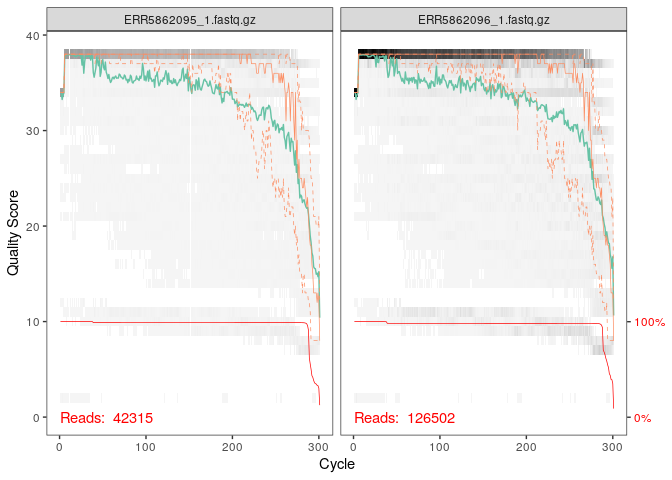
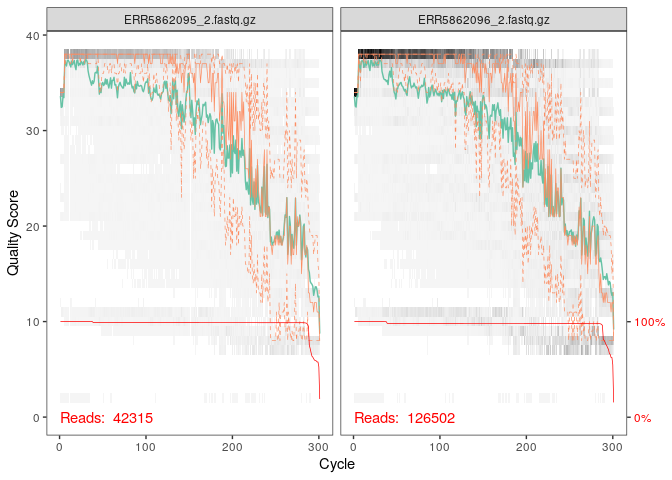
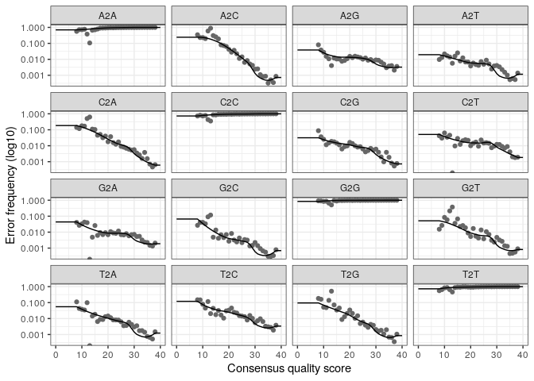
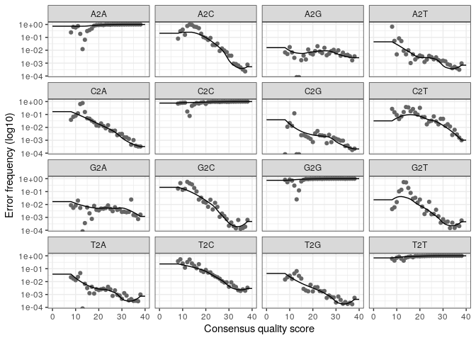

Ecogenomique2_CC2
================

### Effects of Ocean Acidification on Resident and Active Microbial Communities of Stylophora pistillata

## Question scientifique : est-ce que on obtient les mêmes données en utilisant Dada2 phyloseq que MOTHUR en traitement de donnée de bio-informatique?

``` r
if (!requireNamespace("BiocManager", quietly = TRUE))
    install.packages("BiocManager")
```

``` r
library("knitr")
library("BiocStyle")
.cran_packages <- c("ggplot2", "gridExtra", "devtools")
.bioc_packages <- c("dada2", "phyloseq", "DECIPHER", "phangorn")
sapply(c(.cran_packages, .bioc_packages), require, character.only = TRUE)
```

    ## Loading required package: ggplot2

    ## Loading required package: gridExtra

    ## Loading required package: devtools

    ## Loading required package: usethis

    ## Loading required package: dada2

    ## Loading required package: Rcpp

    ## Loading required package: phyloseq

    ## Loading required package: DECIPHER

    ## Loading required package: Biostrings

    ## Loading required package: BiocGenerics

    ## 
    ## Attaching package: 'BiocGenerics'

    ## The following object is masked from 'package:gridExtra':
    ## 
    ##     combine

    ## The following objects are masked from 'package:stats':
    ## 
    ##     IQR, mad, sd, var, xtabs

    ## The following objects are masked from 'package:base':
    ## 
    ##     anyDuplicated, append, as.data.frame, basename, cbind, colnames,
    ##     dirname, do.call, duplicated, eval, evalq, Filter, Find, get, grep,
    ##     grepl, intersect, is.unsorted, lapply, Map, mapply, match, mget,
    ##     order, paste, pmax, pmax.int, pmin, pmin.int, Position, rank,
    ##     rbind, Reduce, rownames, sapply, setdiff, sort, table, tapply,
    ##     union, unique, unsplit, which.max, which.min

    ## Loading required package: S4Vectors

    ## Loading required package: stats4

    ## 
    ## Attaching package: 'S4Vectors'

    ## The following objects are masked from 'package:base':
    ## 
    ##     expand.grid, I, unname

    ## Loading required package: IRanges

    ## 
    ## Attaching package: 'IRanges'

    ## The following object is masked from 'package:phyloseq':
    ## 
    ##     distance

    ## Loading required package: XVector

    ## Loading required package: GenomeInfoDb

    ## 
    ## Attaching package: 'Biostrings'

    ## The following object is masked from 'package:base':
    ## 
    ##     strsplit

    ## Loading required package: RSQLite

    ## Loading required package: parallel

    ## Loading required package: phangorn

    ## Loading required package: ape

    ## 
    ## Attaching package: 'ape'

    ## The following object is masked from 'package:Biostrings':
    ## 
    ##     complement

    ##   ggplot2 gridExtra  devtools     dada2  phyloseq  DECIPHER  phangorn 
    ##      TRUE      TRUE      TRUE      TRUE      TRUE      TRUE      TRUE

``` r
library(dada2)
```

``` r
if (!requireNamespace("BiocManager", quietly = TRUE))
    install.packages("BiocManager")
BiocManager::install("BiocStyle")
```

    ## 'getOption("repos")' replaces Bioconductor standard repositories, see
    ## '?repositories' for details
    ## 
    ## replacement repositories:
    ##     CRAN: https://packagemanager.rstudio.com/all/__linux__/focal/latest

    ## Bioconductor version 3.14 (BiocManager 1.30.16), R 4.1.2 (2021-11-01)

    ## Warning: package(s) not installed when version(s) same as current; use `force = TRUE` to
    ##   re-install: 'BiocStyle'

    ## Installation paths not writeable, unable to update packages
    ##   path: /usr/local/lib/R/library
    ##   packages:
    ##     Matrix

    ## Old packages: 'ape', 'biomaRt', 'broom', 'fansi', 'gert', 'httpuv', 'igraph',
    ##   'RcppParallel', 'rjson'

``` r
BiocManager::install("Rhtslib")
```

    ## 'getOption("repos")' replaces Bioconductor standard repositories, see
    ## '?repositories' for details
    ## 
    ## replacement repositories:
    ##     CRAN: https://packagemanager.rstudio.com/all/__linux__/focal/latest

    ## Bioconductor version 3.14 (BiocManager 1.30.16), R 4.1.2 (2021-11-01)

    ## Warning: package(s) not installed when version(s) same as current; use `force = TRUE` to
    ##   re-install: 'Rhtslib'

    ## Installation paths not writeable, unable to update packages
    ##   path: /usr/local/lib/R/library
    ##   packages:
    ##     Matrix

    ## Old packages: 'ape', 'biomaRt', 'broom', 'fansi', 'gert', 'httpuv', 'igraph',
    ##   'RcppParallel', 'rjson'

``` r
library("knitr")
library("BiocStyle")
.cran_packages <- c("ggplot2", "gridExtra", "devtools")
install.packages(.cran_packages) 
```

    ## Installing packages into '/usr/local/lib/R/site-library'
    ## (as 'lib' is unspecified)

``` r
.bioc_packages <- c("dada2", "phyloseq", "DECIPHER", "phangorn")
BiocManager::install(.bioc_packages)
```

    ## 'getOption("repos")' replaces Bioconductor standard repositories, see
    ## '?repositories' for details
    ## 
    ## replacement repositories:
    ##     CRAN: https://packagemanager.rstudio.com/all/__linux__/focal/latest

    ## Bioconductor version 3.14 (BiocManager 1.30.16), R 4.1.2 (2021-11-01)

    ## Warning: package(s) not installed when version(s) same as current; use `force = TRUE` to
    ##   re-install: 'dada2' 'phyloseq' 'DECIPHER' 'phangorn'

    ## Installation paths not writeable, unable to update packages
    ##   path: /usr/local/lib/R/library
    ##   packages:
    ##     Matrix

    ## Old packages: 'ape', 'biomaRt', 'broom', 'fansi', 'gert', 'httpuv', 'igraph',
    ##   'RcppParallel', 'rjson'

``` r
# Load packages into session, and print package version
sapply(c(.cran_packages, .bioc_packages), require, character.only = TRUE)
```

    ##   ggplot2 gridExtra  devtools     dada2  phyloseq  DECIPHER  phangorn 
    ##      TRUE      TRUE      TRUE      TRUE      TRUE      TRUE      TRUE

``` r
set.seed(100)
miseq_path <- "/home/rstudio/mydatalocal/Ecogeno_CC3_2"
list.files(miseq_path)
```

    ##  [1] "ERR5862095_1.fastq.gz" "ERR5862095_2.fastq.gz" "ERR5862096_1.fastq.gz"
    ##  [4] "ERR5862096_2.fastq.gz" "ERR5862097_1.fastq.gz" "ERR5862097_2.fastq.gz"
    ##  [7] "ERR5862098_1.fastq.gz" "ERR5862098_2.fastq.gz" "ERR5862099_1.fastq.gz"
    ## [10] "ERR5862099_2.fastq.gz" "ERR5862100_1.fastq.gz" "ERR5862100_2.fastq.gz"
    ## [13] "ERR5862101_1.fastq.gz" "ERR5862101_2.fastq.gz" "ERR5862102_1.fastq.gz"
    ## [16] "ERR5862102_2.fastq.gz" "ERR5862103_1.fastq.gz" "ERR5862103_2.fastq.gz"
    ## [19] "ERR5862104_1.fastq.gz" "ERR5862104_2.fastq.gz" "ERR5862105_1.fastq.gz"
    ## [22] "ERR5862105_2.fastq.gz" "ERR5862106_1.fastq.gz" "ERR5862106_2.fastq.gz"
    ## [25] "ERR5862107_1.fastq.gz" "ERR5862107_2.fastq.gz" "ERR5862108_1.fastq.gz"
    ## [28] "ERR5862108_2.fastq.gz" "ERR5862109_1.fastq.gz" "ERR5862109_2.fastq.gz"
    ## [31] "ERR5862110_1.fastq.gz" "ERR5862110_2.fastq.gz" "ERR5862111_1.fastq.gz"
    ## [34] "ERR5862111_2.fastq.gz" "ERR5862112_1.fastq.gz" "ERR5862112_2.fastq.gz"
    ## [37] "ERR5862113_1.fastq.gz" "ERR5862113_2.fastq.gz" "ERR5862114_1.fastq.gz"
    ## [40] "ERR5862114_2.fastq.gz" "ERR5862115_1.fastq.gz" "ERR5862115_2.fastq.gz"
    ## [43] "ERR5862116_1.fastq.gz" "ERR5862116_2.fastq.gz" "ERR5862117_1.fastq.gz"
    ## [46] "ERR5862117_2.fastq.gz" "ERR5862118_1.fastq.gz" "ERR5862118_2.fastq.gz"
    ## [49] "filtered"              "ps"

## Filtration

# Met les reads forward et reverse dans le même ordre

``` r
fnFs <- sort(list.files(miseq_path,pattern="_1.fastq.gz"))
fnRs <- sort(list.files(miseq_path,pattern="_2.fastq.gz"))
```

# Extrait les noms des échantillons et met au même format.

``` r
sampleNames <- sapply(strsplit(fnFs, "_"), `[`, 1)
fnFs <- file.path(miseq_path, fnFs)
fnRs <- file.path(miseq_path, fnRs)
```

# Affiche les 3 premiers éléments de la liste de fnFS

``` r
fnFs[1:3]
```

    ## [1] "/home/rstudio/mydatalocal/Ecogeno_CC3_2/ERR5862095_1.fastq.gz"
    ## [2] "/home/rstudio/mydatalocal/Ecogeno_CC3_2/ERR5862096_1.fastq.gz"
    ## [3] "/home/rstudio/mydatalocal/Ecogeno_CC3_2/ERR5862097_1.fastq.gz"

# Affiche les 3 premiers éléments de la liste de fnRs

``` r
fnRs[1:3]
```

    ## [1] "/home/rstudio/mydatalocal/Ecogeno_CC3_2/ERR5862095_2.fastq.gz"
    ## [2] "/home/rstudio/mydatalocal/Ecogeno_CC3_2/ERR5862096_2.fastq.gz"
    ## [3] "/home/rstudio/mydatalocal/Ecogeno_CC3_2/ERR5862097_2.fastq.gz"

# Graphique de la qualité de fnFs

    library(dada2)
    library(Rcpp)

``` r
plotQualityProfile(fnFs[1:2])
```

    ## Warning: `guides(<scale> = FALSE)` is deprecated. Please use `guides(<scale> =
    ## "none")` instead.

<!-- -->

# Graphique de la qualité de fnRs

``` r
plotQualityProfile(fnRs[1:2])
```

    ## Warning: `guides(<scale> = FALSE)` is deprecated. Please use `guides(<scale> =
    ## "none")` instead.

<!-- -->

``` r
filt_path <- file.path(miseq_path, "filtered")
if(!file_test("-d", filt_path)) dir.create(filt_path)
filtFs <- file.path(filt_path, paste0(sampleNames, "_F_filt.fastq.gz"))
filtRs <- file.path(filt_path, paste0(sampleNames, "_R_filt.fastq.gz"))
```

# Filtration des reads forward et reverse

``` r
library(dada2)
library(Rcpp)
```

``` r
out <- filterAndTrim(fnFs, filtFs, fnRs, filtRs, truncLen=c(240,160),
              maxN=0, maxEE=c(2,2), truncQ=2, rm.phix=TRUE,
              compress=TRUE, multithread=TRUE) 
head(out)
```

    ##                       reads.in reads.out
    ## ERR5862095_1.fastq.gz    42315     32124
    ## ERR5862096_1.fastq.gz   126502     92838
    ## ERR5862097_1.fastq.gz    65379     46643
    ## ERR5862098_1.fastq.gz   127555     94277
    ## ERR5862099_1.fastq.gz   146932    112817
    ## ERR5862100_1.fastq.gz   145654    109440

## Enlève les variants de séquence

# Déréplication

``` r
derepFs <- derepFastq(filtFs, verbose=TRUE)
```

    ## Dereplicating sequence entries in Fastq file: /home/rstudio/mydatalocal/Ecogeno_CC3_2/filtered/ERR5862095_F_filt.fastq.gz

    ## Encountered 15945 unique sequences from 32124 total sequences read.

    ## Dereplicating sequence entries in Fastq file: /home/rstudio/mydatalocal/Ecogeno_CC3_2/filtered/ERR5862096_F_filt.fastq.gz

    ## Encountered 31325 unique sequences from 92838 total sequences read.

    ## Dereplicating sequence entries in Fastq file: /home/rstudio/mydatalocal/Ecogeno_CC3_2/filtered/ERR5862097_F_filt.fastq.gz

    ## Encountered 16060 unique sequences from 46643 total sequences read.

    ## Dereplicating sequence entries in Fastq file: /home/rstudio/mydatalocal/Ecogeno_CC3_2/filtered/ERR5862098_F_filt.fastq.gz

    ## Encountered 19732 unique sequences from 94277 total sequences read.

    ## Dereplicating sequence entries in Fastq file: /home/rstudio/mydatalocal/Ecogeno_CC3_2/filtered/ERR5862099_F_filt.fastq.gz

    ## Encountered 26952 unique sequences from 112817 total sequences read.

    ## Dereplicating sequence entries in Fastq file: /home/rstudio/mydatalocal/Ecogeno_CC3_2/filtered/ERR5862100_F_filt.fastq.gz

    ## Encountered 22492 unique sequences from 109440 total sequences read.

    ## Dereplicating sequence entries in Fastq file: /home/rstudio/mydatalocal/Ecogeno_CC3_2/filtered/ERR5862101_F_filt.fastq.gz

    ## Encountered 24909 unique sequences from 163655 total sequences read.

    ## Dereplicating sequence entries in Fastq file: /home/rstudio/mydatalocal/Ecogeno_CC3_2/filtered/ERR5862102_F_filt.fastq.gz

    ## Encountered 16844 unique sequences from 105908 total sequences read.

    ## Dereplicating sequence entries in Fastq file: /home/rstudio/mydatalocal/Ecogeno_CC3_2/filtered/ERR5862103_F_filt.fastq.gz

    ## Encountered 29692 unique sequences from 194755 total sequences read.

    ## Dereplicating sequence entries in Fastq file: /home/rstudio/mydatalocal/Ecogeno_CC3_2/filtered/ERR5862104_F_filt.fastq.gz

    ## Encountered 27166 unique sequences from 63926 total sequences read.

    ## Dereplicating sequence entries in Fastq file: /home/rstudio/mydatalocal/Ecogeno_CC3_2/filtered/ERR5862105_F_filt.fastq.gz

    ## Encountered 14917 unique sequences from 76550 total sequences read.

    ## Dereplicating sequence entries in Fastq file: /home/rstudio/mydatalocal/Ecogeno_CC3_2/filtered/ERR5862106_F_filt.fastq.gz

    ## Encountered 4682 unique sequences from 26037 total sequences read.

    ## Dereplicating sequence entries in Fastq file: /home/rstudio/mydatalocal/Ecogeno_CC3_2/filtered/ERR5862107_F_filt.fastq.gz

    ## Encountered 33852 unique sequences from 150016 total sequences read.

    ## Dereplicating sequence entries in Fastq file: /home/rstudio/mydatalocal/Ecogeno_CC3_2/filtered/ERR5862108_F_filt.fastq.gz

    ## Encountered 75083 unique sequences from 280864 total sequences read.

    ## Dereplicating sequence entries in Fastq file: /home/rstudio/mydatalocal/Ecogeno_CC3_2/filtered/ERR5862109_F_filt.fastq.gz

    ## Encountered 56156 unique sequences from 185152 total sequences read.

    ## Dereplicating sequence entries in Fastq file: /home/rstudio/mydatalocal/Ecogeno_CC3_2/filtered/ERR5862110_F_filt.fastq.gz

    ## Encountered 42991 unique sequences from 154076 total sequences read.

    ## Dereplicating sequence entries in Fastq file: /home/rstudio/mydatalocal/Ecogeno_CC3_2/filtered/ERR5862111_F_filt.fastq.gz

    ## Encountered 36023 unique sequences from 111621 total sequences read.

    ## Dereplicating sequence entries in Fastq file: /home/rstudio/mydatalocal/Ecogeno_CC3_2/filtered/ERR5862112_F_filt.fastq.gz

    ## Encountered 36085 unique sequences from 127863 total sequences read.

    ## Dereplicating sequence entries in Fastq file: /home/rstudio/mydatalocal/Ecogeno_CC3_2/filtered/ERR5862113_F_filt.fastq.gz

    ## Encountered 67176 unique sequences from 309890 total sequences read.

    ## Dereplicating sequence entries in Fastq file: /home/rstudio/mydatalocal/Ecogeno_CC3_2/filtered/ERR5862114_F_filt.fastq.gz

    ## Encountered 29753 unique sequences from 85811 total sequences read.

    ## Dereplicating sequence entries in Fastq file: /home/rstudio/mydatalocal/Ecogeno_CC3_2/filtered/ERR5862115_F_filt.fastq.gz

    ## Encountered 46146 unique sequences from 200131 total sequences read.

    ## Dereplicating sequence entries in Fastq file: /home/rstudio/mydatalocal/Ecogeno_CC3_2/filtered/ERR5862116_F_filt.fastq.gz

    ## Encountered 39647 unique sequences from 151300 total sequences read.

    ## Dereplicating sequence entries in Fastq file: /home/rstudio/mydatalocal/Ecogeno_CC3_2/filtered/ERR5862117_F_filt.fastq.gz

    ## Encountered 53402 unique sequences from 158874 total sequences read.

    ## Dereplicating sequence entries in Fastq file: /home/rstudio/mydatalocal/Ecogeno_CC3_2/filtered/ERR5862118_F_filt.fastq.gz

    ## Encountered 11271 unique sequences from 34173 total sequences read.

``` r
derepRs <- derepFastq(filtRs, verbose=TRUE)
```

    ## Dereplicating sequence entries in Fastq file: /home/rstudio/mydatalocal/Ecogeno_CC3_2/filtered/ERR5862095_R_filt.fastq.gz

    ## Encountered 12951 unique sequences from 32124 total sequences read.

    ## Dereplicating sequence entries in Fastq file: /home/rstudio/mydatalocal/Ecogeno_CC3_2/filtered/ERR5862096_R_filt.fastq.gz

    ## Encountered 29574 unique sequences from 92838 total sequences read.

    ## Dereplicating sequence entries in Fastq file: /home/rstudio/mydatalocal/Ecogeno_CC3_2/filtered/ERR5862097_R_filt.fastq.gz

    ## Encountered 15456 unique sequences from 46643 total sequences read.

    ## Dereplicating sequence entries in Fastq file: /home/rstudio/mydatalocal/Ecogeno_CC3_2/filtered/ERR5862098_R_filt.fastq.gz

    ## Encountered 19813 unique sequences from 94277 total sequences read.

    ## Dereplicating sequence entries in Fastq file: /home/rstudio/mydatalocal/Ecogeno_CC3_2/filtered/ERR5862099_R_filt.fastq.gz

    ## Encountered 26574 unique sequences from 112817 total sequences read.

    ## Dereplicating sequence entries in Fastq file: /home/rstudio/mydatalocal/Ecogeno_CC3_2/filtered/ERR5862100_R_filt.fastq.gz

    ## Encountered 25045 unique sequences from 109440 total sequences read.

    ## Dereplicating sequence entries in Fastq file: /home/rstudio/mydatalocal/Ecogeno_CC3_2/filtered/ERR5862101_R_filt.fastq.gz

    ## Encountered 26287 unique sequences from 163655 total sequences read.

    ## Dereplicating sequence entries in Fastq file: /home/rstudio/mydatalocal/Ecogeno_CC3_2/filtered/ERR5862102_R_filt.fastq.gz

    ## Encountered 17053 unique sequences from 105908 total sequences read.

    ## Dereplicating sequence entries in Fastq file: /home/rstudio/mydatalocal/Ecogeno_CC3_2/filtered/ERR5862103_R_filt.fastq.gz

    ## Encountered 31404 unique sequences from 194755 total sequences read.

    ## Dereplicating sequence entries in Fastq file: /home/rstudio/mydatalocal/Ecogeno_CC3_2/filtered/ERR5862104_R_filt.fastq.gz

    ## Encountered 22023 unique sequences from 63926 total sequences read.

    ## Dereplicating sequence entries in Fastq file: /home/rstudio/mydatalocal/Ecogeno_CC3_2/filtered/ERR5862105_R_filt.fastq.gz

    ## Encountered 17749 unique sequences from 76550 total sequences read.

    ## Dereplicating sequence entries in Fastq file: /home/rstudio/mydatalocal/Ecogeno_CC3_2/filtered/ERR5862106_R_filt.fastq.gz

    ## Encountered 5638 unique sequences from 26037 total sequences read.

    ## Dereplicating sequence entries in Fastq file: /home/rstudio/mydatalocal/Ecogeno_CC3_2/filtered/ERR5862107_R_filt.fastq.gz

    ## Encountered 39391 unique sequences from 150016 total sequences read.

    ## Dereplicating sequence entries in Fastq file: /home/rstudio/mydatalocal/Ecogeno_CC3_2/filtered/ERR5862108_R_filt.fastq.gz

    ## Encountered 77965 unique sequences from 280864 total sequences read.

    ## Dereplicating sequence entries in Fastq file: /home/rstudio/mydatalocal/Ecogeno_CC3_2/filtered/ERR5862109_R_filt.fastq.gz

    ## Encountered 58694 unique sequences from 185152 total sequences read.

    ## Dereplicating sequence entries in Fastq file: /home/rstudio/mydatalocal/Ecogeno_CC3_2/filtered/ERR5862110_R_filt.fastq.gz

    ## Encountered 39995 unique sequences from 154076 total sequences read.

    ## Dereplicating sequence entries in Fastq file: /home/rstudio/mydatalocal/Ecogeno_CC3_2/filtered/ERR5862111_R_filt.fastq.gz

    ## Encountered 32416 unique sequences from 111621 total sequences read.

    ## Dereplicating sequence entries in Fastq file: /home/rstudio/mydatalocal/Ecogeno_CC3_2/filtered/ERR5862112_R_filt.fastq.gz

    ## Encountered 35266 unique sequences from 127863 total sequences read.

    ## Dereplicating sequence entries in Fastq file: /home/rstudio/mydatalocal/Ecogeno_CC3_2/filtered/ERR5862113_R_filt.fastq.gz

    ## Encountered 71048 unique sequences from 309890 total sequences read.

    ## Dereplicating sequence entries in Fastq file: /home/rstudio/mydatalocal/Ecogeno_CC3_2/filtered/ERR5862114_R_filt.fastq.gz

    ## Encountered 28013 unique sequences from 85811 total sequences read.

    ## Dereplicating sequence entries in Fastq file: /home/rstudio/mydatalocal/Ecogeno_CC3_2/filtered/ERR5862115_R_filt.fastq.gz

    ## Encountered 51746 unique sequences from 200131 total sequences read.

    ## Dereplicating sequence entries in Fastq file: /home/rstudio/mydatalocal/Ecogeno_CC3_2/filtered/ERR5862116_R_filt.fastq.gz

    ## Encountered 34667 unique sequences from 151300 total sequences read.

    ## Dereplicating sequence entries in Fastq file: /home/rstudio/mydatalocal/Ecogeno_CC3_2/filtered/ERR5862117_R_filt.fastq.gz

    ## Encountered 51298 unique sequences from 158874 total sequences read.

    ## Dereplicating sequence entries in Fastq file: /home/rstudio/mydatalocal/Ecogeno_CC3_2/filtered/ERR5862118_R_filt.fastq.gz

    ## Encountered 9557 unique sequences from 34173 total sequences read.

``` r
names(derepFs) <- sampleNames
names(derepRs) <- sampleNames
```

``` r
library(dada2)
library(phyloseq)
errF <- learnErrors(filtFs, multithread=TRUE)
```

    ## 117153360 total bases in 488139 reads from 6 samples will be used for learning the error rates.

``` r
errR <- learnErrors(filtRs, multithread=TRUE)
```

    ## 104287040 total bases in 651794 reads from 7 samples will be used for learning the error rates.

``` r
plotErrors(errF)
```

    ## Warning: Transformation introduced infinite values in continuous y-axis

<!-- -->

``` r
plotErrors(errR)
```

    ## Warning: Transformation introduced infinite values in continuous y-axis

<!-- -->

``` r
dadaFs <- dada(derepFs, err=errF, multithread=TRUE)
```

    ## Sample 1 - 32124 reads in 15945 unique sequences.
    ## Sample 2 - 92838 reads in 31325 unique sequences.
    ## Sample 3 - 46643 reads in 16060 unique sequences.
    ## Sample 4 - 94277 reads in 19732 unique sequences.
    ## Sample 5 - 112817 reads in 26952 unique sequences.
    ## Sample 6 - 109440 reads in 22492 unique sequences.
    ## Sample 7 - 163655 reads in 24909 unique sequences.
    ## Sample 8 - 105908 reads in 16844 unique sequences.
    ## Sample 9 - 194755 reads in 29692 unique sequences.
    ## Sample 10 - 63926 reads in 27166 unique sequences.
    ## Sample 11 - 76550 reads in 14917 unique sequences.
    ## Sample 12 - 26037 reads in 4682 unique sequences.
    ## Sample 13 - 150016 reads in 33852 unique sequences.
    ## Sample 14 - 280864 reads in 75083 unique sequences.
    ## Sample 15 - 185152 reads in 56156 unique sequences.
    ## Sample 16 - 154076 reads in 42991 unique sequences.
    ## Sample 17 - 111621 reads in 36023 unique sequences.
    ## Sample 18 - 127863 reads in 36085 unique sequences.
    ## Sample 19 - 309890 reads in 67176 unique sequences.
    ## Sample 20 - 85811 reads in 29753 unique sequences.
    ## Sample 21 - 200131 reads in 46146 unique sequences.
    ## Sample 22 - 151300 reads in 39647 unique sequences.
    ## Sample 23 - 158874 reads in 53402 unique sequences.
    ## Sample 24 - 34173 reads in 11271 unique sequences.

``` r
dadaRs <- dada(derepRs, err=errR, multithread=TRUE)
```

    ## Sample 1 - 32124 reads in 12951 unique sequences.
    ## Sample 2 - 92838 reads in 29574 unique sequences.
    ## Sample 3 - 46643 reads in 15456 unique sequences.
    ## Sample 4 - 94277 reads in 19813 unique sequences.
    ## Sample 5 - 112817 reads in 26574 unique sequences.
    ## Sample 6 - 109440 reads in 25045 unique sequences.
    ## Sample 7 - 163655 reads in 26287 unique sequences.
    ## Sample 8 - 105908 reads in 17053 unique sequences.
    ## Sample 9 - 194755 reads in 31404 unique sequences.
    ## Sample 10 - 63926 reads in 22023 unique sequences.
    ## Sample 11 - 76550 reads in 17749 unique sequences.
    ## Sample 12 - 26037 reads in 5638 unique sequences.
    ## Sample 13 - 150016 reads in 39391 unique sequences.
    ## Sample 14 - 280864 reads in 77965 unique sequences.
    ## Sample 15 - 185152 reads in 58694 unique sequences.
    ## Sample 16 - 154076 reads in 39995 unique sequences.
    ## Sample 17 - 111621 reads in 32416 unique sequences.
    ## Sample 18 - 127863 reads in 35266 unique sequences.
    ## Sample 19 - 309890 reads in 71048 unique sequences.
    ## Sample 20 - 85811 reads in 28013 unique sequences.
    ## Sample 21 - 200131 reads in 51746 unique sequences.
    ## Sample 22 - 151300 reads in 34667 unique sequences.
    ## Sample 23 - 158874 reads in 51298 unique sequences.
    ## Sample 24 - 34173 reads in 9557 unique sequences.

``` r
dadaFs[[1]]
```

    ## dada-class: object describing DADA2 denoising results
    ## 380 sequence variants were inferred from 15945 input unique sequences.
    ## Key parameters: OMEGA_A = 1e-40, OMEGA_C = 1e-40, BAND_SIZE = 16

## Construction de table de séquences et on va enlever les chimères

``` r
mergers <- mergePairs(dadaFs, derepFs, dadaRs, derepRs)
seqtabAll <- makeSequenceTable(mergers[!grepl("Mock", names(mergers))])
table(nchar(getSequences(seqtabAll)))
```

    ## 
    ##  240  243  244  252  256  262  266  268  269  270  271  272  273  274  275  276 
    ##    2    1    1    2    2    1    2    4    7   11    1    2    4    7   23    7 
    ##  279  280  281  282  283  284  285  286  287  288  289  290  291  292  293  294 
    ##    1    1    7    9   23  105   89  367  575 1320 1200  882 1775  839 1835 2811 
    ##  295  296  297  298  299  300  301  302  303  304  305  306  308  309  310  311 
    ## 1048  467  686  192  117   63   53   10    5    2    2    7    3    4    1    1 
    ##  312  313  318  319  330  334  335 
    ##    1    1    2    1    1    1    1

``` r
seqtabNoC <- removeBimeraDenovo(seqtabAll)
```

## Assignement taxonomique

``` r
fastaRef <-"/home/rstudio/silva_nr99_v138.1_train_set.fa.gz"
taxTab<-assignTaxonomy(seqtabNoC, refFasta=fastaRef, multithread=TRUE)
unname(head(taxTab))
```

    ##      [,1]       [,2]             [,3]                  [,4]              
    ## [1,] "Bacteria" "Bacteroidota"   "Bacteroidia"         "Cytophagales"    
    ## [2,] "Bacteria" "Proteobacteria" "Gammaproteobacteria" "Enterobacterales"
    ## [3,] "Bacteria" "Bacteroidota"   "Bacteroidia"         "Cytophagales"    
    ## [4,] "Bacteria" "Proteobacteria" "Gammaproteobacteria" "Enterobacterales"
    ## [5,] "Bacteria" "Bacteroidota"   "Bacteroidia"         "Flavobacteriales"
    ## [6,] "Bacteria" "Bacteroidota"   "Bacteroidia"         "Cytophagales"    
    ##      [,5]                [,6]           
    ## [1,] "Cyclobacteriaceae" "Fulvivirga"   
    ## [2,] "Colwelliaceae"     "Thalassotalea"
    ## [3,] "Cyclobacteriaceae" "Fulvivirga"   
    ## [4,] "Alteromonadaceae"  "Alteromonas"  
    ## [5,] "Flavobacteriaceae" "Tenacibaculum"
    ## [6,] "Cyclobacteriaceae" "Fulvivirga"

## Construction de l’arbre phylogénétique

``` r
library(DECIPHER)
library(BiocGenerics)
library(Biostrings)
seqs <- getSequences(seqtabNoC)
names(seqs) <- seqs # This propagates to the tip labels of the tree
alignment <- AlignSeqs(DNAStringSet(seqs), anchor=NA,verbose=FALSE)
```

``` r
sapply(c(.cran_packages, .bioc_packages), require, character.only = TRUE)
```

    ##   ggplot2 gridExtra  devtools     dada2  phyloseq  DECIPHER  phangorn 
    ##      TRUE      TRUE      TRUE      TRUE      TRUE      TRUE      TRUE

``` r
phangAlign <- phyDat(as(alignment, "matrix"), type="DNA")
dm <- dist.ml(phangAlign)
```

``` r
treeNJ <- NJ(dm) # Note, tip order != sequence order
fit = pml(treeNJ, data=phangAlign)
```

#`{r} fitGTR <- update(fit, k=4, inv=0.2) fitGTR <- optim.pml(fitGTR, model="GTR", optInv=TRUE, optGamma=TRUE,         rearrangement = "stochastic", control = pml.control(trace = 0)) detach("package:phangorn", unload=TRUE) #`

# L’arbre phylogénétique est très lourd et met du temps à charger.

## Combinaison des data dans un objet phyloseq

#`{r} library(readr) Meta_donnes<- read.csv(file = "~/mydatalocal/meta_donnes.txt") Meta_donnes$SampleID <- paste0(gsub("00", "", Meta_donnes$BioSample), "D") Meta_donnes <- Meta_donnes[!duplicated(Meta_donnes$SampleID),]  rownames(seqtabAll) <- gsub("124", "125", rownames(seqtabAll)) all(rownames(seqtabAll) %in% Meta_donnes$Run) # TRUE #`

#`{r} rownames(Meta_donnes) <- Meta_donnes$SampleID keep.cols <- c("Run","Assay Type","AvgSpotLen","Bases","BioProject","BioSample","Bytes","Center Name","Consent","DATASTORE filetype","DATASTORE provider","DATASTORE region","ENA-FIRST-PUBLIC (run)","ENA-FIRST-PUBLIC","ENA-LAST-UPDATE (run)","ENA-LAST-UPDATE","Experiment","External_Id","INSDC_center_alias","INSDC_center_name","INSDC_first_public","INSDC_last_update","INSDC_status","Instrument","Library Name","LibraryLayout","LibrarySelection","LibrarySource","Organism","Platform","ReleaseDate","Sample Name","sample_name","SRA Study","Submitter_Id","SampleID")  Meta_donnes <- Meta_donnes[rownames(seqtabAll), keep.cols],try(ps_ccpna$CCA$eig, silent = TRUE) #`

#`{r} library(dada2) library(phyloseq) ps <- phyloseq(otu_table(seqtabNoC, taxa_are_rows=FALSE),                 sample_data(Meta_donnes),                 tax_table(taxTab),phy_tree(fitGTR$tree)) ps <- prune_samples(sample_names(ps) != "Mock", ps) # Remove mock sample ps #`
